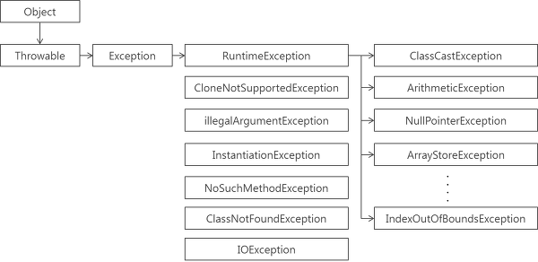

# 기본 요소

## 1. 함수

```kotlin
fun main(args: Array<String>) {
	println("Hello, World!")
}
```

- 함수는 최상위 수준으로 정의할 수 있다. 꼭 클래스 안에 넣어야 할 필요는 없다 (Java와의 차이점)
- Kotlin에서는 배열 처리를 위한 문법이 따로 존재하지 않는다.
- Kotlin 표준 라이브러리는 여러 Java 표준 라이브러리의 Wrapper를 제공
    
    ex. `println()`

<br> 

```kotlin
// 블록이 본문인 함수

fun main(a: Int, b: Int): Int {
	return if (a > b) a else b
}
```

- Kotlin에서 if는 문(statement)이 아니라 식(expression)이다.
    - 식 (Expression)
        
        : 값을 만들어 내며, 다른 식의 하위 요소로 계산에 참여할 수 있음
        
    - 문 (Statement)
        
        : 가장 안쪽 블록의 최상위 요소로 존재하며 값을 만들어내지 않음
        
<br>

```kotlin
// 식이 본문인 함수

fun max(a: Int, b: Int): Int = if (a > b) a else b
```

- 식 하나로 이루어져있는 블록은  중괄호와 return을 없애 간략하게 표현할 수 있음.

<br>

```kotlin
// 식이 본문인 함수에서의 반환 타입 생략

fun max(a: Int, b: Int) = if (a > b) a else b
```

- Kotlin은 타입 추론을 지원하기 때문에 오직 `식이 본문인 함수` 에서만 반환 타입이 생략 가능함
    - 블록이 본문인 함수에서는 반드시 반환 타입을 지정해야 함

<br>

## 2. 변수

```kotlin
val question = "aaa"  // String
val answer = 42    // val answer: Int = 42
val yearsToCompute = 7.5e6  // Double
```

- Java와는 달리 변수에 타입 선언을 생략해도 된다.
    - 마찬가지로, Kotlin은 타입 추론을 지원하기 때문

<br>

### Mutable, Immutable 변수

- `val` (value)
    
    : 변경 불가능한 참조를 저장하는 변수 (`Immutable`)
    
    : 한번 초기화하면 변경이 불가능하다. (Java에서의 final)
    
- `var` (variable)
    
    : 변경 가능한 참조를 저장하는 변수 (`Mutable`)
    
    : 변수의 값은 바뀔 수 있다 (Java에서의 일반 변수
    
<br>

---

- 기본적으로 모든 변수는 `val`을 사용해 불변 변수로 선언.
- 변경이 꼭 필요한 변수만 나중에 `var`로 변경.

- `val` 변수는 블록을 실행할 때 정확히 한 번만 초기화돼야 함.
    - 어떤 블록이 실행될 때 한 초기화 문장만 실행됨을 컴파일러가 확인할 수 있으면, 조건에 따라 `val` 값을 다른 값들로 초기화 할 수 있음
        
        ```kotlin
        val message: String
        if (canPerformOperation()) messsage = "SUCCESS"
        else messsage = "FAILED"
        ```
        
- `val` 참조 자체는 불변이지만 참조로 가리키는 객체의 내부 값은 변경될 수 있다.
    
    ```kotlin
    val languages = arrayListOf("Java")  // 불변 참조 선언
    languages.add("Kotlin")              // 참조가 가리키는 객체 내부를 변경
    ```
    
<br>

## 3. 문자열 템플릿

```kotlin
fun main(args: Array<String>) {
	val name = if (args.size > 0) args[0] else "Kotlin"
	println("Hello, $name!")
}
```

- $ 기호를 통해 문자열 템플릿을 사용할 수 있음.

<br>

# 클래스, 프로퍼티

```kotlin
// name 프로퍼티만 갖는 Person 클래스의 구현

// Java
public class Person {
	private final String name;
	
	public Person(String name) {
		this.name = name;
	}
	
	public String getName() {
		return name;
	}
}

// Kotlin
class Person(val name: String)
```

- `Person(String name)`으로 작성하던 생성자 본문을 생략
- `public` 가시성 변경자가 제거
    - Kotlin에서는 기본 가시성 변경자로 `public`을 사용하기 때문

<br>

## 1. 프로퍼티

- 클래스의 목적은 데이터의 캡슐화(Encapsulation)에 있다.
- Java에서는 데이터를 필드(Field)에 저장하고 `private`하게 가시성을 지정한다.
- 해당 클래스의 데이터에 접근할 수 있도록 접근자 메소드, getter와 setter를 제공

- Java에서는 필드와 접근자 메소드를 프로퍼티(Property)라고 부른다.
- Kotlin 프로퍼티는 Java의 필드와 접근자 메소드를 대신한다
    - 선언을 위해 `val` 또는 `var` 를 사용한다.

<br>

```kotlin
class Person(
	val name: String,            
	var isMarried: Boolean      
)
```

- `val name: String`
    
    : 읽기 전용 프로퍼티
    
    : 비공개 필드, 공개 getter 생성
    
- `var isMarried: Boolean`
    
    : 쓸 수 있는 프로퍼티
    
    : 비공개 필드, 공개 getter, 공개 setter 생성
    

- 읽기 전용 프로퍼티의 경우 getter만 생성하고, 쓸 수 있는 프로퍼티는 getter와 setter 모두 생성

<br>

## 2. Person 프로퍼티 접근 방법

```kotlin
val person = Person("Bob", true)   // Person person = new Person("Bob", true);

// Java
System.out.println(person.getName());    // name 프로퍼티 접근
System.out.println(person.isMarried());  // isMarried 프로퍼티 접근

// Kotlin
println(person.name)                     // name 프로퍼티 접근
println(person.isMarried)                // isMarried 프로퍼티 접근

// isMarried 변경
person.setMarried(false)   // Java
person.isMarried = false   // Kotlin
```

- Kotlin은 프로퍼티의 이름 자체를 사용해도 알아서 getter를 호출한다.

<br>

## 3. 커스텀 접근자

```kotlin
class Rectangle(val height: Int, val width: Int) {
	val isSquare: Boolean
		get() {
			return height == width
		}
 // get() = hegith == width

}

>> val rectangle = Rectangle(41, 43)
>> println(rectangle.isSquare
false
```

- 정사각형 판별을 위한 별도의 필드가 필요없다.
- Rectangle 객체에서 프로퍼티에 접근할 때 마다 getter가 프로퍼티의 값을 매번 계산한다.

<br>

# 선택 표현과 처리: enum, when

## 1. enum 클래스 정의

```kotlin
enum class Color {
	RED, ORANGE, YELLOW, GREEN, BLUE, INDIGO, VIOLET
}
```

- Java에서는 enum으로 사용하는 반면, Kotlin에서는 enum class를 사용한다.
    
    **enum** : 소프트 키워드(soft keyword)
    - class 앞에서만 특별한 의미를 지니지만, 다른 곳에서는 이름으로 사용할 수 있음
  
    **class** : 키워드
    - 이름으로 사용할 수 없음

<br>
    
- enum에는 단순 값 열거만 존재하지 않음, 프로퍼티나 메소드를 정의할 수 있다.
    
    ```kotlin
    enum class Color(
    	val r: Int, 
    	val g: Int, 
    	val b: Int
    ) {
    	RED(255, 0, 0), ORANGE(255, 165, 0), YELLOW(255, 255, 0), GREEN(0, 255, 0),
    	BLUE(0, 0, 255);
    
    	fun rgb() = (r * 256 + g) * 256 + b
    }
    
    >> println(Color.BLUE.rgb())
    255
    ```
    
    - `val r: Int, val g: Int, val b: Int`
        
        : 상수 형 프로퍼티 정의
        
    - `RED(255, 0, 0), ORANGE(255, 165, 0), ..., BLUE(0, 0, 255);`
        
        : 각 상수를 생성할 때 그에 대한 프로퍼티 값을 지정
        
        : 반드시 세미콜론( ; )을 붙인다.
        
    - `fun rgb() =`
        
        : enum 클래스 안에서 메소드를 정의할 수 있음
        
<br>

## 2. when으로 enum 다루기

- `when`으로 Java의 `switch`를 대체할 수 있다.
- `if`와 마찬가지로 값을 만들어내는 식(Expression)이다.

<br>

```kotlin
fun getMnemonic(color: Color) = 
	when (color) {
		Color.RED -> "Richard"
		Color.ORANGE -> "Of"
		Color.GREEN -> "York"
		...
		Color.VIOLET -> "Vain"
	}

>> println(getMnemonic(Color.RED))
Richard
```

- color로 전달된 값을 통해 블럭 안에서 각 분기 끝에 `break`를 넣지 않아도 된다.

<br>

```kotlin
import com.example.kotlininaction.Color

fun getMnemonic(color: Color) = 
	when (color) {
		RED, ORANGE, YELLOW -> "warm"
		...
		VIOLET, BLUE -> "cold"
	}

>> println(getMnemonic(Color.RED))
warm
```

- 한 분기 안에서 여러 값을 사용할 때는 콤마( , )로 구분한다.
- Color enum class를 import하면 단순 enum 열거형으로만 나타낼 수 있다.

<br>

## 3. when과 임의 객체 함께 사용

- Java의 switch는 분기 조건에 상수만 사용할 수 있지만 Kotlin의 when은 분기 조건에 임의 객체가 허용된다.

<br>

```kotlin
fun mix(c1: Color, c2: Color) = 
	when (setOf(c1, c2)) {
		setOf(RED, YELLOW) -> ORANGE
		setOf(YELLOW, BLUE) -> GREEN
		...
		else -> throw Exception("Dirty Color")
	}

>> println(mix(BLUE, YELLOW))
GREEN
```

- when은 인자 값과 매치하는 조건을 찾을 때 까지 각 분기를 검사한다.
    - ex. `setOf(c1, c2)`와 `setOf(RED, YELLOW)`의 동등성을 검사한다.
    - 모든 분기 식에서 만족하는 조건을 찾지 못하면 else로 분기한다.

<br>

## 4. 인자 없는 when 사용

- when에 인자가 없는 경우 각 분기의 조건이 Boolean 결과를 계산하는 식이어야 한다.

<br>

```kotlin
fun refactorMix(c1: Color, c2: Color) = 
	when {
		(c1 == RED && c2 == YELLOW)||
		(c1 == YELLOW && c2 == RED) -> ORANGE
	
		(c1 == YELLOW && c2 == BLUE)||
		(c1 == BLUE && c2 == YELLOW) -> GREEN
		
		...
		else -> throw Exception("Dirty Color")
	}

>> println(mix(BLUE, YELLOW))
GREEN
```

- 불필요한 set 인스턴스 생성을 없애 GC 발생 횟수를 줄일 수 있다.
    - 불필요한 객체 생성을 막을 수 있다.

<br>

## 5. 스마트 캐스트: 타입 검사와 타입 캐스트를 조합

<br>

### 스마트 캐스트 (is)

- Java와는 달리 Kotlin에서는 `is`를 통해 값의 타입을 확인한 후 컴파일러가 자동으로 캐스팅까지 해준다.

<br>

```kotlin
if(e is Sum) {
	return eval(e.right) + eval(e.left)
}
```

- e의 타입이 Sum인지 검사한 다음부터는 컴파일러에서 e의 타입을 Sum으로 해석한다.
    - 곧바로 `e.right`와 `e.left`로 접근할 수 있다.

- 변수에 든 값의 타입을 검사한 다음에 그 값이 바뀔 수 없는 경우에만 작동한다.
    - 프로퍼티는 반드시 `val`이어야 하고 커스텀 접근자를 사용할 수 없다.
    

<br>

### 명시적 캐스트 (as)

- 원하는 타입으로 명시적으로 타입 캐스팅을 하는 경우 `as`를 사용한다.
    
    ```kotlin
    val n = e as Num
    ```
    
<br>

## 6. if → when

```kotlin
// if 식으로 만든 eval()
fun eval(e: Expr): Int = 
	if (e is Num) {
		e.value
	} else if (e is Sum) {
		eval(e.left) + eval(e.right)
	} else { 
		..
	)

```

```kotlin
// when으로 만든 eval()
fun eval(e: Expr): Int = 
	when (e) {
		is Num -> e.value
		is Sum -> eval(e.left) + eval(e.right)
		else -> .. 
	}
```

- `e is Num`과 `e is Sum`을 통해 인자 타입을 검사
- `e.value`와 `eval(e.left) + eval(e.right)`를 통해 스마트 캐스트가 사용

<br>

### if와 when의 분기에서 블록 사용

- if와 when에서 블록을 사용하는 경우 블록의 마지막 문장이 블록 전체의 결과가 됨

```kotlin
when (e) {
	is Num -> {
		println("")
		e.value            // e의 타입이 Num이면 e.value가 반환 
	}
	is Sum -> {
		val left = ..
		val right = ..
		left + right       // e의 타입이 Sum이면 left + right가 반환
	}
	else -> { .. }
}
```

<br>

# 대상을 이터레이션: while과 for 루프

## 1. while

```kotlin
while (condition) {
	/* Do Something */
}

do {
	/* Do Something **/
} while (condition)
```

<br>

## 2. for

```kotlin
for (i in 1..100) { /* Do Something */ }               // 1 ~ 100

for (i in 1 until 100) { /* Do Something */ }          // 1 ~ 99

for (i in 100 downTo 1 step 2) { /* Do Something */ }  // 100, 98 ~ 2
```

- `..`로 범위를 지정하면 항상 끝 값이 포함된다.
    - `1..100` → 1 ~ 100
- `until`을 사용해 범위를 지정하면 끝 값이 포함되지 않는다.
    - `1 until 100` → 1 ~ 99

<br>

## 3. map에 대한 이터레이션

```kotlin
val list = arrayListOf("10", "11", "1001")
for ((index, element) in list.withIndex()) {
	println("$index: $element")
}
```

- 인덱스와 함께 컬렉션을 이터레이션 한다.

<br>

## 4. in을 통한 검사

```kotlin
fun isNotDigit(c: Char) = c !in '0'..'9'

>> println(isNotDigit('x'))
true
```

- `in`을 통해 특정 범위에 속하는지 검사할 수 있다.
- `Comparable` 을 구현한 비교 가능한 클래스라면 객체를 통해 범위를 만들 수 있다.
    - ex) `String`의 경우 `Comparable`구현은 두 문자열을 알파벳 순서로 비교한다.
    
<br>

```kotlin
when (c) {
	in '0'..'9' -> "Digit"
	in 'a'..'z', in 'A'..'Z' -> "Letter"
}
```

- `in`을 when식에서도 사용할 수 있다.

<br>

```kotlin
>> println("Kotlin" in setOf("Java", "Scala"))
false
```

- 컬렉션에서도 `in`을 사용할 수 있다.

<br>

# 코틀린 예외 처리

- 기본적인 예외 처리 방식은 기존 다른 언어들과 동일
    - 함수에서 오류가 발생할 경우 Exception throw
    - 호출자에서는 Exception catch후 처리
    
<br>

```kotlin
val percentage 
	= if (number !in 0..100) number else throw IllegalArgumentException("")
```

- Java와는 달리 `throw`는 식이므로 다른 식에 포함될 수 있음
- `new`를 통해 인스턴스화 하지 않아도 됨

<br>

## 1. try, catch, finally

```kotlin
fun readNumber(reader: BufferedReader): Int? {
	try {
		// 수행 해야 할 작업
		val line = reader.readLine()
		return Integer.parseInt(line)
	} 
	catch (e: NumberFormatException) {
		// try에서 예외가 발생할 경우 수행
		return null
	} 
	finally {
		// 예외가 발생하더라도 반드시 수행해야 할 작업
		reader.close()
	}
}
```

- 해당 함수가 throw할 수  있는 예외를 명시하지 않아도 된다.

<br>

### Checked Exception & Unchecked Exception in Java

<br>

http://plus4070.github.io/nhn%20entertainment%20devdays/2017/01/22/Exception/

<br>




- Exception은 체크 예외(Checked Exception)와 언체크 예외(Unchecked Exception)으로 나뉜다.

<br>

1. 체크 예외
    
    : `RuntimeException`을 상속하지 않는 나머지 클래스들
    
    : 복구 가능한 예외들이기 때문에 반드시 예외를 처리하는 코드를 함께 작성해야 한다.
    
    - `catch` 또는 `throws`

<br>

2. 언체크 예외
    
    : `RuntimeException`을 상속한 클래스들
    
    : 명시적으로 예외 처리를 강제하지 않음
    
    : 프로그램에 오류가 있을 때 발생하도록 의도된 예외
    
    : `catch` 또는 `throws`로 선언하지 않아도 됨
    

<br>

- `throws`를 사용할 경우 반드시 예외가 발생한 함수를 호출하는 메소드에서 try-catch로 예외 처리를 해야 한다.
    
    ```java
    // https://wikidocs.net/229
    
    class FoolException extends Exception {  }  // Exception을 상속하는 체크 예외
    
    public class Sample {
        public void sayNick(String nick) throws FoolException {
            if("fool".equals(nick)) {
                throw new FoolException();
            }
            System.out.println("당신의 별명은 "+nick+" 입니다.");
        }
    
        public static void main(String[] args) {
            Sample sample = new Sample();
            try {
                sample.sayNick("fool");
                sample.sayNick("genious");
            } catch (FoolException e) {
                System.err.println("FoolException이 발생했습니다.");
            }
        }
    }
    ```
    
    - sayNick 메소드에서 발생하는 FoolException은 sayNick을 호출하는 main 메소드에서 try-catch로 예외처리 해야 컴파일 에러가 발생하지 않음

<br>

```kotlin
fun readNumber(reader: BufferedReader): Int? {
	try {
		val line = reader.readLine()
		return Integer.parseInt(line)
	} catch (e: NumberFormatException) {  // 언체크 예외
		return null
	} finally {
		reader.close()
	}
}
```

- Java에서는 컴파일러가 `NumberFormatException`을 처리하도록 강제하지 않음 
(언체크 예외이기 때문에)
    - 컴파일러가 확인하지 않기 때문에 실제 런타임에서는 발생할 가능성이 높음

<br>

### Checked Exception & Unchecked Exception in Kotlin

- Kotlin은 체크 예외와 언체크 예외를 구별하지 않음
- Java는 체크 예외를 반드시 처리해야 하지만 Kotlin은 강제하지 않음

> Kotlin에서는 throws로 던지는 체크예외를 선언하지 않아도 된다.

<br> 

## 2. try를 식으로 사용

- Kotlin에서 try는 if, when과 마찬가지로 식이다.
    - try의 값을 변수에 대입 가능

<br>

```kotlin
// try에서 값 반환 & catch에서 값 반환

val number = try {
	Integer.parseInt(reader.readLine())
} catch (e: NumberFormatException) {
	null
}
```

- 예외가 발생하지 않을 경우 `Integer.parseInt(reader.readLine())`의 결과가 값으로 반환
- 예외가 발생할 경우 `null`이 값으로 반환