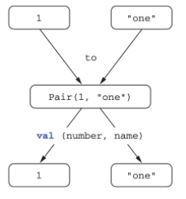

# 3장. 함수 정의와 호출

# 코틀린에서 컬렉션 만들기

```kotlin
val set = hashSetOf(1, 7, 53)  // 집합
val list = arrayListOf(1, 7, 53)  // 리스트
val map = hashMapOf(1 to "one", 7 to "seven", 53 to "fifty-three")  // 맵
```

- Kotlin은 자신만의 컬렉션 기능을 제공하지 않음
    - 기존 Java 컬렉션을 활용
    - Java 컬렉션을 활용하기 때문에 Java 코드와 호환이 쉬움
    - 하지만, Java보다 더 많은 기능을 사용할 수 있음

<br>

```kotlin
>> val string = listOf("a", "b", "c")
>> println(string.last())
c
>> val numbers = setOf(1, 14, 2)
>> println(c.max())
14
```

<br>

# 함수를 호출하기 쉽게 만들기

```kotlin
>> val list = listOf(1, 2, 3)
>> println(list)
[1, 2, 3]
```

- Java에는 Default `toString()`구현이 들어있음
- Java에서 `toString()`을 커스텀하는 것은 Third-party 라이브러리를 추가하는 것 처럼 복잡함
- Kotlin은 표준 라이브러리에 들어있기 때문에 직접 커스텀하는 것이 상대적으로 쉬움

<br>

```kotlin
fun <T> joinToString(
		collection: Collection<T>,
		separator: String,
		prefix: String,
		postfix: String
): String {
		val result = StringBuilder(prefix)
		for ((index, element) in collection.withIndex()) {
				if (index > 0) result.append(separator)
				result.append(element)
		}

		result.append(postfix)
		return result.toString()
}

>> val list = listOf(1, 2, 3)
>> println(joinToString(list, "; ", "(", ")"))
(1; 2; 3)
```

- `joinToString()`은 Generic을 통해 어떤 컬렉션이든 모두 처리할 수 있음

<br>

## 1. 이름 붙인 인자

- 아래와 같은 사용은 가독성에 문제가 있다.
    
    ```kotlin
    >> println(joinToString(list, "; ", "(", ")"))
    (1; 2; 3)
    ```

<br>

- Kotlin에서는 함수 호출 시 parameter의 이름을 붙여 호출할 수 있다. (Java에서는 불가)
    
    ```kotlin
    >> println(joinToString(
    			collection= list,
    			separator= "; ",
    			prefix= "(",
    			postfix= ")")
    	 )
    ```
    
<br>

## 2. 디폴트 파라미터 값

- Java의 단점은 일부 클래스에서 오버로딩한 메서드가 많아진다는 문제가 있음
- Kotlin은 함수 선언에서 파라미터에 default 값을 지정할 수 있음
    
    ```kotlin
    fun <T> joinToString(
    		collection: Collection<T>,
    		separator: String = "; ",
    		prefix: String = "(",
    		postfix: String = ")"
    ): String {
    		...
    }
    
    >> joinToString(list)
    (1; 2; 3)
    >> joinToString(list, ",", "", "")
    1, 2, 3
    >> joinToString(list, ",")
    (1, 2, 3)
    >> joinToString(list, prefix= "", postfix= "")
    1; 2; 3
    ```
    
    - 파라미터에 default 값을 넣게 되면 특정 파라미터를 생략할 수 있음
    - 중간 파라미터를 생략할 경우 이름을 붙인 파리미터를 통해 순서 관계없이 지정할 수 있음

<br>

### 디폴트 파라미터와 Java

- Java에는 이런 개념이없기 때문에 Kotlin 함수를 Java에서 호출할 경우 모든 파라미터를 명시해야 함
    - 편하게 사용하기 위해 호출 시 `@JvmOverloads` 어노테이션을 붙여 사용할 수도 있음

<br>

# 정적 유틸리티 클래스 없애기: 최상위 함수와 프로퍼티

## 1. 최상위 함수

- Kotlin은 Util 클래스를 함수에 포함시키는 대신 파일의 최상위 수준으로 위치시킬 수 있음

<br>

```kotlin
// join.kt
package strings

fun joinToString(..): String { .. }

// --> Byte code(Java)

package strings;

public class JoinKt {
		public static String joinToString(..) { .. }
}
```

- 컴파일 시 JVM은 클래스 안에 들어있는 코드만 실행할 수 있기 때문에 컴파일 시 해당 파일에 대해 새로운 클래스를 정의해줌
- Kotlin 파일 이름은 컴파일시 생성하는 바이트 코드의 클래스 이름과 대응됨

<br>

> 파일에 대응하는 클래스의 이름을 변경하고 싶다면 `@file:JvmName("~")`을 통해 변경할 수 있음

<br>


## 2. 최상위 프로퍼티

```kotlin
var opCount = 0  // 최상위 프로퍼티 선언

fun performOperation() {
		opCount++  // 최상위 프로퍼티 값 변경
		..
}

fun reportOperationCount() {
		println("$opCount")  // 최상위 프로퍼티 값 출력
}
```

<br>

> 전역변수와의 차이점은? (Q)

<br>

# 확장 함수와 확장 프로퍼티

## 1. 확장함수

- 기존 Java API를 재작성하지 않고도 Kotlin이 제공하는 여러 편리한 기능을 사용하도록 하는 역할
- 특정 클래스에 새로운 메소드를 추가하는 것과 유사
    
    ```kotlin
    package strings
    
    fun String.lastChar(): Char = this.get(this.length - 1)
    ```
    
    - `String` : 수신 객체 타입 (확장할 클래스 타입)
    - `this` : 수신 객체 (확장 함수가 호출되는 대상이 되는 객체)

<br>

```kotlin
// Android 예시

object NavigationUtil {
		fun View.navigate(action: Int) {
        Navigation.findNavController(this).navigate(action)
    }

    fun Fragment.navigate(action: Int) {
        this.findNavController().navigate(action)
    }
}
```

<br>

```kotlin
package strings

fun String.lastChar(): Char = get(length - 1)
```

- 수신 객체 멤버에 `this` 없이 접근할 수 있음

<br>

## 2. 임포트와 확장 함수

- 확장 함수를 사용하기 위해 해당 함수를 다른 클래스나 함수와 마찬가지로 import 해야 함
    
    ```kotlin
    import strings.lastChar
    // import strings.*
    
    val c = "Kotlin".lastChar()
    ```
    
    <br>

    ```kotlin
    import strings.lastChar as last
    
    val c = "Kotlin".last()
    ```
    
    - `as`를 사용하면 import한 클래스나 함수를 다른 이름으로 사용 가능
    
    <br>

    ```kotlin
    // Android 예시
    
    import com.xxx.ui.common.NavigationUtil.navigate
    
    class SearchFragment : BaseFragment<FragmentSearchBinding>(R.layout.fragment_search) {
        override fun onViewCreated(view: View, savedInstanceState: Bundle?) {
            super.onViewCreated(view, savedInstanceState)
    
            bindViews()
        }
    
        private fun bindViews() {
            binding.clSearchOption.setOnClickListener {
                navigate(R.id.action_search_to_search_option)
            }
            binding.tbSearch.setOnClickListener {
                navigate(R.id.action_search_to_place_detail)
            }
        }
    }
    ```
    
<br>

## 3. Java에서 확장 함수 호출

```java
char c = StringUtilKt.lastChar("Java");
```

- 확장함수를 StringUtil.kt에 정의했다면 `StringUtilKt`로 접근할 수 있다.

<br>

## 4. 확장 함수로 유틸리티 함수 정의

```kotlin
fun <T> Collection<T>.joinToString(
		separator: String = ", ",
		prefix: String = "" ,
		postfix: String = ""
): String {
		val result = StringBuilder(prefix)
		for ((index, element) in this.withIndex()) {
				if (index > 0) result.append(separator)
				result.append(element)
		}

		result.append(postfix)
		return result.toString()
}
```

- `Collection<T>`에 대한 확장함수를 선언
- `for( .. in this.withIndex())`
    - `this`는 T타입의 원소로 이루어진 컬렉션을 의미

<br>

```kotlin
fun Collection<String>.join(
		separator: String = ", ",
		prefix: String = "" ,
		postfix: String = ""
) = joinToString(separator, prefix, postfix)

>> println(listOf("one", "two", "three").join(" "))
one two three
```

- 특정 원소의 컬렉션에서만 실행할 수 있도록 수정할 수도 있음
- 해당 함수는 리스트에 대해서는 호출할 수 없음
    
    ```kotlin
    >> listOf(1, 2, 8).join()
    Error: Type mismatch ....
    ```

<br>    

## 5. 확장 함수는 오버라이드할 수 없다

- Kotlin에서의 메소드 오버라이드는 일반적인 객체 지향에서의 메소드 오버라이딩과 동일하다
- 확장함수로 이루어진 메소드는 오버라이딩 할 수 없다.

<br>

```kotlin
open class View {
		open fun click() = println("View clicked")
}

class Button : View() {
		override fun click() = println("Button Clicked")
}
```

- 위 코드처럼 특정 멤버함수를 오버라이딩 하는 경우를 볼 수 있다.
- 확장함수는 위 방식처럼 작동되지 않는다.
    - 확장함수는 클래스 외부에 선언되기 때문
    
    > *이름과 파라미터가 완전히 같은 확장 함수를  기반 클래스와 하위 클래스에 대해 정의해도 실제로는 확장 함수를 호출할 때 수신 객체로 지정한 변수의 정적 타입에 의해 어떤 확장 함수가 호출될지 결정되지, 그 변수에 저장된 객체의 동적인 타입에 의해 확장 함수가 결정되지 않는다. (?)*
    > 

<br>

```kotlin
fun View.showOff() = println("I'm a view!")
fun Button.showOff() = println("I'm a button!")

>> val view: View = Button()
>> view.showOff()
I'm a view!
```

- `view`가 가리키는 객체의 타입은 `Button`이지만 선언되어있는 타입은 `View`이기 때문에 View의 확장함수가 실행됨

<br>

> Kotlin은 호출될 확장 함수를 정적으로 결정하기 때문에 확장함수를 오버라이딩 할 수 없다

<br>

## 6. 확장 프로퍼티

```kotlin
val String.lastChar: Char
		get() = get(length - 1)
```

- 일반적인 프로퍼티와 유사하지만 `수신 객체 클래스`가 추가된 프로퍼티
- getter는 반드시 정의해야 한다.

<br>

```kotlin
var stringBuilder.lastChar: Char
		get() = get(length - 1)
		set(value: Char) {
				this.setCharAt(length - 1, value)
		}
```

- StringBuilder에서 맨 마지막 문자는 변경 가능하므로 `var`과 함께 프로퍼티 setter도 함께 사용할 수 있음

<br>

# 컬렉션 처리: 가변 길이 인자, 중위 함수 호출, 라이브러리 지원

- Kotlin은 다음과 같은 언어적 특성을 갖는다
    1. `vararg`를 통해 호출 시 파라미터 개수가 달라질 수 있는 함수를 정의할 수 있다.
    2. `infix`(중의) 함수 호출 구문을 사용하면 파라미터가 하나뿐인 메서드를 간편하게 호출할 수 있다.
    3. 구조 분해 선언을 사용하면 복합적인 값을 분해해서 여러 변수에 나눠담을 수 있다.

<br>

## 1. Java 컬렉션 API 확장

```kotlin
>> val strings: List<String> = listOf("first", "second", "fourteenth")
>> strings.last()
fourtenth

>> val numbers: Collection<Int> = setOf(1, 14, 2)
>> numbers.max()
14
```

<br>

```kotlin
fun <T> List<T>.last(): T { .. }
fun Collection<Int>.max(): Int { .. }
```

- 기존에 Java에서 제공하는 컬렉션 API에 대해 `last()`, `max()`와 같은 기능을 추가한 것은 이 두 함수가 `확장함수`이기 때문이다

<br>

## 2. 가변 인자 함수: 인자의 개수가 달라질 수 있는 함수에 대한 정의

```kotlin
fun listOf<T>(vararg values: T): List<T> { .. }
```

- 가변 길이 인자 (Java)
    - 메소드를 호출할 때 원하는 개수만큼 값을 인자로 넘겨 Java 컴파일러가 값들을 넣어주는 기능
    - Kotlin에서는 `vararg`를 파라미터 앞에 붙여 사용

<br>

```kotlin
fun main(args: Array<String>) {
		val list = listOf("args: ", *args)
		println(list)
}
```

- 이미 배열에 들어있는 원소를 가변 길이 인자로 넘길때는 배열을 명시적으로 풀어서 배열의 각 원소가 인자로 전달되게 해야한다.
    - `스프레드 연산자`
    
<br>

## 3. 값의 쌍 다루기: 중위 호출, 구조 분해 선언

```kotlin
val map = mapOf(1 to "one", 7 to "seven", 53 to "fifty-three")
```

- map을 구성할 때 사용하는 `to`는 Kotlin 키워드가 아니다.
    - `중위 호출`을 통해 `to`라는 일반 메소드를 호출한 것

<br>

```kotlin
1.to("one")  ==   1 to "one"
```

- 두 호출 방식은 동일하다.
    - `1.to("one")` : 일반적인 방식의 호출
    - `1 to "one"` : 중위 호출 방식으로 호출

<br>

```kotlin
infix fun Any.to(other: Any) = Pair(this, other)
```

- `infix`를 통해 인자가 하나뿐인 일반 메소드 또는 인자가 하나뿐인 확장함수에 중위 호출을 사용할 수 있음
- Pair 인스턴스를 반환한다.

<br>

```kotlin
val (number, name) = 1 to "one"
```

- Pair의 내용으로 `number`와 `name`을 즉시 초기화할 수 있다. (**구조분해선언)**

<br>



- `to`를 통해 Pair를 만들고 구조 분해를 통해 순서쌍을 풀 수 있음

<br>

```kotlin
for ((index, element) in collection.withIndex() {
		println("$index: $element")
}
```

- 구조 분해 선언과 `withIndex()`를 조합하여 컬렉션의 인덱스와 값을 변수에 따로 저장할 수 있음

<br>

```kotlin
fun <K, V> mapOf(vararg values: Pair<K, V>): Map<K, V>
```

- `mapOf()`에도 원하는 만큼의 파라미터를 넣을 수 있지만, 각 파리미터는 Key-Value 쌍이어야 함

<br>

# 문자열과 정규식

## 1. 문자열 나누기

- Java에서는 `"12.345-6.A".split(".")`의 결과는 [12, 345-6, A]가 아니다
    - `split()`의 구분 문자열은 실제로는 정규식이다.
    - 즉, `split(”.”)`은 모든 문자를 나타내는 정규식으로 해석된다.

<br>

- Kotlin에서는 여러가지 다른 조합의 파라미터를 받는 `split()`확장 함수를 제공한다.
    - 정규식을 파라미터로 받을 경우 String이 아닌 Regex 타입의 값이 들어간다.
    
    <br>

    ```kotlin
    // split의 파라미터가 Regex(정규식)일 경우
    >> println("12.345-6.A".split("\\.|-".toRegex())
    [12, 345, 6, A]
    ```
    
    - `toRegex()`를 통해 문자열을 Regex로 변환할 수 있음
    
    <br>

    ```kotlin
    // split의 파라미터가 String일 경우
    >> println("12.345-6.A".split(".", "-")
    [12, 345, 6, A]
    ```
    
    - 여러 구분 문자열을 지원한다

<br>

## 2. 정규식과 3중 따옴표로 묶은 문자열

```kotlin
fun parsePath(path: String) {
		val directory = path.substringBeforeLast("/")
		val fullName = path.substringAfterLast("/")
		val fileName = fullName.substringBeforeLast(".")
		val extension = fullName.substringAfterLast(".")

		println("Dir: $directory, name: $fileName, ext: $extension")
}
```

- `substringBeforeLast()`와 `substringAfterLast()`를 사용하면 정규식 없이도 쉽게 파싱할 수 있다
- 정규식은 알아보기 힘들다는 단점이 존재한다.

<br>

```kotlin
fun parsePath(path: String) {
		val regex = """(.+)/(.+)\.(.+)""".toRegex()
		val matchResult = regex.matchEntire(path)
		if (matchResult != null) {
				val (directory, filename, extension) = matchResult.destructed
				println("Dir: $directory, name: $fileName, ext: $extension")
		}
}
```

<br>

## 3. 여러 줄 3중 따옴표 문자열

- 3중 따옴표 문자열에는 줄 바꿈을 표현하는 아무 문자열이나 그대로 들어간다
- 여러 줄 문자열을 코드에서 보기 좋게 하기 위해서는 들여쓰기를 하되 끝부분을 특별한 문자열로 표시한 후, `tripMargin()`을 사용해 문자열과 직전의 공백을 제거한다.

```kotlin
"""C:\\Users\xxxx"""

val price = """${'$'}99.9"""
```

<br>

# 코드 다듬기 : 로컬 함수와 확장

- Kotlin에서는 코드 중복을 방지하기 위해 함수에서 추출한 함수를 원 함수 내부에 중첩시킬 수 있다.

```kotlin
class User(val id: Int, val name: String, val address: String)

// 필드 검증이 중복되는 saveUser 메소드
fun saveUser(user: User) {
		if (user.name.isEmpty()) {
				throw IllegalArgumentException
		}

		if (user.address.isEmpty()) {
				throw IllegalArgumentException
		}
}
```

<br>

```kotlin
// 로컬 함수 validate 메소드를 통해 중복 제거
fun saveUser(user: User) {
		
		fun validate(user: User, value: String, fieldName: String) {
				if (value.isEmpty()) {
						throw IllegalArgumentException
				}
		}
}
```

- user의 필드 검증에 대한 중복 로직을 없애도록 리팩토링할 수 있음
- `User` 객체를 로컬 함수에 하나하나 전달해야 한다는 단점이 존재

<br>

```kotlin
// 로컬 함수에서 바깥 함수의 파라미터 접근
fun saveUser(user: User) {
		
		fun validate(value: String, fieldName: String) {
				if (value.isEmpty()) {
						throw IllegalArgumentException
				}
		}
}
```

<br>

```kotlin
// validate 로직을 확장함수로 추출
fun User.validateBeforeSave() {
		
		fun validate(value: String, fieldName: String) {
				if (value.isEmpty()) {
						throw IllegalArgumentException
				}
		}
}

fun saveUser(user: User) {
		user.validateBeforeSave()
}
```

- `User.validateBeforeSave()`를 `saveUser()`내부에 로컬 함수로 넣을 수 있다.
    - 중첩의 깊이가 깊어지면 가독성이 낮아짐
    - 일반적으로는 한 단계의 함수만 중첩하도록 권장