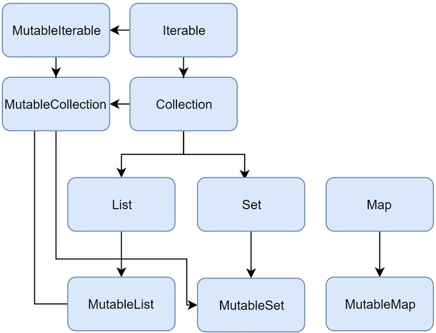

# 스터디용_3장 함수 정의와 호출

3장에서 다루는 내용

- 컬렉션, 문자열, 정규식을 다루기 위한 함수
- 이름 붙인 인자, 디폴트 파라미터 값, 중위 호출 문법 사용
- 확장 함수와 확장 프로퍼티를 사용해 자바 라이브러리 적용
- 최상위 및 로컬 함수와 프로퍼티를 사용해 코드 구조화


### 3.1 코틀린에서 컬렉션 만들기

- setOf(), hashSetOf(), arrayListOf(), hashMapOf
- 예) val map = hashMapOf(1 **to** “one”, 7 **to** “seven”, 53 **to** “fifty-three”)

****Collections 소개 및 사용법 정리 (List, Map, Set)****




## **List**

List는 데이터가 저장하거나 삭제될 때 순서를 지키는 Collection이다.

Mutable(변할 수 없는)과 Immutable(불변의)이 있다.

- ### **List : Immutable(수정할 수 없는 객체, 불변의)**

`listOf<타입>(아이템, )`로 Immutable List를 생성 및 초기화를 할 수 있다.

코틀린은 아이템의 타입을 추론하기 때문에 타입을 생략된다.

Immutable이기 때문에 get만 가능하다.

List의 getter는 자바처럼 `get(index)`도 지원하고 배열처럼 `[index]`도 지원한다.

- ### **List : Mutable(수정가능한 객체, 변할 수 있는)**

수정가능한 List는 `mutableListOf`로 선언한다. 추가 및 삭제가 가능하다.


## **Set**

Set은 동일한 아이템이 없는 Collection이다. Set의 아이템들의 순서는 특별히 정해져 있지 않다. Set은 null 객체를 갖고 있을 수 있다. 동일한 객체는 추가될 수 없기 때문에 null도 1개만 갖고 있을 수 있다.

- ### **Set : Immutable**

`setOf<타입>(아이템들)`로 객체를 생성할 수 있다.

- ### **Set : Mutable**

Mutable은 `mutableSetOf<타입>(아이템들)` 로 생성할 수 있다. Mutable이기 때문에 추가, 삭제가 가능하다.


## **Map**

Map은 key와 value를 짝지어 저장하는 Collection이다. **Map의 key는 유일하기 때문에 동일한 이름의 key는 허용되지 않는다.**

- ### **Map : Immutable**

Map은 `mapOf<key type, value type>(아이템)`로 생성할 수 있다. 아이템은 Pair객체로 표현하며, Pair에 key와 value를 넣을 수 있다. `Pair(A, B)`는 `A to B`로 간단히 표현이 가능하다. 이런 문법이 가능한 것은 to가 [Infix](https://codechacha.com/ko/kotlin-infix-functions/)이기 때문이다.

- ### **Map : Mutable**

Mutable은 `mutableMapOf<key type, value type>(아이템)`로 생성한다. 객체 추가는 `put` 메소드이며, Pair를 사용하지 말고 인자로 key와 value를 넣어주면 된다. `put`도 배열 방식을 지원한다.


### 3.2 함수를 호출하기 쉽게 만들기

- 이름 붙인 인자를 통해 → 함수를 호출할때 함수에 전달하는 인자 중 이름을 명시할 수 있다.
- 디폴트 파라미터 값을 통해 → 함수 선언에서 파라미터의 디폴트 값을 지정할 수 있다.

joinToString() : 컬렉션의 원소를 StringBuilder의 뒤에 덧붙인다. 원소 사이에 구분자 separator를 추가하고 StringBuilder의 맨 앞과 맨 뒤에는 접두사 prefix와 접미사 posfix를 추가한다.

```kotlin
fun<T> joinToString(
    collection: Collection<T>,
    seprator: String,
    prefix: String,
    postfix: String
) : String{
    val result = StringBuilder(prefix)

    for((index, element) in collection.withIndex()){
        if(index > 0) result.append(seprator)
        result.append(element)
    }

    result.append(postfix)
    return result.toString()
}
```

- 이름 붙인 인자를 통한 호출 →

```kotlin
fun main(args: Array<String>){
    val list =listOf(1, 2, 3)
		println(joinToString(list, seprator = “ “, prefix = “ “, postfix = “.”))
}
```

- 디폴트 파리미터 값 사용 →

```kotlin
fun<T> joinToString(
    collection: Collection<T>,
    seprator: ", ",
    prefix: "",
    postfix: ""
) : String{
```


### 3.3 메소드를 다른 클래스에 추가 : 확장함수와 확장프로퍼티

확장함수 : 어떤 클래스의 멤버 메소드인 것처럼 호출할 수 있지만 그 클래스의 밖에 선언된 함수이다.

만드는 법

- 추가하려는 함수 이름 앞에 그 함수가 확장할 클래스의 이름을 덧붙힌다.

  fun String.lastChar() : Char = this.get(this.length - 1)

  혹은 fun String.lastChar() : Char = get(length - 1)

  >>> println(”kotlin”.lastChar())

  n

- 클래스 이름 → 수신 객체 타입(receiver type), 확장함수가 호출되는 대싱아 되는 값(객체) → 수신 객체(receiver object)


- 제약

  1. 클래스 안에서 정의한 메소드와 달리 확장 함수 안에서는 클래스 내부에서만 사용할 수 있는 비공개(private) 멤버나 보호된(protected) 멤버를 사용할 수 없다.
  2. 확장함수는 오버라이드 할 수 없다.


- as 키워드를 사용하면 임포트한 클래스나 함수를 다른 이름으로 부를 수 있다.


### 3.4 컬렉션 처리 : 가변 길이 인자, 중위 함수 호출, 라이브러리 지원

가변 인자 함수 : 인자의 개수가 달라질 수 있는 함수 정의

vararg 키워드를 사용하면 호출 시 인자 개수가 달라질 수 있는 함수를 정의할 수 있다.

중위 함수 호출 구문을 사용하면 인자가 하나뿐인 메소드를 간편하게 호출할 수 있다.

구조 분해 선언을 사용하면 복합적인 값을 분해해서 여러 변수에 나눠 담을 수 있다.

```kotlin
fun sub(args:Array<String>){
    val list =listOf("args", *args)
		println(list)
}

fun main(){
    val array =arrayOf("a", "b", "c")
		sub(array)
}
```

값의 쌍 다루기 : 중위 호출과 구조 분해 선언

val map = mapOf(1 to “one”, 7 to “seven”, 53 to “fitfty-tree”)

1.to(”one”) ← to 메소드를 일반적인 방식으로 호출함

1 to “one” ← to 메소드를 중위 호출 방식으로 호출함

```kotlin

/**
 * Creates a tuple of type[Pair] from this and[that].
 *
 * This can be useful for creating[Map] literals with less noise, for example:
 *@samplesamples.collections.Maps.Instantiation.mapFromPairs
*/
public infix fun <A, B> A.to(that: B): Pair<A, B> = Pair(this, that)
```

함수(메소드)를 중위 호출에 사용하게 허용하고 싶으면 infix 변경자를 함수(메소드) 선언 앞에 추가해야 한다.

infix fun Any.to(other: Any) = Pair(this, other)

val (number, name) = 1 to “one”

→ 이와 같은 선언을 구조 분해 선언(destructuring declaration)이라고 부른다.

루프에서도 구조 분해 선언을 활용할 수 있다. joinToString에서 본 withIndex를 구조분해선언과 조합하면 컬렉션 원소의 인덱스와 값을 따로 변수에 담을 수 있다.

for((index, element) in collection.withIndex()){

  println(”$index: $element”)

}

```kotlin

/**
 * Returns a new read-only list of given elements.  The returned list is serializable (JVM).
 *@samplesamples.collections.Collections.Lists.readOnlyList
*/
public fun <T> listOf(vararg elements: T): List<T> = if (elements.size > 0) elements.asList() elseemptyList()
```

예) listOf() 사용

List는 데이터가 저장하거나 삭제될 때 순서를 지키는 Collection이다.

```kotlin
fun main(args:Array<String>) {
    //val map = mapOf(1 to "one", 7 to "seven", 53 to "fifty")
    val list = listOf(1 to"one", 7 to"seven", 53 to"fifty")

    for((index, element) in list.withIndex()){
			println("$index : $element")
    }
}
```

예) mapOf(사용)

Map은 key와 value를 짝지어 저장하는 Collection이다. **Map의 key는 유일하기 때문에 동일한 이름의 key는 허용되지 않는다.**

```kotlin
fun main(args:Array<String>) {
    val map = mapOf(1 to"one", 7 to"seven", 53 to"fifty")

    for((index, element) in map){
			println("$index : $element")
    }
}
```

to함수는 확장함수. to를 사용하면 타입과 관계없이 임의의 순서쌍을 만들 수 있다. to의 수신 객체가 제네릭하다.

1 to “one”, “one” to 1, list to list.size() 호출 모두 가능.

mapOf함수의 선언을

listOf와 마찬가지로 mapOf에도 원하는 개수만큼 인자를 전달 할 수 있다.


### 3.5.1 문자열과 정규식

- toRegex()함수
- split()함수
- 3중 따옴표

split()와 toRegex()

```kotlin
fun main(){
	println("12.345-6.A".split("\\.|-".toRegex()))
	println("12.345-6.A".split(".", "-"))
}
```

3중 따옴표 → \ 생략 가능하다.

```kotlin
fun parsePath(path: String){
//    println("12.345-6.A".split("\\.|-".toRegex()))
//    println("12.345-6.A".split(".", "-"))
    val regex = """(.+)/(.+)\.(.+)""".toRegex()
    val matchResult = regex.matchEntire(path)
    if(matchResult != null){
        val (directory, filename, extension) = matchResult.destructured
					println("Dir : $directory, name: $filename, ext: $extension")
    }
}

fun main(args: Array<String>){
    parsePath("/Users/yole/kotlin-book/chapter.adoc")
}
```


### 3.6 코드 다듬기 : 로컬함수와 확장

코틀린에서는 함수에서 추출한 함수를 원 함수 내부에 중첩시킬 수 있다.

반복적이다. 리팩토링이 필요하다.

```kotlin
import java.lang.IllegalArgumentException

class User(val id: Int, val name: String, val address: String)

fun saveUser(user: User){
    if(user.name.isEmpty()){
        throw IllegalArgumentException(
            "Can't save user ${user.id}: empty Name"
        )
    }
    if(user.address.isEmpty()){
        throw IllegalArgumentException(
            "Can't save user ${user.address}: empty address"
        )
    }
}

fun main(args: Array<String>){
		saveUser(User(1, "", ""))
}
```

DRY 원칙을 준수할 수 있다.

```kotlin
fun saveUser(user: User){
    user.validateBeforeSave()
}

fun User.validateBeforeSave(){
    fun validate(value: String, fieldName: String){
        if(value.isEmpty()){
            throw IllegalArgumentException(
                "Can't save user $id: empty $fieldName"
            )
        }else{
						println("$fieldName : $value")
        }
    }
    validate(name, "Name")
    validate(address, "Address")
}

fun main(args: Array<String>){
		saveUser(User(1, "ysp", "kyung-ki"))
}
```
