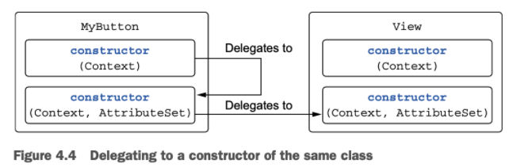

# 클래스 계층 정의

## 1. Kotlin Interface

- 추상 메소드뿐 아니라 구현이 있는 메소드도 정의 가능
- 프로퍼티 포함 가능 (기본적으로 final, public)
- getter, setter를 통한 필드는 들어갈 수 없음

```kotlin
interface Clickable {
	fun click()
}

class Button : Clickable {
	override fun click() = println("Clicked")
}

>> Button().click()
Clicked
```

- `click()`이라는 추상 메소드가 포함되어있는 인터페이스
    - 이 인터페이스를 구현하는 모든 클래스는 `click()`에 대한 구현을 제공해야 함
- Java와 마찬가지로 클래스는 인터페이스를 원하는 만큼 구현할 수 있지만, 클래스는 오직 하나만 확장할 수 있다.

```kotlin
interface Clickable {
	fun click()
	fun showOff() = println("Clickable")
}

interface Focusable {
	fun showOff() = println("Focusable")
}
```

- 디폴트 구현을 제공할 수 있음
    - Java와는 달리 메소드 앞에 `default`를 붙이지 않아도 됨
    - 디폴트 구현을 사용할 경우 구현하는 클래스에서 새로운 동작을 정의할 수도 있고, 정의를 생략할 수도 있음

- 한 클래스에서 두 인터페이스를 함께 구현하고 `click()`을 함께 구현하면 어느쪽도 호출되지 않고 컴파일 에러를 발생시킴

```kotlin
// 상속한 인터페이스의 메소드를 모두 구현해야 할 경우
class Button : Clickable, Focusable {
	override fun click() = println("Clicked")

	override fun showOff() {
		super<Clickable>.showOff()
		super<Focusable>.showOff()
	}
}

// 상속한 인터페이스 중 하나만 구현해도 될 경우
override fun showOff() = super<Clickable>.showOff()
```

## 2. open, final, absract 변경자: 기본적으로 final

- Java에서 기본적으로 클래스와 메소드는 상속에 대해 열려있지만,
    - Kotlin의 클래스와 메소드는 기본적으로 `final`이다.
- 어떤 클래스의 상속을 허용하기 위해서는 클래스 앞에 `open`을 붙여야 함
    - override 하고싶은 메소드나 프로퍼티에도 `open`을 붙여야 함

```kotlin
open class RichButton: : Clickable {
	fun disable() { }
	open fun animate() { }
	override fun click() { }
}
```

- `RichButton` 클래스는 다른 클래스에서 상속 가능하다
- `disable()` 메소드는 `final`이다.
    - 하위 클래스에서 override 할 수 없다.
- `animate()` 메소드는 다른 클래스에서 상속 가능한 메소드이다.
- `click()` 메소드는 상위 클래스에서 override한 메소드이다
    - override한 메소드는 기본적으로 `open`이다.
    - 다른 클래스에서 상속을 못하게 막기 위해서는 `final`을 명시한다.
        
        ```kotlin
        final override fun click() { }
        ```
        

- abstract로 선언된 추상 클래스는 인스턴스화 할 수 없다.
- 구현이 없는 추상 멤버가 있기 때문에 반드시 하위 클래스에서 override해 구현해야 한다.
- 추상 멤버는 항상 `open` 상태이다. 즉, 추상 멤버 앞에 `open`을 명시할 필요가 없다.

```kotlin
abstract class Animated {
	abstract fun animate()
	open fun stopAnimating() { }
	fun animateTwice() { }
}
```

- `Animated`에 대한 인스턴스를 만들 수 없다.
- `animate()` 메소드는 추상 함수이다.
    - 바디를 갖지 않고 반드시 하위 클래스에서 override해 바디를 구현해야 한다.
- `stopAnimating()`과 `animateTwice()`는 추상 멤버함수가 아니기 때문에 기본적으로 `final`이다.
    - 원한다면 `open`으로 override를 허용할 수 있다.

## 3. 가시성 변경자 : 기본적으로 public

- 코드 기반에 있는 선언에 대한 클래스 외부 접근을 제어
- 어떤 클래스의 구현에 대한 접근을 제어함으로써 그 클래스에 의존하는 외부 코드를 깨지 않고도 클래스 내부 구현을 변경할 수 있음
- Kotlin에서의 기본 가시성은 `public`
- 패키지 전용 가시성에 대한 대안으로 `internal` 도입
    - 모듈 내부에서만 볼 수 있음

```kotlin
internal open class TalkativeButton : Focusable {
	private fun yell() = println("Hey!)
	protected fun whisper() = println("Let's talk")
}

fun TalkativeButton.giveSpeech() {
	yell()
	whisper()
}
```

- `public`한 `giveSpeech()` 멤버가 그보다 가시성이 낮은 `TalkativeButton`을 참조하지 못함
    - 컴파일 오류 발생
- 클래스 혹은 메소드에서 참조를 허용하게 하기 위해선느 자신의 가시성과 같거나 더 높아야 한다.

- `giveSpeech()`가 참조하기 위해서는
    1. `giveSpeech()`의 가시성을 `internal`로 변경
    2. `TalkativeButton`의 가시성을 `public`으로 변경

## 4. 내부 클래스와 중첩된 클래스: 기본적으로 중첩 클래스

- Kotlin의 Nested class는 명시적으로 요청하지 않는 한 바깥 클래스 인스턴스에 대한 접근 권한이 없다.
- Java에서 다른 클래스 안에 정의한 클래스는 자동으로 Inner class이다.
- Kotlin의 Nested class에 아무런 변경자가 붙지 않으면 Java의 static nested class와 동일하다.
    - 바깥쪽 클래스에 대한 참조를 포함하고 싶다면 `inner` 변경자를 붙여야 한다.

```kotlin
interface State: Serializable

interface View {
	fun getCurrentState(): State
	fun restoreState(state: State) { }
}

class Button : View {
	override fun getCurrentState(): State = ButtonState()
	override fun restoreState(state: State) { /*..*/ }
	
	class ButtonState : State { /*..*/ }  // Button에 대한 멤버를 참조할 수 없음
}
```

- nested class 안에는 바깥쪽 클래스에 대한 참조가 없지만 inner class에는 있다.
    - 내부 클래스 Inner 안에서 바깥쪽 클래스 Outer의 참조에 접근하려면 this@Outer라고 써야 한다.
        
        ```kotlin
        class Outer {
        	inner class Inner {
        		fun getOuterReference(): Outer = this@Outer
        	}
        }
        ```
        

## 5. 봉인 클래스: 클래스 계층 정의 시 계층 확장 제한

```kotlin
interface Expr

class Num(val value: Int) : Expr
class Sum(val left: Expr, val right: Expr) : Expr

fun eval(e: Expr): Int = 
	when (e) {
		is Num -> e.value
		is Sum -> eval(e.right) + eval(e.left)
		else -> throw IllegalArgumentException
	}
}
```

- Kotlin 컴파일러는 when을 사용해 타입의 값을 검사할 때 else 분기를 반드시 포함해야 한다.
- 디폴트 else 분기가 없으면 이런 클래스 계층에서 새로운 하위 클래스를 추가하더라도 컴파일러가 when이 모든 분기를 처리하는지 제대로 검사할 수 없다.
- 새로운 클래스 처리를 잊어버리면 디폴트 분기로 처리되기 때문에 심각한 버그가 발생할 수 있다.
- 이러한 문제의 해결책으로 `sealed class`를 사용할 수 있다.
- 상위 클래스에 `sealed` 변경자를 붙이면 상위 클래스를 상속한 하위 클래스 정의를 제한할 수 있다.
    - 하위 클래스를 정의할 때는 반드시 상위 클래스 안에 중첩시켜야 한다.

```kotlin
sealed class Expr {
	class Num(val value: Int) : Expr()
	class Sum(val left: Expr, val right: Expr) : Expr()
}

fun eval(e: Expr): Int = 
	when (e) {
		is Num -> e.value
		is Sum -> eval(e.right) + eval(e.left)
	}
}
```

- when식이 모든 하위 클래스를 검사하기 때문에 else 분기처리가 없어도 된다.
- `sealed`로 표시된 클래스는 항상 `open`이다. (별도로 `open`을 붙일 필요가 없다.)
- `sealed class`는 클래스 외부에 자신을 상속한 클래스르 둘 수 없다.
- 내부적으로 `Expr` 클래스는 `private` 생성자를 가진다.
    - 항상 클래스 내부에서만 호출할 수 있다.

# 뻔하지 않은 생성자와 프로퍼티를 갖는 클래스 선언

- Kotlin은 주 생성자(primary constructor)와 부 생성자(secondary constructor)를 구분한다.
- Kotlin은 초기화 블록(init block)을 통해 초기화 로직을 추가할 수 있다.

## 1. 클래스 초기화: 주 생성자와 초기화 블록

```kotlin
class User(val nickname: String)
```

- 괄호로 둘러싸인 코드를 주 생성자라고 부른다.
- 주 생성자의 목적
    1. 생성자 파라미터 지정
    2. 생성자 파라미터에 의해 초기화되는 프로퍼티를 정의

```kotlin
class User constructor(_nickname: String) {
	val nickname: String

	init {
		nickname = _nickname
	}
}
```

- `constructor`는 주 생성자나 부 생성자를 정의할 때 사용
- `init`은 클래스의 객체가 만들어질 때 실행될 초기화 코드가 들어감
    - 주 생성자와 함께 사용됨
    - 주 생성자는 제한적이기 때문에 별도의 코드를 포함할 수 없으므로 `init block`이 필요
    - 필요에 따라 여러 `init block`을 선언할 수도 있음

```kotlin
class User(_nickame: String) {
	val nickname = _nickname
}
```

- `nickname` 프로퍼티를 주 생성자 파라미터인 `_nickname`으로 초기화

```kotlin
class User(val nickname: String, val isSubscribed: Boolean = true)

>> val hyun = User("현석")
>> println(hyun.isSubscribed)
true
```

- 주 생성자와 초기화 블록을 `val`을 통해 간략히 쓸수 있다.
- 생성자 파라미터에 대한 디폴트 값을 제공한다.

```kotlin
open class User(val nickname: String) { ... }

class TwitterUser(nickname: String) : User(nickname) { ... }
```

- 클래스에 기반 클래스가 있다면 주 생성자에 기반 클래스의 생성자를 호출해야 한다.

```kotlin
open class Button

interface ClickListener {
	fun onClick() { }
}

class RadioButton : Button(), ClickListener
```

- Button에는 인자가 없는 디폴트 생성자가 만들어진다.
- Button의 생성자는 아무 인자도 받지 않지만, Button을 상속한 하위 클래스는 반드시 Button의 생성자를 호출해야 한다.
    - 그렇기 때문에 빈 괄호가 들어가는 것
- 인터페이스의 경우 생성자가 없기 때문에 해당 인터페이스를 구현하는 클래스에서 괄호가 들어가지 않음

```kotlin
class Secretive private constructor() { }
```

- 클래스 외부에서 인스턴스화 하지 못하게 막기 위해 생성자를 `private`로 지정할 수 있음
    - 주 생성자는 `private`이다.

### 비공개 생성자를 쓰는 이유

- Util 함수를 담아두는 역할만 하는 클래스는 인스턴스화 할 이유가 없다.
- 또한, Singleton한 클래스는 특정한 생성 방법을 통해서만 객체를 생성해야 한다.
- Java에서는 `private`을 통해 해당 클래스를 다른 곳에서 인스턴스화 하지 못하게 막을 수 있다.
- Kotlin에서는 언어 자체에서 지원한다.
    - 최상위 함수 또는 object를 통해 사용할 수 있다.

## 2. 부 생성자: 상위 클래스를 다른 방식으로 초기화

```kotlin
open class View {
	constructor(context: Context) {
		...
	}

	constructor(context: Context, attr: AttributeSet) {
		...
	}
}
```

- 주 생성자 없이 부 생성자 2개가 있는 View 클래스
- 필요에 따라 부 생성자를 여러개 만들 수 있다.
- 클래스를 확장하면서 똑같이 부 생성자를 정의할 수 있다.
    
    ```kotlin
    class MyButton : View() {
    	constructor(context: Context): super(context) {
    		..
    	}
    
    	constructor(context: Context, attr: AttributeSet): super(context, attr) {
    
    	}
    }
    ```
    
    - `super`를 통해 상위 클래스의 생성자를 호출
    - MyButton의 생성자가 상위 클래스인 View에게 객체 생성을 위임
- `this`를 통해 클래스 자신의 다른 생성자를 호출할 수 있음
    
    ```kotlin
    class MyButton : View() {
    	constructor(context: Context): this(context, MY_STYLE) {
    		..
    	}
    
    	constructor(context: Context, attr: AttributeSet): super(context, attr) {
    
    	}
    }
    ```
    
    
    
    - 파라미터의 디폴트 값을 넘겨 같은 클래스의 두번째 생성자에게 생성을 위임

- 클래스에 주 생성자가 없다면 모든 부 생성자는 반드시 상위 클래스를 초기화하거나 다른 생성자에게 생성을 위임해야 함
- 부 생성자가 필요한 이유는 자바 상호운용성 때문이다.
    - 클래스 인스턴스를 생성할 때 파라미터 목록이 다른 생성 방법이 여럿 존재할 경우, 부 생성자가 여럿 필요하다.

## 3. 인터페이스에 선언된 프로퍼티 구현

```kotlin
// 추상 프로퍼티 선언이 들어있는 인터페이스
interface User {
	val nickname: String
}
```

- 인터페이스는 아무 상태도 포함할 수 없기 때문에 상태를 저장해야 한다면 인터페이스를 구현한 하위 클래스에 상태 저장을 위한 프로퍼티를 만들어야 함

```kotlin
class PrivateUser(override val nickname: String) : User

class SubscribingUser(val email: String) : User {
	override val nickname: String
		get() = email.substringBefore('@')
}

class FacebookUser(val accountId: Int) : User {
	override val nickname = getFacebookName(accountId)
}
```

- PrivateUser 클래스는 nickname을 저장하기만 함
    - 주 생성자 안에 프로퍼티를 직접 선언
- SubscribingUser 클래스는 nickname과 함께 이메일을 저장함
    - 커스텀 게터로 nickname 프로퍼티 설정
- FacebookUser 클래스는 accountId를 저장함
    - getFacebookName 메소드로 nickname을 초기화

- SubscribingUser와 FacebookUser 클래스의 가장 큰 차이점
    - SubscribingUser 클래스는 호출될 때마다 getter를 통해 substringBefore 호출하여 계산
    - FacebookUser 클래스는 객체 초기화 시점에 getFacebookName읕 통해 계산한 값을 필드에 저장했다가 불러오는 방식

## 4. getter와 setter에서 뒷받침하는 필드에 접근

```kotlin
class User(val name: String) {
	var address: String = "unspecified"
		set(value: String) {
			println("${field} -> ${value}")
			field = value
		}
}
```

- Kotlin에서 프로퍼티의 값을 바꿀 때 필드 설정 구문을 사용
    
    ```kotlin
    user.address = "new Value"
    ```
    
    - 내부적으로 address의 세터를 호출
- 클래스의 프로퍼티를 사용하는 쪽에서 프로퍼티를 읽거나 쓸 때, 뒷받침 필드의 유무는 관계 없다.
    - getter나 setter에서 field를 사용하는 프로퍼티에 대해 뒷받침하는 필드를 생성
    - field를 사용하지 않는 커스텀 접근자 구현 시 뒷받침 필드는 존재하지 않는다.
    

## 5. 접근자의 가시성 변경

- 접근자의 가시성은 기본적으로 프로퍼티의 가시성과 같음
    - 원한다면 get이나 set 앞에 가시성 변경자를 추가하여 접근자의 가시성을 변경할 수 있음

```kotlin
class LengthCounter {
	var counter: Int = 0  // 클래스 외부에서 counter 프로퍼티의 값을 변경할 수 없다.
		private set
	
	fun addWord(word: String) {
		counter += word.length
	}
}
```

---

# 컴파일러가 생성한 메서드: 데이터 클래스와 클래스 위임

- Java에서는 클래스가 equals, hashCode, toString 등의 메서드를 구현해야 한다.
- Kotlin 컴파일러는 이러한 메서드를 생성해준다.

## 1. 모든 클래스가 정의해야 하는 메서드

- Kotlin 클래스도 toString, equals, hashCode를 오버라이드 할 수 있다.

```kotlin
class Client(val name: String, val postalCode: Int)
```

### 문자열 표현: toString()

- 기본으로 제공되는 객체의 문자열 표현은 `Client@5ef923b6`과 같은데 기본 구현을 바꾸기 위해 `toString()`을 사용

```kotlin
class Client(val name: String, val postalCode: Int) {
	override fun toString() = "Client(name=$name, postalCode=$postalCode)"
}

>> val client = Client("Jaesung", 1123)
>> println(client)
Client(name="Jaesung", postalCode=1123)
```

### 객체의 동등성: equals()

- 서로 다른 두 객체가 내부에서 동일한 데이터를 포함하는 경우에는 두 객체를 동등하게 간주해야 하는 경우가 있음

```kotlin
>> val client1 = Client("A", 11)
>> val client2 = Client("A", 11)
>> println(client1 == client2)
false
```

- `==` 연산자는 객체의 참조 동일성을 검사하지 않고 객체의 동등성을 검사한다.
    - `==` 연산은 equals를 호출하는 식으로 컴파일 된다.

> Kotlin에서 객체를 비교하기 위해서는 `==` 연산자, 참조를 비교하기 위해서는 `===`을 사용한다.
> 

```kotlin
class Client(val name: String, val postalCode: Int) {
	overide fun equals(other: Any?): Boolean {
		if (other == null || other !is Client) return false
		return name == other.name && postalCode == other.postalCode
	}

	override fun toString() = "Client(name=$name, postalCode=$postalCode)"
}
```

### 해시 컨테이너: hashCode()

- Java에서는 equals를 오버라이드 할 때 반드시 hashCode도 함께 오버라이드 해야 함
    - 해시 코드가 다를 때 equals가 반환하는 값은 판단 결과에 영향을 끼치지 못함

```kotlin
class Client(val name: String, val postalCode: Int) {
	overide fun equals(other: Any?): Boolean {
		if (other == null || other !is Client) return false
		return name == other.name && postalCode == other.postalCode
	}

	override fun toString() = "Client(name=$name, postalCode=$postalCode)"

	override fun hashCode(): Int = name.hashCode() * 31 + postalCode
}
```

## 2. 데이터 클래스 : 모든 클래스가 정의해야 하는 메서드 자동 생성

- 어떤 클래스가 데이터를 저장하는 역할만 수행한다면 `toString()`, `equals()`, `hashCode()`를 반드시 오버라이드 해야한다.
- Kotlin은 `data class`로 만들면 함수들을 자동으로 만들어준다.

```kotlin
data class Client(val name: String, val postalCode: Int)
```

- 인스턴스간 비교를 위한 `equals()`
- HashMap과 같은 해시 기반 컨테이너에서 키로 사용할 수 있는 `hashCode()`
- 클래스의 각 필드를 선언 순서대로 표시하는 문자열 표현을 만드는 `toString()`

- `equals()` 나 `hashCode()` 는 주 생성자에 나열된 모든 프로퍼티를 고려하여 만들어진다.
    - 주 생성자 밖에 정의된 프로퍼티는 계산할 때 고려 대상이 아니다.

### 데이터 클래스의 불변성: copy() 메소드

- 데이터 클래스의 프로퍼티는 꼭 val일 필요 없다. var을 써도 된다.
- 하지만, 모든 프로퍼티를 읽기 전용으로 만들어 불변 클래스로 만들도록 권장한다.
- 데이터 클래스 객체를 키로 하는 값을 컨테이너에 담은 다음 키로 쓰인 데이터 객체의 프로퍼티를 변경하면 컨테이너의 상태가 잘못될 수 있다.
- 데이터 클래스 인스턴스를 불변 객체로 더 쉽게 활용할 수 있는 메소드이다.
- 복사본은 원본과 다른 생명주기를 갖고, 복사를 하면서 일부 프로퍼티 값을 바꾸거나 복사본을 제거해도 원본을 참조하는 다른 부분에 전혀 영향을 끼치지 않는다.

## 3. 클래스 위임: by 키워드 사용

- 대규모 객체지향 시스템에서 취약하게 만드는 문제는 보통 `구현 상속(implementation inheritance)`에 의해 발생한다.
    - 하위 클래스는 상위 클래스의 세부 구현 사항에 의존하게 된다.
    - 하위 클래스가 상위 클래스에 대해 갖고 있던 가정이 깨져 코드가 오작동하는 경우가 있다.
- 코틀린은 기본적으로 final로 취급해서 open 변경자를 보고 해당 클래스를 다른 클래스가 상속하리라 예상할 수 있다.
- 하지만 종종 상속을 허용하지 않는 클래스에 새로운 동작을 추가해야 할 때 `데코레이터(Decorator) 패턴`을 사용한다.
    - 상속을 허용하지 않는 클래스(기존 클래스) 대신 사용할 수 있는 새로운 클래스(데코레이터)를 만들되 기존 클래스와 같은 인터페이스를 데코레이터가 제공하게 만들고 기존 클래스를 데코레이터 내부에 필드로 유지하는 것이다.
    - 이때 새로 정의해야 하는 기능은 데코레이터의 메서드에 새로 정의하고 기존 기능이 그대로 필요한 부분은 데코레이터의 메서드가 기존 클래스의 메서드에게 요청을 전달한다.
    - 준비 코드가 많이 필요하다는 단점이 있다.

# object 키워드: 클래스 선언과 인스턴스 생성

- Kotlin에서는 object 키워드를 다양한 상황에서 사용하지만 정의와 동시에 인스턴스를 생성한다는 공통점이 존재

## 1. 객체 선언: 싱글톤 쉽게 만들기

- 객체 선언은 클래스 선언과 클래스에 속한 단일 인스턴스의 선언을 합친 선언
    - Ex. 급여 대장을 만든다고 한다면 여러 급여 대장이 필요하지 않으므로 싱글톤을 쓰는게 좋음

```kotlin
object Payroll {
	val allEmployees = arrayListOf<Person>()
	fun calculateSalary() {
		for (person in allEmployees) {
				..
		}
	}
}
```

- 객체 선언도 클래스나 인터페이스를 상속할 수 있음
- 클래스와 마찬가지로 객체 선언 안에도 프로퍼티, 메소드, 초기화 블록이 들어갈 수 있다.

## 2. 동반 객체: 팩토리 메소드와 정적 멤버가 들어갈 장소

- Kotlin은 static을 지원하지 않는 대신 패키지 수준의 최상위 함수와 객체 선언을 활용한다.
- 클래스 안에 정의된 객체 중 하나에 companion 키워드를 붙이면 그 클래스의 동반 객체를 만들 수 있다.

```kotlin
class A {
	companion object {
		fun bar() {
			println("~~")
		}
	}
}
>> A.bar()
~~
```

- 동반 객체는 클래스안에 정의된 일반 객체
    - 동반 객체는 자신을 둘러싼 클래스의 모든 private 멤버에 접근할 수 있다.
    - 동반 객체는 팩토리 패턴을 구현하기 가장 적합하다.