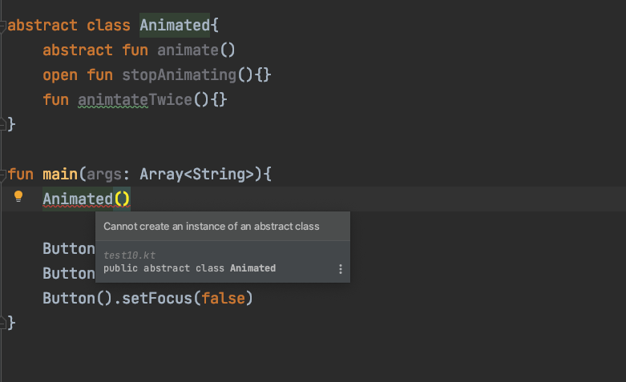
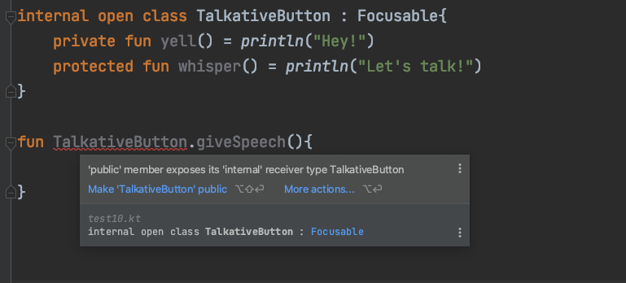
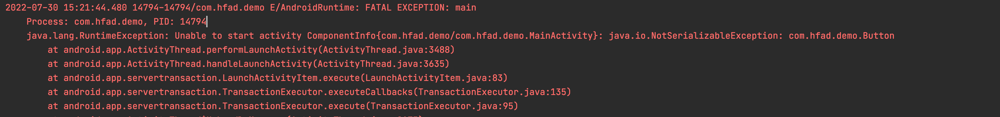

# 4장 클래스, 객체, 인터페이스

<aside>
💡 자바와 달리 인터페이스에 프로퍼티 선언이 들어갈 수 있다.

</aside>

<aside>
💡 자바와 달리 기본 선언이 final이며 public이다.

</aside>

<aside>
💡 중첩클래스는 기본적으로 내부 클래스가 아니다.

</aside>

<aside>
💡 코틀린 중첩 클래스에는 외부 클래스에 대한 참조가 없다.

</aside>

<aside>
💡 클래스를 data로 선언하면 컴파일러가 일부 표준 메소드를 생성해준다.

</aside>

<aside>
💡 코틀린 언어가 제공하는 위임(delegation)을 사용하면 위임을 처리하기 위한 준비 메소드를 직접 작성할 필요가 없다.

</aside>

<aside>
💡 싱글턴 클래스, 동반객체(companion object), 객체 식(object expression← 자바의 anonymous class )을 표현할 때 object 키워드를 쓴다.

</aside>

<aside>
💡 sealead 변경자는 클래스 상속을 제한한다.

</aside>

# 코틀린 인터페이스

```kotlin
interface Clickalble{
    fun click()
}

class Button : Clickalble {
    **override** fun click() = println("I was clicked")
}

fun main(args: Array<String>){
    Button().click()
}
```

```kotlin
interface Clickalble{
    fun click()
    fun showOff() =println("I'm clickable!")
}

interface Focusable {
    fun setFocus(b: Boolean) = println("i ${if (b) "got" else "lost"} focus.")
    fun showOff() =println("I'm focusable!")
}

class Button : Clickalble, Focusable {
    override fun click() =println("I was clicked")
    override fun showOff() {
        super<Clickalble>.showOff()
        super<Focusable>.showOff()
    }
}

fun main(args: Array<String>){
    Button().click()
    Button().showOff()
    Button().setFocus(false)
}
```

# 클래스 상속제어 변경자

open, final, abstract 변경자 : 기본적으로 final

final로 상속을 금지하지 않는 클래스에 경우 다른 클래스가 상속할 수 있지만, 취약한 기반 클래스(fragile base class) 문제가 생길 수 있다. 하위클래스가 기반 클래스에 대해 가졌던 가정이 기반 클래스를 변경함으로써 깨져버린 경우이다. 이 때문에 조슈아 블로크(Effective java 저자)는 “상속을 위한 설계와 문서를 갖추거나, 그럴 수 없다면 상속을 금지하라"는 조언을 한다. 코틀린은 그러한 철학을 따르고, 상속을 허용하는 클래스를 선언하려면 open 변경자를 붙혀야한다.(메소드나 프로퍼티에 대해서도 마찬가지로 open을 붙혀야 한다)

```kotlin
open class RichButton : Clickalble {
    fun disable(){} <-- 이 함수는 final이다. 하위 클래스가 이 메소드를 오버라이드 할 수 없다.
    open fun animate(){} <-- 이 함수는 열려있다. 하위 클래스에서 이 메소드를 오버라이드 할 수 있다.
    override fun click() {} <-- 이 함수는 (상위클래스에서 선언된) 열려있는 메소드를 오버라이드한다. 오버라이드한 메소드는 기본적으로 열려있다.
}
```

```kotlin
open class RichButton : Clickalble {
    fun disable(){}
    open fun animate(){}
    **final** override fun click() {} <-- 하위클래스가 오버라이드 못하게하려면 final을 붙힌다.
}
```

자바처럼 코틀린에서도 클래스를 abstract로 선언할 수 있다. **abstract로 선언한 추상 클래스는 인스턴스화할수 없다.**



추상 클래스에는 구현이 없는 추상 멤버가 있기 때문에 하위 클래스에서 그 추상 멤버를 오버라이드해야만 한다. 추상 멤버는 항상 열려있다. 따라서 open 변경자를 명시할 필요 없다.

### 클래스 내에서 상속 제어 변경자의 의미

| 변경자 | 이 변경자 붙은 멤버는 | 설명 |
| --- | --- | --- |
| final | 오버라이드 X | 클래스 멤버의 기본 변경자이다. |
| open | 오버라이드 O | 반드시 open을 명시해야 오버라이드 할 수 있다. |
| abstract | 반드시 오버라이드 해야함 | 추상 클래스의 멤버에만 이 변경자를 붙일 수 있다. 추상 멤버에는 구현이 있으면 안된다. |
| override | 상위 클래스나 상위 인스턴스의 멤버를 오버라이드하는중 | 오버라이드하는 멤버는 기본적으로 열려있다. 하위 클래스의 오버라이드를 금지하려면 final을 명시해야 한다. |

# 클래스 가시성 변경자

자바와 같은 public, protected, private 변경자가 있고, 기본 가시성은 public이다. 코틀린은 자바와 달리 package-private를 네임스페이스를 관리하기 위한 용도로만 사용해 가시성 제어에 사용하지 않는다. 패키지 전용 가시성에 대한 대안으로 코틀린에는 internal이라는 새로운 가시성 변경자를 도입했다.

→ 우리말로는 모듈 내부라고 번역하며, 모듈 내부에서만 볼 수 있다는 의미이다.

→ 모듈은 한번에 한꺼번에 컴파일되는 코틀린 파일들을 의미한다.

| 변경자 | 클새스 멤버 | 최상위 선언 |
| --- | --- | --- |
| public(기본 가시성) | 모든 곳에서 볼 수 있다. | 모든 곳에서 볼 수 있다. |
| internal | 같은 모듈 안에서만 볼 수 있다. | 같은 모듈 안에서만 볼 수 있다. |
| protected | 하위 클래스 안에서만 볼 수 있다. | (최상위 선언에 적용할 수 없음) |
| private | 같은 클래스 안에서만 볼 수 있다. | 같은 파일 안에서만 볼 수 있다. |



public 멤버가 자신의 internal 수신 타입인 TalkativeButton을 노출하여 error가 발생했다. giveSpeech 확장함수의 가시성을 internal로 바꾸거나 TalkativeButton 클래스의 가시성을 public으로 바꿔야 한다.

코틀린과 자바 가시성 규칙의 또 다른 차이는 코틀린에서는 외부 클래스가 내부 클래스나 중첩된 클래스의 private 멤버에 접근할 수 없다는 점이다. 내부 클래스와 중첩된 클래스의 예를 통해 알 수 있다.

### 중첩클래스

자바와의 차이는 코틀린의 중첩 클래스(nested class)는 명시적으로 요청하지 않는 한 바깥쪽 클래스 인스턴스에 대한 접근 권한이 없다.

```java
public class Button implements View{
    @NonNull
    @Override
    public State getCurrentState() {
        return new ButtonState();
    }

    @Override
    public void restoreState(@NonNull State state) {

    }

    public class ButtonState implements State{

    }
}
```

```kotlin
interface State : Serializable

interface View {
    fun getCurrentState(): State
    fun restoreState(state: State){}
}

class MainActivity : AppCompatActivity() {
    override fun onCreate(savedInstanceState: Bundle?) {
        super.onCreate(savedInstanceState)
        setContentView(R.layout.activity_main)

        val buttonState = Button().getCurrentState()
        var serializedState: ByteArray

        ByteArrayOutputStream().use{baos->
					ObjectOutputStream(baos).use{oos->
							oos.writeObject(buttonState)
                // serializedMember -> 직렬화된 member 객체
                serializedState = baos.toByteArray()
					}
        }
		}
}
```



자바에서 다른 클래스 안에 정의된 클래스는 자동으로 inner class가 되고, 바깥쪽 Button 클래스에 대한 참조를 포함한다. 이때, 그 참조가 직렬화를 방해한다. 따라서, ButtonState 클래스를 static으로 선언해야 한다. (참조가 사라진다)

```kotlin
public class Button implements View{
    @NonNull
    @Override
    public State getCurrentState() {
        return new ButtonState();
    }

    @Override
    public void restoreState(@NonNull State state) {

    }

    public static class ButtonState implements State{

    }
}
```

코틀린 중첩 클래스에 아무런 변경자가 붙지 않으면 자바 static 중첩 클래스와 같다. 이를 내부 클래스로 변경해서 바깥쪽 클래스에 대한 참조를 포함하게 만들고 싶다면 inner 변경자를 붙여야 한다.

**→ 코틀린에서는 중첩 클래스에 아무런 변경자가 붙지 않으면 자바 static 중첩 클래스와 같다.**

자바와 코틀린의 중첩 클래스와 내부 클래스의 관계

| 클래스 B 안에 정의된 클래스 A | 자바에서는 | 코틀린에서는 |
| --- | --- | --- |
| 중첩 클래스(바깥쪽 클래스에 대한 참조를 저장하지 않음) | static class A | class A |
| 내부 클래스(바깥쪽 클래스에 대한 참조를 저장함) | class A | inner class A |


```kotlin
class Outer{
    inner class Inner{
        fun getOuterReference(): Outer = this@Outer
    }
}
```

# 봉인된 클래스 : 클래스 계층 정의 시 계층 확장 제한

sealed 클래스는 그 상위 클래스를 상속한 하위 클래스 정의를 제한할 수 있다. sealed 클래스의 하위 클래스를 정의할 때는 반드시 상위 클래스 안에 중첩시켜야 한다. sealed 클래스를 사용함으로써 when 식에서 디폴트 분기(else 분기)가 필요없다.


# 프로퍼티를 갖는 클래스 선언

코틀린에는 주(primary) 생성자, 부(secondary) 생성자, 초기화 블록에 방법이 있다.

- 주 생성자는 클래스 이름 뒤에 괄호로 둘러싸 선언할 수 있다. 예) `class User(val nickname: String)`
    - 주 생성자는 생성자 파라미터를 지정하고, 그 생성자 파라미터에 의해 초기화되는 프로퍼티를 정의하는 두 가지 목적으로 쓰인다.

  예)

    ```kotlin
    class User_ constructor(_nickname: String){
        val nickname: String
        init {
            nickname = _nickname
        }
    }
    ```

    - constructor키워드는 주 생성자나 부 생성자를 정의할 때 사용한다.
    - init 키워드는 초기화 블록을 시작한다.

  다음과 같이 간단히 나타낼 수 있다. `class User__(val nickname: String)`

  여기서 val은 이 파라미터에 상응하는 프로퍼티가 생성된다는 뜻이다.

  **기반 클래스 생성자**

  클래스에 기반 클래스가 있다면 주 생성자에서 기반 클래스의 생성자를 호출해야할 필요가 있다.

  기반 클래스를 초기화하려면 기반 클래스 이름 뒤에 괄호를 치고 생성자 인자를 넘긴다.

    ```kotlin
    open class User(val nickname: String){
        fun getSettingName() = nickname
    }
    
    class TwitterUser(nickname: String) : User(nickname){}
    
    fun main(args: Array<String>) {
        val twitterUser = TwitterUser("ysp")
    		println(twitterUser.getSettingName())
    }
    ```

  반면, 인터페이스는 생성자가 없기 때문에 어떤 클래스가 인터페이스를 구현하는 경우 그 클래스의 상위 클래스 목록에 있는 인터페이스 이름 뒤에는 아무 괄호도 없다.


# 인터페이스에 선언된 프로퍼티 구현

코틀린에서는 인터페이스에 추상 프로퍼티 선언을 넣을 수 있다.

```kotlin
interface User{
    val nickname: String
}

class PrivateUser(override val nickname: String) : User3
class SubscribingUser(val email: String) : User3{
    override val nickname: String
        get() = email.substringBefore('@')
}
class FacebookUser(val accountId: Int) : User3{
    override val nickname: getFacebookName(accountId)
}
```

- 인터페이스에 있는 프로퍼티 선언에는 뒷받침하는 필드나 게터 등의 정보가 없다. 상태를 저장할 필요가 있다면 인터페이스를 구현한 하위 클래스에서 상태 저장을 위한 프로퍼티 등을 만들어야 한다.
- 인터페이스에는 추상 프로퍼티뿐 아니라 게터와 세터가 있는 프로퍼티를 선언할 수 있다.

```kotlin
interface User{
    val email: String
    val nickname: String
    get() = email.substringBefore('@')
}
```

User Interface를 구현하는 클래스는 추상프로퍼티 email을 반드시 오버라이드 해야하지만, nickname은 오버라이드 하지 않아도 된다.

# 데이터 클래스와 클래스 위임 (컴파일러가 생성한 메소드)

코틀린 컴파일러는 데이터 클래스에 유용한 메소드를 자동으로 만들어준다. 그리고 클래스 위임패턴을 간단하게 쓸 수 있다.

- 문자열 표현 : toString()
- 객체의 동등성 : equals()
- 해시 컨테이너 : hashCode() 가 있다.

대규모 객체지향 시스템을 설계할때 시스템을 취약하게 만드는 문제는 보통 구현 상속에 의해 발생한다. 상속을 허용하지 않으면서 클래스에 새로운 동작을 추가해야 할때가 있다. 이럴때 사용하는 일반적인 방법이 Decroator 패턴이다.

Decorator패턴의 핵심은 상속을 허용하지 않는 클래스(기존 클래스) 대신 사용할 수 있는 새로운 클래스(데코레이터)를 만들되 기존 클래스와 같은 인터페이스를 데코레이터가 제공하게 만들고, 기존 클래스를 데코레이터 내부에 필드로 유지하는 것이다. 데코레이터 패턴 예)

```java
public abstract class Beverage {
    String description = "no-name";

    public String getDescription(){
        return description;
    }
    public abstract double cost();
}

```

```java
public abstract class CondimentDecorator extends Beverage{
    public abstract String getDescription();
}

```

```java
public class Espresso extends Beverage{

    public Espresso(){
        description = "Espresso";
    }

    @Override
    public double cost() {
        return 1.99;
    }
}

```

```java
public class Mocha extends CondimentDecorator{
    Beverage beverage;

    public Mocha(Beverage beverage){
        this.beverage = beverage;
    }

    @Override
    public String getDescription() {
        return beverage.getDescription() + ", mocha";
    }

    @Override
    public double cost() {
        return .20 + beverage.cost();
    }
}

```

```java
public class StarbuzzCoffee {
    public static void main(String[] args) {
        Beverage beverage = new Espresso();
        beverage = new Mocha(beverage);
        System.out.println(beverage.getDescription() + " " + beverage.cost());
    }
}
```

### kotlin by 사용예

```kotlin
class CountingSet<T>(
    val innerSet: MutableCollection<T> = HashSet<T>()
) : MutableCollection<T> by innerSet {
    var objectsAdded = 0
    override fun add(element: T) : Boolean {
        objectsAdded++
        return innerSet.add(element)
    }
    override fun addAll(c:Collection<T>) : Boolean{
        objectsAdded += c.size
        return innerSet.addAll(c)
    }
}

fun main(args: Array<String>){
    val cast = CountingSet<Int>()
    cast.addAll(listOf(1, 1, 2))
		println("${cast.objectsAdded} objects were added, ${cast.size} remain")
}
```

# object 키워드 : 클래서 선언과 인스턴스 생성

코틀린에서 object 키워드를 사용하는 경우

- 객체 선언(object declaration)은 싱글턴을 정의하는 방법 중 하나다.
- 동반객체(companion object)는 인스턴스 메소드는 아니지만 어떤 클래스와 관련 있는 메소드와 팩토리 메소드를 담을 때 쓰인다. 동반 객체 메소드에 접근할 때는 동반 객체가 포함된 클래스의 이름을 사용할 수 있다.
- 객체 식은 자바의 무명 내부 클래스(annonymous inner class) 대신 쓰인다.

**코틀린에서는 객체 선언 기능을 통해 싱글턴을 기본 지원한다. 객체 선언은 클래스 선언과 그 클래스에 속한 단일 인스턴스의 선언을 합친 선언이다. 객체 선언은 object 키워드로 시작한다. 생성자는(주 생성자와 부 생성자 모두) 객체 선언에 쓸 수 없다.**

```kotlin
data class Person(val name: String, var salary:Float)

object Payroll {
    val allEmployees =arrayListOf<Person>()

    fun showSalary(){
        for (person in allEmployees){
						println(person.salary)
        }
    }
}

fun main(args: Array<String>){
    Payroll.allEmployees.add(Person("ysp", 3500.0f))
    Payroll.allEmployees.add(Person("abc", 3500.0f))
    Payroll.showSalary()
}
```

- 객체 선언도 클래스나 인터페이스를 상속할 수 있다.
- 클래스 안에서 객체를 선언할 수 있다. 그런 객체도 인스턴스는 단 하나 뿐이다.

```kotlin
data class Person2(val name: String){
    object NameComparator : Comparator<Person2>{
        override fun compare(o1: Person2, o2: Person2): Int =
            o1.name.compareTo(o2.name)
    }
}
```

# 동반 객체 : 팩토리 메소드와 정적 멤버가 들어갈 장소

코틀린 클래스 안에는 정적인 멤버가 없다. 코틀린 언어는 자바 static 키워드를 지원 않는다. 그 대신 코틀린에서는 **패키지 수준의 최상위 함수**(자바의 정적 메소드 역할을 거의 대신 할 수 있다)와 **객체 선언**(자바의 정적 메소드 역할 중 코틀린 최상위 함수가 대신할 수 없는 역할이나 정적 필드를 대신할 수 있다)을 활용한다. 클래스 내부 정보에 접근해야 하는 함수가 필요할 때는 클래스에 중첩된 객체 선언의 멤버 함수로 정의해야 한다. 그런 함수의 대표적인 예로 팩토리 메소드를 들 수 있다.

팩토리 메서드(팩토리 패턴)

- 생성자로 직접 객체를 생성하는 것이 아니라 메소드를 통해 객체를 생성한다.
- 객체를 만들어내는 부분을 서브클래스에 위함하는 패턴이라고도 정의한다.
- 객체를 만들어내는 팩토리를 만드는 패턴

클래스 안에 정의된 객체중 하나에 companion이라는 특별한 표시를 붙이면 그 클래스의 동반 객체로 만들 수 있다. 동반 객체의 프로퍼티나 메소드에 접근하려면 그 동반 객체가 정의된 클래스 이름을 사용한다.

동반 객체가 private 생성자를 호출하기 좋다. 동반 객체는 자신을 둘러싼 클래스의 모든 private 멤버에 접근할 수 있다. 따라서 동반 깨체는 바깥쪽 클래스의 private 생성자도 호출할 수 있다. 따라서 동반객체는 팩토리 패턴을 구현하기 가장 적합한 위치다.

- 동반 객체 안에 생성자를 호출하는 팩토리 메소드를 정의할 수 있는데, 이때 private인 생성자까지 호출할 수 있다.

```kotlin
class User private constructor(val nickname: String){
    companion object{
        fun newSubscribingUser(email:String) = User(email.substringBefore('@'))
        fun newFacebookUser(accountId: Int) = User(getFacebookName(accountId))
    }
}
```

# 동반 객체를 일반 객체처럼 사용

동반 객체는 클래스 안에 정의된 일반 객체다. 따라서 동반 객체에 이름을 붙이거나, 동반 객체가 인터페이스를 상속하거나, 동반 객체 안에 확장 함수와 프로퍼티를 정의할 수 있다.

```kotlin
class User private constructor(val nickname: String){
    companion object func{
        fun newSubscribingUser(email:String) = User(email.substringBefore('@'))
        fun newFacebookUser(accountId: Int) = User(getFacebookName(accountId))
    }
}

fun main(args:Array<String>){
    User.func.newFacebookUser(12)
}
```

```kotlin
interface JSONFactory<T>{
    fun fromJSON(jsonText: String): T
}

class Person(val name: String){
    companion object : JSONFactory<Person>{
        override fun fromJSON(jsonText: String): Person
        = ...
    }
}
```

# 동반객체 확장

보통 확장함수처럼 동반 객체도 확장함수를 만들 수 있다.

```kotlin
fun Person.Companion.fromJSON(json: String) : Person{
    ...
}
```

# 객체 식 : 무명 내부 클래스를 다른 방식으로 작성

object 키워드는 무명 객체를 정의할 때도 쓴다. 무명 객체는 자바의 무명 내부 클래스를 대신한다. 객체 선언과 달리 무명 객체는 싱글턴이 아니다. 객체 식이 쓰일 때마다 새로운 인스턴스가 생성된다. 객체선언과 유일한 차이는 객체 이름이 빠졌다는 점이다. 그 클래스나 인스턴스에 이름을 붙이지는 않는다.

무명 객체는 다음의 형식을 통해 만들 수 있다.

object : [인터페이스 명]{

[인터페이스에서 구현해야 하는 메소드]

}

```kotlin
interface ButtonClickListener{
    fun onButtonClicked();
}

class Button(private val buttonClickListener: ButtonClickListener){
    fun buttonClickCallback(){
        buttonClickListener.onButtonClicked()
    }
}

~~class PushButtonClickListener : ButtonClickListener{
    override fun onButtonClicked() =println("Button Click!")
}~~

fun main(args:Array<String>){
    Button(object : ButtonClickListener{
        override fun onButtonClicked() {
						println("Button Click!")
        }
    }).buttonClickCallback()
}
```