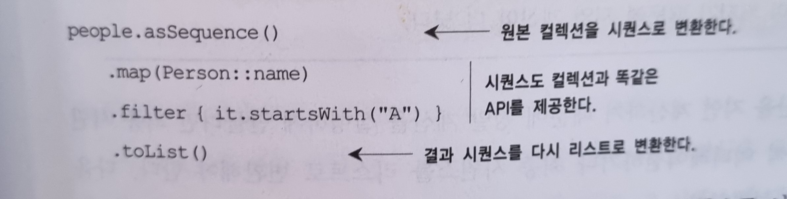
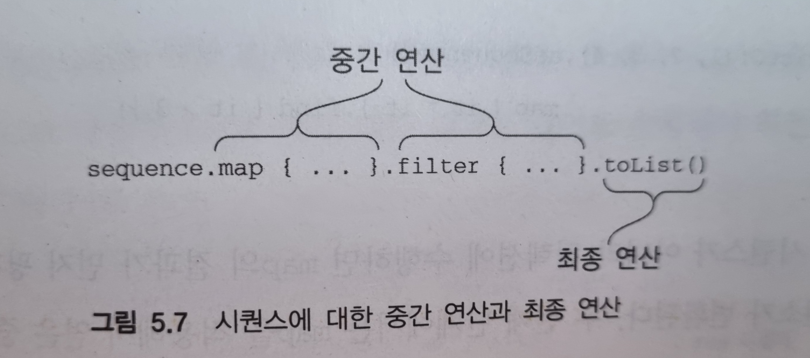
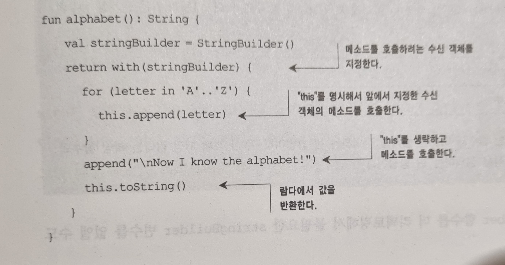

# 5장 람다로 프로그래밍

5장에서 다루는 내용

■ 람다 식과 멤버 참조

■ 함수형 스타일로 컬렉션 다루기

■ 시퀀스 : 지연 컬렉션 연산

■ 자바 함수형 인터페이스를 코틀린에서 사용

■ 수신 객체 지정람다 사용

람다 식 또는 람다는 기본적으로 다른 함수에 넘길 수 있는 작은 코드 조각을 뜻한다.

람다를 자주 사용하는 경우로 컬렉션 처리를 들 수 있다.

수신 객체 지정 람다는 특별한 람다로, 람다 선언을 둘러싸고 있는 환경과는 다른 상황에서 람다 본문을 실행할 수 있다.

“이벤트가 발생하면 이 핸들러를 실행하자”, 데이터 구조의 모든 원소에 이 연산을 적용하자”와 같은 동작을 코드로 표현하기 위해 자바에서는 무명 내부 클래스를 통해 이런 목적을 달성했다. 무명 내부 클래스를 사용하면 코드를 함수에 넘기거나 변수에 저장할 수 있기는 하지만 상당히 번거롭다.

↔ 이와 달리 함수형 프로그래밍에서는 함수를 값처럼 다루는 접근 방법을 택함으로써 이 문제를 해결한다. (클래스를 선언하고 그 클래스의 인스턴스를 함수에 넘기는 대신)

- **함수를 직접 다른 함수에 전달할 수 있다.**
- **람다 식을 사용하면 함수를 선언할 필요가 없고 코드 블록을 직접 함수의 인자로 전달할 수 있다.**

# 람다와 컬렉션

컬렉션을 다룰 때 수행하는 대부분의 작업은 몇 가지 일반적인 패턴에 속한다. 코틀린에서는 편리한 컬렉션 라이브러리를 제공한다.

컬렉션 기능을 직접 구현한 경우

```kotlin
data class Person(val name: String, val age: Int)

fun findTheOldest(people : List<Person>){
    var maxAge = 0
    var theOldest: Person? = null
    for(person in people){
      if(person.age > maxAge){
           maxAge = person.age
           theOldest = person
        }
    }
		println(theOldest)
}

fun main(args: Array<String>){
    val people=
listOf(Person("Alice", 29), 
Person("Bob", 31))
		findTheOldest(people)
}
```

람다를 사용해 컬렉션 검색하기

```kotlin
fun main(args: Array<String>){
    val people=
listOf(Person("Alice", 29), Person("Bob", 31))
println(people.maxByOrNull{it.age})
}
```

이 코드는 컬렉션의 원소를 인자로 받아서 (it이 그 인자를 가리킨다) 비교에 사용할 값을 반환한다. 여기서는 Person 객체가 컬렉션의 원소이다. 이 함수가 반환하는 값은 Person 객체의 age 필드에 저장된 나이 정보이다. → 단지 함수나 프로퍼티를 반환하는 역할을 수행하는 람다는 멤버 참조로 대치할 수 있다.

```kotlin
fun main(args: Array<String>){
    val people=
listOf(Person("Alice", 29), Person("Bob", 31))
		println(people.maxByOrNull{ it.age})
		println(people.maxByOrNull(Person::age))
}
```

# 람다 식의 문법

람다는 값처럼 여기저기 전달할 수 있는 동작의 모음이다. 람다를 따로 선언해서 변수에 저장할 수도 있다.

```kotlin
val multi={x: Int, y:Int->x * y}
println(multi(10,20))
```

하지만 maxByOrNull처럼 함수에 인자로 넘기면서 바로 람다를 정의하는 경우가 대부분이다.

람다 식을 선언하기 위한 문법은 다음과 같다.

- 코틀린 람다 식은 항상 중괄호로 둘러싸여 있다.
- 인자 목록 주변에 괄호가 없다.
- 화살표 →가 인자 목록과 람다 본문을 구분해준다.

**`{**   *println*(42) **}**()` 원한다면 람다 식을 직접 호출해도 된다. 하지만 이와 같은 구문은 읽기 어렵고 그다지 쓸모도 없다. 굳이 람다를 만들자마자 바로 호출하느니 람다 본문을 직접 실행하는 편이 낫다. 이렇게 **코드의 일부분을 블록으로 둘러싸 실행할 필요가 있다면 run을 사용**한다. run은 인자로 받은 람다를 실행해주는 라이브러리 함수이다. 그리고 그 람다결과를 반환해준다.

```kotlin
fun lambda_run(){
    val a = 10
    var skills = "kotlin"
		println(skills)
    skills = run{v
al level = "kotlin level : $a"
    level
	}
	println(skills)
}

fun main(args: Array<String>){
	lambda_run()
}
```

람다를 사용함에 있어 구분자가 많이 쓰여 가독성이 떨어지는 경우, 컴파일러가 문맥으로부터 유추할 수 있는 인자 타입을 굳이 적을 필요가 없다. 인자가 단 하나뿐인 경우 굳이 인자에 이름을 붙이지 않아도 된다.

```kotlin
val people =listOf(Person("Alice", 29), Person("Bob", 31))
println(people.maxByOrNull({p: Person->p.age}))
```

위 람다 사용에 있어 첫번째 개선사항은 중괄호이다. 코틀린에는 함수 호출 시 맨 뒤에 있는 인자가 람다 식이라면 그 람다를 괄호 밖으로 빼낼 수 있다.

*`println*(people.*maxByOrNull*() **{** p:Person **->** p.age  **}**)`

이 코드는 람다가 유일한 인자며 마지막 인자이기도 하다. 따라서 괄호 뒤에 람다를 둘 수 있다.

두번째 개선사항은 어떤 함수의 유일한 인자이고 괄호 뒤에 람다를 썼다면 호출 시 빈 괄호를 없애도 된다.

*`println*(people.*maxByOrNull* **{** p: Person **->** p.age **}**)`

### 람다 파라미터 타입 제거하기

로컬 변수처럼 컴파일러는 람다 파라미터의 타입도 추론할 수 있다. 따라서 파라미터 타입을 명시할 필요가 없다. maxByOrNull 함수의 경우 파라미터의 타입은 항상 컬렉션 원소 타입과 같다. 컴파일러는 Person 타입의 객체가 들어있는 컬렉션에 대해 maxByOrNull를 호출한다는 사실을 알고 있으므로 람다의 파라미터도 Person이라는 사실을 알 수 있다.

*`println*(people.*maxByOrNull***{** p **->** p.age**}**)`

마지막으로 람다의 파라미터 이름을 디폴트 이름인 it으로 바꾸면 람다 식을 더 간단하게 만들 수 있다.

*`println*(people.*maxByOrNull* **{ it**.age **}**)`

(람다 파라미터 이름을 따로 지정하지 않은 경우메나 it이라는 이름이 자동으로 만들어 진다)

<aside>
📖 람다 안에 람다가 중첩되는 경우 각 람다의 파라미터를 명시하는 편이 낫다. 파라미터를 명시하지 않으면 각각의 it이 가리키는 파라미터가 어떤 람다에 속했는지 파악하기 어려울 수 있다.

<aside>
📖 문맥에서 람다 파라미터의 의미나 파라미터의 타입을 쉽게 알 수 없는 경우에도 파라미터를 명시적으로 선언하면 도움이 된다.

</aside>

</aside>

<aside>
📖 람다를 변수에 저장할때는 파라미터의 타입을 추론할 문맥이 존재하지 않는다. 따라서 파라미터 타입을 명시해야 한다.

```kotlin
val getAge ={p: Person->p.age}
println(people.maxByOrNull(getAge))
```

</aside>

<aside>
👇 람다 식은 꼭 한 줄로 이뤄지지 않았다. 본문이 여러 줄로 이뤄진 경우 본문의 맨 마지막에 있는 식이 람다의 결과 값이 된다.

```kotlin
val sum ={x: Int, y: Int->
println("Computing the sum of $x and $y...")
    x + y
}
println(sum(1, 2))
```

</aside>

### 인텔리J 아이디어 사용시 유용한 팁

코드를 하나의 호출 형식에서 다른 호출 형식으로 바꾸고 싶으면

1. 람다 식을 괄호 밖으로 이동하기(Move lambda expression out of paremthese) 메뉴 선택
2. 람다 식을 괄호 안으로 이동하기(Move labmda expression into parentheses) 메뉴 선택

# 현재 영역에 있는 변수에 접근

람다를 함수 안에서 정의하면 함수의 파라미터뿐 아니라 람다 정의의 앞에 선언된 로컬 변수까지 람다에서 모두 사용할 수 있다. forEach 표준함수를 예로 들 수 있다.(forEach는 컬렉션의 모든 원소에 대해 람다를 호출해준다)

```kotlin
fun printMessageWithPrefix(message: Collection<String>, prefix: String){
    message.forEach{
				println("$prefix $it")
		}
}

fun main(args: Array<String>){
    val errors =listOf("403 Forbidden", "404 not Found")
		printMessageWithPrefix(errors, "Errors:")
}
```

<aside>
🔸 자바와 다른 점중 중요한 한 가지는 코틀린 람다 안에서는 파이널 변수가 아닌 변수에 접근할 수 있다! 또한 람다안에서 바깥의 변수를 변경해도 된다.

</aside>

```kotlin
fun printProblemCounts(response: Collection<String>){
    var clientErrors = 0
    var serverErrors = 0
    response.forEach{
				if(it.startsWith("4")){
            clientErrors++
        }else if(it.startsWith("5")){
            serverErrors++
				}
			}
			println("$clientErrors client errors, $serverErrors server errors")
}

fun main(args: Array<String>){
    val response =listOf("200 OK", "418 I'm a teapot",
        "500 Internal Server Error")
		printProblemCounts(response)
}
```

<aside>
⬆️ prefix, clientErrors, serverErrors와 같이 람다 안에서 사용하는 외부 변수를 ‘람다가 포획(capture)한 변수’라고 한다.

<aside>
🔸 기본적으로 함수 안에 정의된 로컬 변수의 생명주기는 함수가 반환되면 끝난다. 하지만 어떤 함수가 자신의 로컬 변수를 포획한 람다를 반환하거나 다른 변수에 저장한다면 로컬 변수의 생명주기와 함수의 생명주기가 달라질 수 있다. → 포획한 변수가 있는 람다를 저장해서 함수가 끝난 뒤에 실행해도 람다의 본문 코드는 여전히 포획한 변수를 읽거나 쓸 수 있다.

</aside>

<aside>
🔸 파이널 변수를 포획한 경우에는 람다 코드를 변수 값과 함께 저장한다.

</aside>

<aside>
🔸 파이널이 아닌 변수를 포획한 경우에는 변수를 특별한 래퍼로 감싸서 나중에 변경하거나 읽을 수 있게 한 다음, 래퍼에 대한 참조를 람다 코드와 함께 저장한다.

</aside>

</aside>

<aside>
📖 클로저 :

</aside>

# 멤버 참조

코틀린에서는 자바8과 마찬가지로 함수를 값으로 바꿀 수 있다 이때 이중 클론(::)을 사용한다.

<aside>
➡️ ::를 사용하는 식을 멤버 참조(member reference)라고 부른다. 멤버 참조는 프로퍼티나 메소드를 단 하나만 호출하는 함수 값을 만들어준다.

<aside>
🔸 ::는 클래스 이름과 참조하려는 멤버(프로퍼티나 메소드) 이름 사이에 위치한다.

</aside>

<aside>
🔸 Person::age는 다음 람다 식 val getAge = {person: Person → person.age} 더 간략하게 표현한 것이다.

</aside>

<aside>
🔸 참조 대상이 함수인지 프로퍼티인지와는 관계없이 멤버 참조 뒤에는 괄호를 넣으면 안된다.

</aside>

<aside>
🔸 멤버 참조는 그 멤버를 호출하는 람다와 같은 타입이다.

```kotlin
println(people.maxByOrNull(Person::age))
println(people.maxByOrNull{p->p.age})
println(people.maxByOrNull{ it.age})
```

</aside>

<aside>
🔸 최상위에 선언된(그리고 다른 클래스의 멤버가 아닌) 함수나 프로퍼티를 참조할 수도 있다.

</aside>

</aside>

# 컬렉션 함수형 API

### 필수적인 함수 : filter와 map

filter와 map은 컬렉션을 활용할 때 기반이 되는 함수다. 대부분의 컬렉션 연산을 이 두 함수를 통해 표현 할 수 있다.

```kotlin
val list_s =listOf(1, 2, 3, 4)
println(list_s.filter{ it% 2 == 0})
```

<aside>
⬆️ filter 함수(필터 함수 또는 걸러내는 함수라고 부름)는 컬렉션을 이터레이션하면서 주어진 람다에 각 원소를 넘겨서 람다가 true를 반환하는 원소만 모은다.

<aside>
🔸 결과는 입력 컬렉션의 원소 중에서 주어진 술어(참/거짓을 반환하는 함수를 술어predicate라고 한다)를 만족하는 원소만으로 이뤄진 새로운 컬렉션이다.

```kotlin
val people_s =listOf(Person("Alice", 29), Person("Bob", 31))
println(people_s.filter{ it.age > 30})
```

</aside>

<aside>
🔸 filter는 원소를 변환할 수 없다. 원소를 변환하려면 map 함수를 사용해야 한다.

</aside>

</aside>

<aside>
⬆️ map 함수는 주어진 람다를 컬렉션의 각 원소에 적용한 결과를 모아서 새 컬렉션을 만든다.

<aside>
🔸 다음과 같이 하면 숫자로 이뤄진 리스트를 각 숫자의 제곱이 모인 리스트로 바꿀 수 있다.

```kotlin
val list = listOf(1, 2, 3, 4)
println(list.map{ it*it })
```

</aside>

<aside>
🔸 아래 코드에서 사람의 리스트가 아니라 이름의 리스트를 출력하고 싶다면 map으로 사람의 리스트를 이름의 리스트로 변환하면 된다.

```kotlin
val people_s =listOf(Person("Alice", 29), Person("Bob", 31))

println(people_s.map{it.name})
```

</aside>

<aside>
🔸 위 코드를 멤버 참조를 사용해 같은 결과를 얻을 수 있다.

```kotlin
*println*(people_s.*map*(Person::name))
```

</aside>

<aside>
🔸 filter와 map을 사용해 다음 결과를 얻을 수 있다.

```kotlin
*println*(people_s.*filter* **{ it**.age > 30 **}**.*map*(Person::name))
```

</aside>

</aside>

<aside>
🔸 가장 나이 많은 사람의 이름을 구하는 코드

- 먼저 목록에 있는 사람들의 나이의 최댓값을 구한다.
- 나이가 그 최댓값과 같은 모든 사람을 반환하면 된다.
</aside>

```kotlin
class Book(val title: String, val authors: List<String>)

fun main(args: Array<String>){
    val books = listOf(Book("Thursday Next", listOf("Jasper Eforde")),
        Book("Mort", listOf("Terry Pratchett")),
        Book("Good Owens", listOf("Terry Pratchett", "Neil Gaiman")))

    println(books.flatMap { it.authors }.toSet())
}
```

위 코드에서 book.authors 프로퍼티는 작가를 모아둔 컬렉션이다. flatMap 함수는 모든 책의 작가를 평평한(문자열만으로 이뤄진) 리스트 하나로 모은다.

toSet은 flatMap의 결과 리스트에서 중복을 없애고 집합으로 만든다. 따라서 최종 출력에서는 Terry Pratchett를 한번만 볼 수 있다.

리스트의 리스트가 있는데, 모든 중첩된 리스트의 원소를 한 리스트로 모아야 한다면 flatMap을 떠올릴 수 있다. 하지만 특별히 반환해야 할 내용이 없다면 리스트의 리스트를 평평하게 펼치기만 하면 된다. 그런 경우 **listOfLists.faltten()처럼 flatten 함수를 사용할 수 있다.**

# 지연계산(lazy) 컬렉션 연산

컬렉션 연산을 연쇄 실행하는 여러가지 방법

map이나 filter와 같은 컬렉션 함수는 결과 컬렉션을 즉시 생성한다. 이는 컬력션 함수를 연쇄하면 매 단계마다 계산 중간 결과를 새로운 컬렉션에 임시로 담는다는 말이다. 시퀀스를 사용하면 중간 임시 컬렉션을 사용하지 않고도 컬렉션 연산을 연쇄할 수 있다.

코틀린 표준 라이브러리 참조 문서에는 filter와 map이 리스트를 반환한다고 써 있다. 연쇄호출이 리스트를 2개 만든다는 뜻으로 원소가 수백만 개가 되면 훨씬 더 효율이 떨어진다.

<aside>
➡️ 이를 더 효율적으로 만들기 위해서는 각 연산이 컬렉션을 직접 사용하는 대신 시퀀스(sequnce)를 사용하게 만들어야 한다.



```kotlin
val people = listOf(Person("Alice", 29), Person("Bob", 31), Person("Ally", 25))
println(people.map(Person::name).filter{it.startsWith("A")})
```

```kotlin
val people = listOf(Person("Alice", 29), Person("Bob", 31), Person("Ally", 25))

println("Sequence "+people.asSequence().map(Person::name).filter{ it.startsWith("A")}.toList())
```

</aside>

코틀린 지연 계산 시퀀스는 Sequence 인터페이스에서 시작한다. 이 인터페이스는 단지 한 번에 하나씩 열거될 수 있는 원소의 시퀀스를 표현할 뿐이다.

Sequence 안에는 iterator라는 단 하나의 메소드가 있다. 그 메소드를 통해 시퀀스로부터 원소 값을 얻을 수 있다.

Sequence 인터페이스의 강점은 그 인터페이스 위에 구현된 연산이 계산을 수행하는 방법 때문에 생긴다. **시퀀스의 원소는 필요할 때 비로소 계산된다. 따라서 중간 처리 결과를 저장하지 않고도 연산을 연쇄적으로 효율적으로 계산을 수행할 수 있다.**

<aside>
➡️ asSequence 확장함수를 호출하면 어떤 컬렉션이든 시퀀스로 바꿀 수 있다.

</aside>

<aside>
➡️ 시퀀스를 리스트로 만들 때는 toList를 사용한다.

</aside>

왜 시퀀스를 다시 컬렉션으로 되돌려야 할까? 컬렉션보다 시퀀스가 항상 낫지는 않다. 시퀀스의 원소를 차례로 이터레이션 한다면 시퀀스를 써도 된다. 하지만 시퀀스 원소를 인덱스를 사용해 접근하는 등의 다른 API 메소드가 필요하다면 시퀀스를 리스트로 변환해야 한다.

<aside>
📖 큰 컬렉션에 대해서 연산을 연쇄시킬 때는 시퀀스를 사용하는 것을 규칙으로 삼는다.

<aside>
🔸 8.2절에서는 중간 컬렉션을 생성함에도 불구하고 코틀린에서 즉시 계산 컬렉션에 대한 연산이 더 효율적인 이유를 설명한다.

</aside>

<aside>
🔸 컬렉션에 들어있는 원소가 많으면 중간 원소를 재배열하는 비용이 커지기 때문에 지연 계산이 더 낫다.

</aside>

</aside>

# 시퀀스 연산 실행 : 중간연산과 최종연산

시퀀스에 대한 연산은 중간(intermediate)연산과 최종(terminal)연산으로 나뉜다.  중간 연산은 다른 시퀀스를 반환한다. 그 시퀀스는 최초 시퀀스의 원소를 변환하는 방법을 안다. 최종 연산은 결과를 반환한다. 결과는 최초 컬렉션에 대해 변환을 적용한 시퀀스로부터 일련의 계산을 수행해 얻을 수 있는 컬렉션이나 원소, 숫자 또는 객체다.



중간 연산은 항상 지연 계산된다.

<aside>
➡️ 중간 연산 예제

```kotlin
fun main(args: Array<String>){
    val list =listOf(1, 2, 3, 4).asSequence()
        .map{print("map($it) ");it*it}
.filter{print("filter($it) ");it% 2 == 0}
}
```

<aside>
⬆️ 위 코드를 실행하면 아무 내용도 출력되지 않는다. 이는 map과 filter 변환이 늦춰져서 결과를 얻을 필요가 있을 때(즉 최종 연산이 호출될 때) 적용 된다는 뜻이다.

</aside>

</aside>

<aside>
➡️ 최종 연산 적용예제

```kotlin
fun main(args: Array<String>){
    val list =listOf(1, 2, 3, 4).asSequence()
        .map{print("map($it) ");it*it}
				.filter{print("filter($it) ");it% 2 == 0}
				.toList()
}
```

</aside>

직접연산 vs 지연연산

직접 연산을 구현한다면 map함수를 각 원소에 대해 먼저 수행해서 새 시퀀스를 얻고, 그 시퀀스에 대해 다시 filter를 수행할 것이다. 하지만 시퀀스에 대한 map과 filter는 그렇지 않다. 시퀀스의 경우 모든 연산은 각 원소에 대해 순차적으로 적용된다. 즉 첫 번째 원소가(변환된 다음에 걸러지면서) 처리되고, 다시 두번째 원소가 처리되며, 이런 처리가 모든 원소에 대해 적용된다.

# 자바 함수형 인터페이스 활용

- 자바 메소드에 람다를 인자로 전달
- SAM 생성자 : 람다를 함수형 인터페이스로 명시적으로 변경

<aside>
📖 람다와 리스너 등록/해제하기

람다에는 무명 객체와 달리 인스턴스 자신을 가리키는 this가 없다. 따라서 람다를 변환할 무명 클래스의 인스턴스를 참조할 방법이 없다. 컴파일러는 람다를 코드 블록으로 판단하고 객체가 아니므로 객체처럼 람다를 참조할 수는 없다. **람다 안에서 this는 그 람다를 둘러싼 클래스의 인스턴스를 가리킨다.**

```kotlin
class lambda_class{
    fun test() = run {
        println(this)
    }
}

fun main(args: Array<String>){
    lambda_class().test()
}
```

**람다 vs 무명객체**

이벤트 리스너가 이벤트를 처리하다가 자기 자신의 리스너 등록을 해제해야 한다면 **람다를 사용 할 수 없다.** 그런 경우 람다 대신 무명 객체를 사용해 리스너를 구현하라. **무명 객체 안에서는 this가 그 무명 객체 인스턴스 자신을 가리킨다.** 따라서 리스너를 해제하는 API 함수에게 this를 넘길 수 있다.

<aside>
📖 (참고) 4장 무명객체 설명
object 키워드를 싱글턴과 같은 객체를 정의하고 그 객체에 이름을 붙일 때만 사용하지는 않는다. 무명객체(anonymous object)를 정의할 때도 object 키워드를 쓴다. **무명객체는 자바의 무명 내부 클래스를 대신한다.** 예를 들어 자바에서 흔히 무명 내부 클래스로 구현하는 이벤트 리스너가 있다.

</aside>

</aside>

함수형 인터페이스를 요구하는 메소드를 호출할 때는 대부분의 SAM 변환을 컴파일러가 자동으로 수행할 수 있지만, 가끔 오버로드한 메소드 중에서 어떤 타입의 메소드를 선택해 람다를 변환해 넘겨져야 할지 모호할 때가 있다. **그런 경우 명시적으로 SAM 생성자를 적용하면 컴파일 오류를 피할 수 있다.**

수신 객체 지정 람다를 살펴보고 그런 람다를 활용해 언어가 기본 제공하는 요소처럼 보이는 편리한 라이브러리 함수를 어떻게 작성할 수 있는지 확인하자. (문법과 용례에 대해)

# 수신 객체 지정 람다 : with와 apply

자바의 람다에는 없는 코틀린 람다의 독특한 기능이 있다.

<aside>
🟥 수신 객체를 명시하지 않고 람다의 본문 안에서 다른 객체의 메소드를 호출할 수 있게 하는 기능이다. 그러한 람다를 수신 객체 지정람다(lambda with receiver)라고 부른다.

</aside>

## with 함수

```kotlin
fun alphabet() : String{
    val result = StringBuilder()
    for (letter in 'A'..'Z'){
        result.append(letter)
    }
    result.append("\nNow I know the alphabet!")
    return result.toString()
}

fun main(args:Array<String>){
	println(alphabet())
}
```

이 예제에서는 result에 대해 다른 여러 메소드를 호출하면서 매번 result를 반복 사용했다.

```kotlin
fun alphabet_with() : String{
    val stringBuilder = StringBuilder()
    return with(stringBuilder){
		for (letter in 'A'..'Z'){
		            this.append(letter)
		        }
		        append("\nNow I know the alphabet!")
		        this.toString()
		}
}

fun main(args:Array<String>){
		println(alphabet_with())
}
```



with문은 실제로는 파라미터가 2개 있는 함수다. 첫 번째 파라미터는 stringBuilder이고, 두 번째 파라미터는 람다다. 람다를 괄호 밖으로 빼내었다. 따라서 with(stringBuilder, {…})라고 쓸 수 있지만 더 읽기 나빠진다.

<aside>
🔸 인자로 받은 람다 본문에서는 this를 사용해 그 수신 객체에 접근할 수 있다.

</aside>

<aside>
🔸 일반적인 this와 마찬가지로 this와 점(.)을 사용하지 않고 프로퍼티나 메소드 이름을 사용해도 수신 객체의 멤버에 접근할 수 있다. 따라서, 위 코드의 this는 with의 첫 번째 인자로 전다로된 stringBuider다.

</aside>

<aside>
🔸 with가 반환하는 값은 람다 코드를 실행한 결과며, 그 결과는 람다 식의 본문에 있는 마지막 식의 값이다.

</aside>

<aside>
💡 람다의 결과 대신 수신 객체가 필요한 경우도 있다. 그럴 때는 apply 라이브러리 함수를 사용할 수 있다.

</aside>

## apply 함수

apply와 with의 차이 → apply는 항상 자신에게 전달된 객체(즉, 수신 객체)를 반환한다는 점뿐이다.

```kotlin
fun alphabet_apply() = StringBuilder().apply{
for (letter in 'A'..'Z'){
        append(letter)
    }
    append("\nNow I know the alphabet!")
}.toString()

fun main(args:Array<String>){
	println(alphabet_apply())
}
```

<aside>
💠 apply는 확장함수로 정의돼 있다. apply의 수신 객체가 전달받은 람다의 수신 객체가 된다. 이 코드에서 apply를 실행한 결과는 StringBuilder 객체다. 따라서 그 객체의 toString을 호출해서 String 객체를 얻을 수 있다.

</aside>

<aside>
✅ apply 함수는 객체의 인스턴스를 만들면서 즉시 프로퍼티 중 일부를 초기화해야 하는 경우 유용하다. (자바에서는 별도의 Builder 객체가 이런 역할을 담당한다)

</aside>

<aside>
✅ 코틀린에서는 어떤 클래스가 정의돼 있는 라이브러리의 특별한 지원 없이도 그 클래스 인스턴스에 대해 apply를 활용할 수 있다.

</aside>

참고) with와 apply는 수신 객체 지정 람다를 사용하는 일반적인 예제 중 하나다. 예를 들어 표준 라이브러리의 buildString함수를 사용하면 alphabet 함수를 더 단순화할 수 있다. buildString은 앞에서 살펴본 alphabet 코드에서 StringBuilder 객체를 만드는 일과 toString을 호출해주는 역할을 한다.

<aside>
🔸 buildeString의 인자는 수신 객체 지정 람다며, 수신 객체는 항상 StringBuilder가 된다.

</aside>

```kotlin
fun alphabet_buildString() = buildString{
	for (letter in 'A'..'Z'){
	        append(letter)
	    }
	    append("\nNow I know the alphabet!")
}

fun main(args:Array<String>){
		println(alphabet_buildString())
}
```

# 요약

- 람다를 사용하면 코드 조각을 다른 함수에게 인자로 넘길 수 있다.
- 코틀린에서는 람다가 함수 인자인 경우 괄호 밖으로 람다를 빼낼 수 있고, 람다의 인자가 단 하나뿐인 경우 인자 이름을 지정하지 않고 it이라는 디폴트 이름으로 부를 수 있다.
- 람다 안에 있는 코드는 그 람다가 들어있는 바깥 함수의 변수를 읽거나 쓸 수 있다.
- 메소드, 생성자, 프로퍼티의 이름 앞에 ::을 붙이면 각각에 대한 참조를 만들 수 있다. 그런 참조를 람다 대신 다른 함수에게 넘길 수 있다.
- filter, map, all, any 등의 함수를 활용하면 컬렉션에 대한 대부분의 연산을 직접 원소를 이터레이션 않고 수행 할 수 있다.
- 시퀀스를 사용하면 중간 결과를 담는 컬렉션을 생성하지 않고도 컬렉션에 대한 여러 연산을 조합할 수 있다.
- 함수형 인터페이스(추상 메소드가 단 하나뿐인 SAM 인터페이스)를 인자로 받는 자바함수를 호출할 경우 람다를 함수형 인터페이스 인자 대신 넘길 수 있다.
- 수신 객체 지정람다를 사용하면 람다 안에서 미리 정해둔 수신 객체의 메소드를 직접 호출할 수 있다.
- 표준 라이브러리의 with 함수를 사용하면 어떤 객체에 대한 참조를 반복해서 언급하지 않으면서 그 객체의 메소드를 호출 할 수 있다.
- apply를 사용하면 어떤 객체라도 빌더 스타일의 API를 사용해 생성하고 초기화할 수 있다.