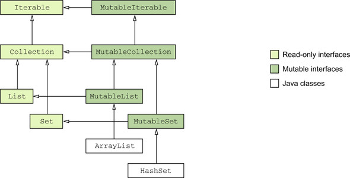

# 6장. 코틀린 타입 시스템

# 1. 널 가능성 (Nullability)

- Nulllability는 NPE를 피할 수 있게 돕기 위한 Kotlin 타입 시스템의 특성
- Kotlin을 비롯한 최신 언어에서 null에 대한 접근 방법은 이 문제를 런타임에서 컴파일타임으로 옮기는 것
    - 컴파일러가 여러가지 오류를 컴파일 시 미리 감지해 런타임에 발생할 수 있는 소지를 줄일 수 있음

## 널이 될 수 있는 타입

- Kotlin은 null이 될 수 있는 타입을 명시적으로 지원
- 어떤 변수가 널이 될 수 있다면 그 변수에 대해 메서드 호출 시 NPE가 발생하므로 안전하지 않음
    - Kotlin은 이러한 메서드 호출 자체를 금지하여 많은 오류를 방지

```kotlin
fun strLen(s: String) = s.length

>> strLen(null)
ERROR: Null can not be a value of a non-null type String
```

- null이 될 수 있는 인자를 넘기는 것은 금지되며, 그런 값을 넘기게 된다면 컴파일 시 오류가 발생

```kotlin
fun strLenSafe(s: String?) = ..
```

- ?를 통해 해당 타입의 변수나 프로퍼티에 null 참조를 저장할 수 있다.
    - Type? = Type 또는 null을 의미
- 모든 타입은 기본적으로 null이 될 수 없는 타입이다.

- null이 될 수 있는 타입의 변수가 있다면 그에 대해 수행할 수 있는 연산이 제한됨
    - 변수.메서드() 형태의 호출이 제한됨
        
        ```kotlin
        >> fun strLenSafe(s: String?) = s.length()
        ERROR: only safe(?.) or non-null asserted(!!.) ~~
        ```
        
    - null이 될 수 있는 값을 null이 될 수 없는 타입의 변수에 대입할 수 없다.
        
        ```kotlin
        >> val x: String? = null
        >> var y: String = x
        ERROR: Type mismatch: inferred type is String? but String was expected
        ```
        
    - null이 될 수 있는 타입의 값을 null이 될 수 없는 타입의 파라미터를 받는 함수에 전달할 수 없다.
        
        ```kotlin
        >> strLen(x)
        ERROR: Type mismatch: inferred type is String? but String was expected
        ```
        

- null이 될 수 있는 타입의 값으로 할 수 있는 가장 중요한 일은 바로 null과 비교하는 것
    - null과 비교하고 나면 컴파일러는 null이 아님이 확실한 영역에서 해당 값이 Non-null 타입의 값처럼 사용할 수 있다.

## 타입의 의미

- Java에서 String에는 String이나 null이라는 두 가지 종류의 값이 들어갈 수 있다.
    - String으로 할 수 있는 연산과 null이 들어있을 떄 할 수 있는 연산들은 다르다.
    - null 여부를 추가로 검사하기 전에는 그 변수에 대해 어떤 연산을 수행할 수 있을지 알 수 없다.
    - 특정 변수가 절대로 null일 수 없다는 사실을 확신하고 검사를 생략할 경우 NPE가 발생하며 중단될 가능성이 높다.
- Kotlin의 nullable 타입은 종합적인 해법을 제공한다.
    - 모든 검사는 컴파일 시점에 수행된다.
    - 따라서, Kotlin에서 널이 될 수 있는 타입을 처리하는 데 별도의 실행 시점 부가 비용이 들지 않는다.

## 안전한 호출 연산자: ?.

- ?.은 null 검사와 메서드 호출을 한 번의 연산으로 수행한다.
    
    ```kotlin
    s?.toUpperCase() == if (s != null) s.toUpperCase() else null
    ```
    
- 안전한 호출의 결과 타입도 null이 될 수 있는 타입이다.
    
    ```kotlin
    s?.toUpperCase() -> String?
    ```
    
    ```kotlin
    fun printAllCaps(s: String?) {
    	val allCaps: String? = s?.toUpperCase()
    	println(allCaps)
    }
    
    >> printAllCaps("abc")
    ABC
    >> printAllCaps(null)
    null
    ```
    
- 프로퍼티 접근 시 안전한 호출을 사용할 수 있다.
    
    ```kotlin
    class Employee(val name: String, val manager: Employee?)
    fun managerName(employee: Employee): String? = employee.manager?.name
    
    >> val ceo = Employee("AA", null)
    >> val developer = Employee("BB", ceo)
    >> println(managerName(developer))
    AA
    >> println(managerName(ceo))
    null
    ```
    

- 안전한 호출 연산자를 연쇄적으로 사용해 반복되는 if문을 없앨 수 있다.
    
    ```kotlin
    class Address(val streetAddress: String, val zipCode: Int, val city: String, val country: String)
    class Company(val name: String, val address: Address?)
    class Person(val name: String, val company: Company?)
    
    fun Person.countryName(): String {
    	val country = this.company?.address?.country
    	return if (country != null) country else "Unknown"
    }
    ```
    

## 엘비스 연산자: ?:

- Kotlin에서 null 대신 사용할 디폴트 값을 지정할 때 엘비스 연산자 사용한다.
    
    ```kotlin
    fun foo(s: String?) {
    	val t: String = s ?: ""    // s가 null이면 결과는 빈 문자열이다.
    }
    ```
    
- `foo ?: bar` → `foo` (foo ≠ null) / `bar` (foo = null)

```kotlin
fun strLenSafe(s: String?): Int = s?.length() ?: 0
>> println(strLenSafe("abc"))
3
>> println(strLenSafe(null))
0
```

```kotlin
fun Person.countryName(): String {
	val country = this.company?.address?.country
	return if (country != null) country else "Unknown"
}

fun Person.countryName() = company?.address?.country ?: "Unknown"
```

- Kotlin에서 return과 throw 등의 연산도 식이다.
    - 따라서, 엘비스 연산자의 우항에 retrun, throw 등의 연산을 넣을 수 있다.
- 함수의 전제 조건을 검사하는 경우에 유용하게 사용할 수 있다.

## 안전한 캐스트: as?

- Java 타입 캐스트와 마찬가지로 대상 값을 as로 지정한 타입으로 바꿀 수 없다면 ClassCastException이 발생한다.
    - as로 타입 캐스팅 하기 전에 is를 통해 미리 as로 변환 가능한 타입인지 검사할 수도 있다.

- Kotlin의 as? 연산자는 어떤 값을 지정한 타입으로 캐스트한다.
    - 값을 대상 타입으로 변환할 수 없다면 null을 반환한다.
    - `foo as? Type` → `foo as Type` (foo is Type) / `null` (foo !is Type)
    
- 안전한 캐스트를 사용할 때 일반적인 패턴은 캐스트를 수행한 뒤 엘비스 연산자를 사용하는 것이다.
    
    ```kotlin
    class Person(val firstName: String, val lastName: String) {
    	override fun equals(o: Any?): Boolean {
    		val otherPerson = o as? Person ?: return false
    		
    		return otherPerson.firstName == firstName && otherPerson.lastName == lastName
    	}
    
    	override fun hashCode(): Int = firstName.hashCode() * 37 + lastName.hashCode()
    }
    
    >> val p1 = Person("AA", "BB")
    >> val p2 = Person("AA", "BB")
    >> println(p1 == p2)
    true
    >> println(p1.equals(p2))
    false
    ```
    
    - 이 패턴을 사용하면 파라미터로 받은 값이 원하는 타입인지 쉽게 검사하고 캐스트할 수 있으며 타입이 맞지 않을 경우 쉽게 false를 반환할 수 있다.

## 널 아님 단언: !!

- Not-null assertion은 Kotlin에서 null이 될 수 있는 타입의 값을 다룰 때 사용할 수 있는 도구 중에서 가장 단순하면서도 무딘 도구이다.
- !!은 어떤 값이든 null이 될 수 없는 타입으로 강제로 바꿀 수 있다.
    - 실제로 null에 대해 !!를 적용하면 NPE가 발생한다.
    - `foo!!` → `foo` (foo ≠ null) / `NPE` (foo == null)
    

```kotlin
fun ignoreNulls(s: String?) {
	val sNotNull: String = s!!
	println(sNotNull.length)
}

>> ignoreNulls(null)
Exception in thread "main" Kotlin.KotlinNullPointerException ~~
```

- 근본적으로 !!은 컴파일러에게 “나는 이 값이 null이 아님을 잘 알고있다. 내가 잘못 생각했다면 예외가 발생해도 감수하겠다"라고 단언하는 것

- !!를 null에 대해 사용해서 발생하는 예외의 스택 트레이스에는 어떤 파일의 몇 번째 줄인지에 대한 정보는 들어있지만 어떤 식에서 예외가 발생했는지에 대한 정보는 들어있지 않음
    - 어떤 값이 null이였는지 확실히 하기 위해 !!를 한 줄에 함께 쓰는 일은 지양해야 한다.
        
        ```kotlin
        person.company!!.address!!.country
        ```
        

## let 함수

- let 함수를 사용하면 null이 될 수 있는 식을 더 쉽게 다룰 수 있다.
- let 함수를 안전한 호출 연산자와 함께 사용하면 원하는 식을 평가해서 결과가 null인지 검사한 다음 그 결과를 변수에 넣는 작업을 간단한 식으로 한번에 처리할 수 있다.
- let 함수는 자신의 수신 객체를 인자로 전달받은 람다에게 넘긴다.
    - null이 될 수 있는 값에 대해 안전한 호출 구문을 사용해 let을 호출하되 null이 될 수 없는 타입을 인자로 받는 람다를 let에 전달한다.
    
    ```kotlin
    foo?.let {
    	..it..
    }
    
    // foo != null이면 it은 람다 안에서 null이 아니다.
    // foo == null이면 아무 일도 일어나지 않는다. (구문이 생략됨) 
    ```
    

```kotlin
fun sendToEmail(email: String) {
	println("Sending email to $email")
}

>> var email: String? = "aa@gmail.com"
>> email?.let { sendToEmail(it) }
Sending email to aa@gmail.com

>> email = null
>> email?.let { sendToEmail(it) }

```

## 나중에 초기화할 프로퍼티

- 객체 인스턴스를 일단 생성한 다음 나중에 초기화 하는 경우가 많다.
- Kotlin에서 클래스 안의 null이 될 수 없는 프로퍼티를 생성자 안에서 초기화하지 않고 특별한 메서드 안에서 초기화할 수는 없다.
- Kotlin에서 일반적으로 생성자에서 모든 프로퍼티를 초기화해야 한다.
- 프로퍼티 타입이 null이 될 수 없는 타입이라면 반드시 null이 아닌 값으로 그 프로퍼티를 초기화해야 한다.

- Non-null Assertion을 통해 null이 될 수 있는 프로퍼티에 접근
    - 가독성에 좋지 못하다.
    - 프로퍼티를 여러번 사용할 경우 코드가 지저분해진다.

```kotlin
class MyService {
	fun performAction(): String = "foo"
}

class MyTest {
	private var myService: MyService? = null  // null로 초기화하기 위해 null이 될 수 있는 타입인 프로퍼티 선언
	
	@Before fun setUp() {
		myService = MyService()  // 프로퍼티에 대한 초기화 진행
	}

	@Test fun testAction() {
		Assert.assertEquals("foo", myService!!.performAction())  // 반드시 null 가능성에 대해 ?. 또는 !!로 신경써야 한다.
	}
}
```

- 나중에 초기화 하는 프로퍼티를 사용하도록 리팩토링할 수 있다.

```kotlin
class MyService {
	fun performAction(): String = "foo"
}

class MyTest {
	private lateinit var myService: MyService  // 초기화하지 않고 null이 될 수 없는 프로퍼티를 선언

	@Before fun setUp() {
		myService = MyService()  // 프로퍼티에 대한 초기화 진행
	}

	@Test fun testAction() {
		Assert.assertEquals("foo", myService.performAction())  // null 검사를 수행하지 않고 프로퍼티 사용
	}
}
```

- 나중에 초기화 하는 프로퍼티는 항상 var이어야 한다.
- lateinit var를 사용하는 경우 프로퍼티를 초기화하기 전에 프로퍼티에 접근하면 `lateinit property myService has not been initialized`라는 예외가 발생한다.

## null이 될 수 있는 타입 확장

- null이 될 수 있는 타입에 대한 확장함수를 정의하면 null값을 다루는 강력한 도구로 활용할 수 있다.
- String의 확장함수인 isEmpty나 isBlank처럼 null검사를 할 수 있는 확장함수를 제공한다.
    - isEmpty() - 문자열이 빈 문자열인지 검사
    - isBlank() - 문자열이 모두 공백문자로 이뤄졌는지 검사
    - isNullOrEmpty()
    - isBlankOrEmpty()

```kotlin
fun verifyUserInput(input: String?) {
	if (input.isNullOrBlank()) {
		println("Please fill in the required fields")
	}
}

>> verifyUserInput("")
Please fill in the required fields
>> verifyUserInput(null)
Please fill in the required fields
```

- isNullOrBlank는 null을 명시적으로 검사해서 null일 경우 true를 반환하고 null이 아닌 경우 isBlank를 호출한다.
    
    ```kotlin
    fun String?.isNullOrBlank(): Boolean = this == null || this.isBlank()
    ```
    

## 타입 파라미터의 널 가능성

- Kotlin에서는 함수나 클래스의 모든 타입 파라미터는 기본적으로 null이 될 수 있다.
- null이 될 수 있는 타입을 포함하는 어떤 타입이라도 타입 파라미터를 대신할 수 있다.
- 타입 파라미터 T를 클래스나 함수 안에서 타입 이름으로 사용할 경우 ?가 없더라도 T는 null이 될 수 있는 타입이다.

```kotlin
fun <T> printHashCode(t: T) {
	println(t?.hashCode())  // t는 null이 될 수 있으므로 safe-call을 사용해야 한다.
}

>> printHashCode(null)  // T의 타입은 Any?로 추론된다.
null
```

- 타입 파라미터가 null이 아님을 확실히 하려면 타입 상한을 지정해야 한다.

```kotlin
fun <T: Any> printHashCode(t: T) { // T는 null이 될 수 없는 타입이다.
	println(t.hashCode())
}

>> printHashCode(null)
Error: Type parameter bound for 'T' is not satisfied
>> printHashCode(42)
42
```

# 2. Kotlin의 원시 타입

## 원시 타입: Int, Boolean

- Java는 원시 타입과 참조 타입을 구분한다.
    - 원시 타입의 변수에는 그 값이 직접 들어간다. (int, …)
    - 참조 타입의 변수에는 메모리상의 객체 위치가 들어간다. (String, ..)
    - 참조타입이 필요한 경우 특별한 래퍼 타입으로 원시 타입 값을 감싸서 사용한다.
        - 정수 컬렉션을 정의하려면 `Collection<int>`가 아닌 `Collection<Integer>`를 사용해야 한다.
        
- Kotlin은 원시 타입과 래퍼 타입을 구분하지 않고 항상 같은 타입을 사용한다.
    
    ```kotlin
    val i: Int = 1
    val list: List<Int> = listOf(1, 2, 3)
    ```
    

- Kotlin에서는 실행 시점에 숫자 타입은 가능한 한 가장 효율적인 방식으로 표현된다.
    - 대부분의 경우 Kotlin의 Int 타입은 자바의 int타입으로 컴파일된다.
    - 이런 컴파일이 불가능한 경우는 컬렉션과 같은 제네릭 클래스를 사용하는 경우 뿐이다.
    - Int 타입을 컬렉션의 타입 파라미터로 넘기면 그 컬렉션에는 Int의 래퍼 타입에 해당하는 java.lang.Integer객체가 들어간다.
- Int와 같은 Kotlin 타입에는 널 참조가 들어갈 수 없기 때문에 그에 상응하는 자바 원시 타입으로 컴파일할 수 있다.

## null이 될 수 있는 원시 타입: Int?, Boolean? 등

- null 참조를 Java의 참조 타입의 변수에만 대입할 수 있기 때문에 null이 될 수 있는 Kotlin 타입은 자바 원시 타입으로 표현할 수 없다.
    - Kotlin에서 null이 될 수 있는 원시 타입을 사용하면 그 타입은 Java의 래퍼 타입으로 컴파일된다.
    

```kotlin
data class Person(val name: String, val age: Int? = null) {
	fun isOlderThan(other: Person): Boolean? {
		if (age == null || other.age == null) return null
		return age > other.age
	}
}

>> println(Person("AA", 35).isOlderThan(Person("BB", 42))
false
>> println(Person("AA", 35).isOlderThan(Person("BB"))
null
 
```

- null이 될 가능성이 있기 때문에 Int? 타입의 두 값을 직접 비교할 수 없다.
    - 두 값이 모두 null이 아닌지 먼저 검사해야 한다.

- 제네릭 클래스의 겨우 래퍼 타입을 사용한다.
    
    ```kotlin
    val listOfInts = listOf(1, 2, 3)
    ```
    
    - null 값이나 null이 될 수 있는 타입을 전혀 사용하지 않지만 해당 리스트는 래퍼인 Integer 타입으로 이뤄진 리스트이다.

## 숫자 변환

- Kotlin은 한 타입의 숫자를 다른 타입의 숫자로 자동 변환하지 않는다.
    
    ```kotlin
    val i = 1
    val l: Long = i  // Error: type mismatch 발생
    ```
    
    ```kotlin
    val i = 1
    val l: Long = i.toLong()
    ```
    
- Kotlin은 Boolean을 제외한 모든 원시타입에 대한 변환 함수를 제공한다.
    - toByte(), toShort(), toChar(), …
- Kotlin은 혼란을 방지하기 위해 타입 변환을 명시한다.
    - 박스 타입간의 equals 메서드는 안의 값을 비교하는 것이 아니라 박스 타입 객체 자체를 비교한다.
    
- Kotlin에서는 타입을 명시적으로 변환해서 같은 타입의 값으로 만든 후 비교해야 한다.
    
    ```kotlin
    val x = 1  // int 타입 변수
    val list = listOf(1L, 2L, 3L)  // Long으로 이뤄진 리스트
    x in list  // 묵시적 타입 변환으로 인해 false (이 식은 컴파일되면 안된다.)
    
    >> val x = 1
    >> println(x.toLong() in listOf(1L, 2L, 3L))
    true
    ```
    

## Any, Any? : 최상위 타입

- Java에서 Object가 클래스 계층의 최상위 타입이듯 Kotlin에서는 Any가 모든 null이 될 수 없는 타입의 최상위 타입이다.
- Java와 마찬가지로 Kotlin에서도 원시 타입 값을 Any 타입의 변수에 대해 대입하면 자동으로 값을 객체로 감싼다.
    
    ```kotlin
    val answer: Any = 42  // Any는 참조 타입이기 때문에 42가 박싱된다.
    ```
    
- Any는 null이 될 수 없는 타입이다.
    - null을 포함하는 모든 값을 대입할 변수를 선언하기 위해서는 Any? 타입을 사용해야 한다.
- 내부적으로는 java.lang.Object에 대응한다.
    - Kotlin 함수가 Any를 사용하면 Java 바이트코드의 Object로 디컴파일된다.

## Unit 타입: 코틀린의 void

- Kotlin의 Unit 타입은 Java의 void와 같은 기능을 한다.
- 기본 반환 타입으로 Unit을 사용할 수 있다.
    
    ```kotlin
    fun f(): Unit { .. }  ==  fun f() { .. }
    ```
    
- Kotlin 함수의 반환 타입이 Unit이고 그 함수가 제네릭 함수를 오버라이드하지 않는다면 그 함수는 내부에서 Java void함수로 컴파일된다.
    - Kotlin 함수를 Java에서 override하는 경우 void를 반환 타입으로 해야 한다.
    
- Kotlin의 Unit과 Java의 void의 차이점?
    - Unit은 모든 기능을 갖는 일반적인 타입이며, void와 달리 Unit을 타입 인자로 쓸 수 있다.
    - Unit 타입에 속한 값은 단 하나 뿐이며, 이름도 Unit이다.
    - Unit 타입의 함수는 Unit 값을 묵시적으로 반환한다.

```kotlin
interface Processor<T> {
	fun process(): T
}

class NoResultProcessor : Processor<Unit> {  // Unit을 반환하지만 타입을 지정할 필요는 없다.
	override fun process() {
		// do something..  (여기서 return을 명시할 필요가 없다.)
	}
}
```

- NoResultProcessor에서 명시적으로 Unit을 반환할 필요는 없다.
    - 컴파일러가 묵시적으로 return Unit을 넣어준다.

## Nothing 타입: 이 함수는 결코 정상적으로 끝나지 않는다.

- Kotlin에는 결코 성공적으로 값을 돌려주는 일이 없으므로 ‘반환값'이라는 개념 자체가 없는 함수가 일부 존재한다.
    - ex.) 테스트 라이브러리에서의 fail 함수
- Kotlin에는 정상적으로 끝나지 않는 함수를 표현하기 위해 Nothing이라는 특별한 반환 타입이 있다.

```kotlin
fun fail(message: String): Nothing {
	throw IllegalStateException(message)
}
>> fail("Error occoured")
java.lang.IllegalStateException: Error occurred
```

- Nothing 타입은 아무 값도 포함하지 않기 때문에 함수의 반환 타입이나 반환 타입으로 쓰일 타입 파라미터로 쓸 수 있다.
    - 그 외에 다른 용도로 사용할 경우 Nothing 타입의 변수를 선언하더라도 그 변수에 아무 값도 저장할 수 없기 때문에 불필요하다.
- Nothing을 반환하는 함수를 엘비스 연산자의 우항에 적용해 전제 조건을 검사할 수 있다.
    
    ```kotlin
    val address = company.address ?: fail("No Address")
    println(address.city)
    ```
    
    - 컴파일러는 company.address가 null인 경우 엘비스 연산자의 우항에서 예외가 발생한다는 사실을 파악하고 address의 값이 null이 아님을 추론할 수 있다.

# 3. 컬렉션과 배열

## null 가능성과 배열

```kotlin
fun readNumbers(reader: BufferedReader): List<Int?> {
	val result = ArrayList<Int?>()  // null이 될 수 있는 Int 값으로 이뤄진 리스트 생성
	for (line in reader.lineSequence()) {
		try {
			val number = line.toInt()
			result.add(number)  // null이 아닌 정수를 리스트에 추가
		} catch (e: NumberFormatException) {
			result.add(null)
		}
	}
	return result
}
```

- List<Int?>와 List<Int>?의 차이
    - List<Int?>에서의 리스트 자체는 항상 null이 아니다. 대신, 리스트에 들어가는 각 원소는 null이 될 수 있다.
    - List<Int>?에서 리스트를 가리키는 변수에는 null이 들어갈 수 있지만 리스트 안에는 null이 아닌 값만 들어갈 수 있다.
- 경우에 따라서는 List<Int?>?로 표현하기도 한다.
    - 이 경우, 변수에 대해 null검사를 수행한 다음 리스트에 속한 모든 원소에 대해 다시 null 검사를 수행해야 한다.

```kotlin
fun addValidNumbers(numbers: List<Int?>) {
	var sumOfValidNumbers = 0
	var invalidNumbers = 0
	for (number in numbers) {
		if (number != null) {
			sumOfValidNumbers += number
		} else {
			invalidNumbers++
		}
	}
	..
}

```

- null이 될 수 있는 값으로 이뤄진 컬렉션으로 null 값을 걸러내는 경우에는 filterNotNull이라는 함수를 사용할 수 있다.
    
    ```kotlin
    fun addValidNumbers(numbers: List<Int?>) {
    		val validNumbers = numbers.filterNotNull()
    		..
    }
    ```
    
    - filterNotNull이 컬렉션 안에 null이 들어있지 않음을 보장하기 때문에 validNumbers의 타입은 List<Int>이다.

## 읽기 전용과 변경 가능한 컬렉션

- Kotlin은 컬렉션에서 데이터에 접근하는 인터페이스와 컬렉션 안의 데이터를 변경하는 인터페이스를 분리한다.
- kotlin.collections.Collection 인터페이스를 사용하면 아래 항목을 수행 가능하다.
    - 컬렉션 안의 원소에 대해 이터레이션
    - 컬렉션의 크기
    - 컬렉션 내부에 어떤 값이 있는지 검사
    - 컬렉션에서 데이터를 읽는 여러 다른 연산
- Mutable Collection 인터페이스는 Collection 인터페이스를 확장한다.
- kotlin.collections.MutableCollection 인터페이스를 사용하면 아래 항목을 수행 가능하다.
    - 컬렉션에 원소 추가
    - 원소 삭제
    - 원소 전체 삭제

- 가능하면 읽기 전용 인터페이스인 Collection 인터페이스를 사용하는 것을 일반적인 규칙으로 삼아야 한다.
    - 코드에서 컬렉션을 변경할 필요가 있을 때만 변경가능한 MutableCollection 인터페이스를 사용한다.

### 방어적 복사

- 어떤 함수가 MutableCollection이 아닌 Collection 타입의 인자를 받는다면 그 함수는 컬렉션을 변경하지 않고 읽기만 한다.
- 반대 경우에는 컬렉션의 데이터를 바꿀 수 있다고 가정할 수 있다.
- 어떤 컴포넌트의 내부 상태에 컬렉션이 포함된다면 그 컬렉션을 MutableCollection을 인자로 받는 함수에 전달할 때는 원본의 변경을 막기위해 컬렉션을 복사해야 한다.
    - 이를 방어적 복사라고 한다.

```kotlin
fun <T> copyElements(source: Collection<T>, target: MutableCollection<T>) {
	for (item in sources) {
		target.add(item)
	}
}
```

- target에 해당하는 인자로 읽기 전용 컬렉션을 넘기게 되면 컴파일 오류가 발생한다.

- 읽기 전용 컬렉션이 반드시 변경 불가능한 컬렉션일 필요는 없다.
    - 읽기 전용 인터페이스 타입인 변수를 사용할 때 그 인터페이스는 실제로는 어떤 컬렉션 인스턴스를 가리키는 수많은 참조 중에 하나일 수 있다.
    
- 읽기 전용 컬렉션 타입의 참조와 변경 가능한 컬렉션 타입의 참조가 동일한 컬렉션 객체를 가리키는 경우
    - 두 참조를 병렬 실행시켜 내용이 변경되는 경우 ConcurrentModificationException이나 다른 오류가 생기게 된다.
    - 즉, 읽기 전용 컬렉션은 항상 Thread safe하지 않다.
    - 다중 스레드 환경에서는 데이터를 적절히 동기화 시키거나 동시 접근을 허용하는 전략을 취해야 한다.

## 코틀린 컬렉션과 자바

- 모든 Kotlin 컬렉션은 그에 상응하는 Java 컬렉션 인터페이스의 인스턴스이다.
- Kotlin은 모든 Java 컬렉션 인터페이스마다 읽기 전용과 변경 가능한 인터페이스라는 두 가지 표현을 제공한다.



| 컬렉션 타입 | 읽기 전용 타입 | 변경 가능 타입 |
| --- | --- | --- |
| List | listOf | mutableListOf, arrayListOf |
| Set | setOf | mutableSetOf, hashSetOf, linkedSetOf, sortedSetOf |
| Map | mapOf | mutableMapOf, hashMapOf, linkedMapOf, sortedMapOf |
- Java는 읽기 전용 컬렉션과 변경 가능 컬렉션을 구별하지 않으므로 Kotlin에서 읽기 전용 Collection으로 선언된 객체라도 Java 코드에서는 그 컬렉션 객체의 내용을 변경할 수 있다.
- Kotlin 컴파일러는 Java 코드가 컬렉션에 대해 어떤 일을 하는지 완전히 분석할 수 없다.
    - 컬렉션을 변경하는 Java 메서드에 읽기 전용 Collection을 넘겨도 Kotlin 컴파일러는 알 수 없다.

```java
// CollectionUtils.java
public class CollectionUtils {
	public static List<String> uppercaseAll(List<String> items) {
		for (int i = 0; i < items.size(); i++) {
			items.set(i, items.get(i).toUpperCase());
		}
		return items;
	}
}
```

```kotlin
fun printInUpperCase(list: List<String>) {  // 읽기 전용 파라미터 선언
	println(CollectionUtils.uppercaseAll(list))  // 커렉션을 변경하는 Java 함수 호출
	println(list.first())
}
>> val list = listOf("a", "b", "c")
>> printInUppercase(list)
[A, B, C]
A
```

## 객체의 배열과 원시 타입의 배열

```kotlin
fun main(args: Array<String>) {
	for (i in args.indices) {  // 인덱스 값의 범위에 대한 이터레이션을 위해 사용
		println("Args $i is: ${args[i]}")
	}
}
```

- Kotlin에서 배열을 만드는 방법은 간단하다.
    - arrayOf 함수에 원소를 넘기면 배열을 만들 수 있다.
    - arrayOfNulls 함수에 정수 값을 인자로 넘기면 모든 원소가 null이고 그 값만큼 크기를 할당한다.
    - Array 생성자는 배열 크기와 람다를 인자로 받아 람다를 호출해 각 배열 원소를 초기화한다. arrayOf를 사용하지 않고 각 원소가 null이 아닌 배열을 만들어야 하는 경우 이 생성자를 사용한다.

```kotlin
>> val letters = Array<String>(26) { i -> ('a' + i).toString() }
>> println(letters.joinToString(""))
abcdefghijklmnopqrstuvwxyz
```

- Kotlin에서는 배열을 인자로 받는 Java 함수를 호출하거나 vararg 파라미터를 받는 Kotlin 함수를 호출하기 위해 배열을 자주 만든다.
    - 데이터가 이미 컬렉션에 들어 있다면 컬렉션을 배열로 변환해야 한다.
        - toTypedArray 메서드로 컬렉션을 배열로 바꿀 수 있다.
        
        ```kotlin
        >> val strings = listOf("a", "b", "c")
        >> println("$s/$s/$s".format(*strings.toTypedArray()))  // vararg 인자를 넘기기 위해 스프레드 연산자(*) 사용
        a/b/c
        ```
        

- Kotlin은 원시 타입의 배열을 표현하는 별도 클래스를 제공한다.
    - Int → IntArray, .. , ByteArray, CharArray, BooleanArray
    - 모든 타입은 Java 원시 타입 배열인 int[], byte[], char[] 등으로 컴파일된다.
- 원시 타입 배열을 만드는 방법은 다음과 같다.
    - 각 배열 타입의 생성자는 size를 받아서 size 크기의 배열을 반환한다.
    - 팩토리 함수는 여러 값을 가변 인자로 받아 그 값이 들어간 배열을 반환한다.
    - 크기와 람다를 인자로 받는 생성자를 사용한다.
    
    ```kotlin
    val fiveZeros = IntArray(5)
    val fiveZerosToo = intArrayOf(0, 0, 0, 0, 0)
    val squares = IntArray(5) { i -> (i + 1) * (i + 1) }
    ```
    

- forEachIndexed는 배열의 모든 원소를 갖고 인자로 받은 람다를 호출해준다.
    
    ```kotlin
    fun main(args: Array<String>) {
    	args.forEachIndexed { index, element ->
    		println("Args $index is:$element")
    	}
    }
    ```