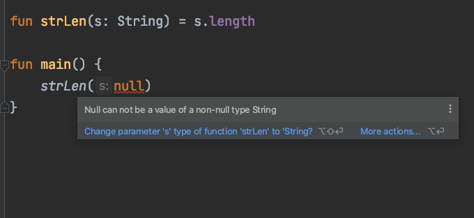
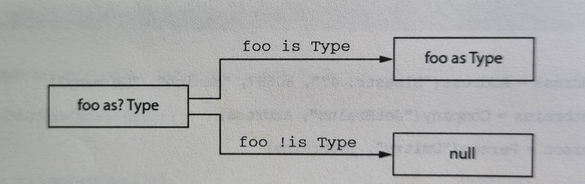

# 6장 코틀린 타입 시스템

6장에서 다루는 내용

▪︎널이 될 수 있는 타입과 널을 처리하는 구문의 문법

▪︎코틀린 원시 타입 소개와 자바 타입과 원시 타입의 관계

▪︎코틀린 컬렉션 소개와 자바 컬렉션과 코틀린 컬렉션의 관계

코틀린의 타입 시스템(type system)은 코드의 가독성을 향상시키는데 도움이 되는 몇 가지 특성을 제공한다. 그런 특성으로는 **널이 될 수 있는 타입(nullable type)**과 **읽기 전용 컬렉션**이 있다. 또한 코틀린은 자바 타입 시스템에서 불필요하거나 문제가 되던 배열 지원을 제거하였다.

# 널 가능성

널 가능성(nullability)은 NullPointerException 오류를 피할 수 있게 돕기 위한 코틀린 타입 시스템의 특성이다. 널이 될 수 있는지 여부를 타입 시스템에 추가함으로써 컴파일러가 여러 가지 오류를 컴파일 시 미리 감지해서 실행 시점에 발생 할 수 있는 예외의 가능성을 줄일 수 있다. 널이 될 수 있는 타입은 프로그램 안의 프로퍼티나 변수에  null을 허용하게 만드는 방법이다. 어떤 변수가 널이 될 수 있다면 그 변수에 대해(그 변수를 수신 객체로) 메소드를 호출하면 NullPointerException이 발생할 수 있으므로 안전하지 않다. **코틀린은 그런 메소드 호출을 금지함으로써 많은 오류를 방지한다.**

```java
/* Java */
int strLen(String s){
    return s.length();
}
```

위 함수를 코틀린으로 다시 작성해 볼시 고려해야할 사항은 “이 함수가 널을 인자로 받을 수 있는가?”이다. 여기서 널을 인자로 받을 수 있다는 말은 **strLen(null)처럼 직접 null 리터럴을 사용하는 경우뿐 아니라 변수나 식의 값이 실행 시점에 null이 될 수 있는 경우를 모두 포함한다.**

```kotlin
fun strLen(s: String) = s.length
```

strLen 함수에서 파라미터 s의 타입은 String인데 코틀린에서 이는 s가 항상 String의 인스턴스여야 한다는 뜻이다. 이때 컴파일러는 널이 될 수 있는 값을 strLen에게 인자로 넘기지 못하게 막는다. 따라서 strLen 함수가 결코 실행시점에 NullPointerException을 발생시키지 않으리라 장담할 수 있다.

![strLen함수가 널과 문자열을 인자로 받을 수 있게 하려면 타입 이름 뒤에 물음표(?)를 명시해야 한다!]


strLen함수가 널과 문자열을 인자로 받을 수 있게 하려면 타입 이름 뒤에 물음표(?)를 명시해야 한다!

String?, Int?, MyCustomType? 등 어떤 타입이든 타입 이름 뒤에 물음표를 붙이면 그 타입의 변수나 프로퍼티에 null 참조를 저장할 수 있다는 뜻이다!**(물음표가 없는 타입은 그 변수가 null 참조를 저장할 수 없다는 뜻이다!)**

널이 될 수 있는 타입의 변수가 있다면 그에 대해 수행할 수 있는 연산이 제한된다. 

예) 

① 널이 될 수 있는 타입인 변수에 대해 변수.메소드()처럼 메소드를 직접 호출할 수 없다!


② 널이 될 수 있는 값을 널이 될 수 없는 타입의 변수에 대입할 수 없다!


③ 널이 될 수 있는 타입의 값을 널이 될 수 없는 타입의 파라미터를 받는 함수에 전달 할 수 없다!


이렇게 제약이 많이 있음에도 nullable 타입의 값은 **null과 비교할 수 있다는 가장 중요한 기능을 갖고 있다.** 일단 null과 비교하고 나면 컴파일러는 그 사실을 기억하고 **null이 아님이 확실한 영역에서는 해당 값을 널이 될 수 없는 타입의 값처럼 사용할 수 있다.**

```kotlin
fun strLenSafe(s: String?) : Int =
    if (s != null) s.length else 0

fun main() {
    val x: String? = null
		println(strLenSafe(x))
		println(strLenSafe("abc"))
}
```

자바에서 String 타입의 변수에는 String이나 null이라는 두가지 종류의 값이 들어갈 수 있다. 이 두 종류의 값은 서로 완전히 다르다. 심지어 바자 객체의 instanceof 연산자도 null이 String이 아니라고 답한다. 두 종류의 값에 대해 실행할 수 있는 연산도 완전히 다르다. 실제 String이 들어있는 변수에 대해서는 String 클래스에 정의된 모든 메소드를 호출할 수 있다. 하지만 null이 들어 있는 경우에는 사용할 수 있는 연산이 많지 않다.

→ 이는 자바의 타입시스템이 널을 제대로 다루지 못한다는 뜻이다. 변수에 선언된 타입이 있지만 널 여부를 추가로 검사하기 전에는 그 변수에 대해 어떤 연산을 수행할 수 있을지 알 수 없다. 프로그램을 작성하면서 프로그램의 데이터 흐름 속에서 특정 위치에 특정 변수가 절대로 널일 수 없다는 사실을 확신하고 이런 검사를 생략하는 경우가 자주 있다. 하지만 그 생각이 틀리면 실행시점에 프로그램이 NullPointerException 예외를 발생시키며 오류로 중단된다.

→ 코틀린의 널이 될 수 있는 타입은 이런 문제에 대해 종합적인 해법을 제공한다. 널이 될 수 있는 타입과 널이 될 수 없는 **타입을 구분하면 각 타입의 값에 대해 어떤 연산이 가능할지 명확히 이해할 수 있고**, **실행 시점에 예외를 발생시킬 수 있는 연산을 판단할 수 있다.**(따라서 그런 연산을 아예 금지시킬 수 있다) 

<aside>
📖 실행 시점에 널이 될 수 있는 타입이나 널이 될 수 없는 타입의 객체는 같다. 널이 될 수 있는 타입은 널이 될 수 없는 타입을 감싼 래퍼 타입이 아니다. 모든 검사는 컴파일 시점에 수행된다. 따라서 코틀린에서는 널이 될 수 있는 타입을 처리하는데 별도의 실행 시점 부가 비용이 들지 않는다.

</aside>

# ☀︎ 안전한 호출(safe call) 연산자: ?.

코틀린이 제공하는 가장 유용한 도구 중 하나가 안전한 호출 연산자인 ?. 이다. ?.은 null 검사와 메소드 호출을 한 번의 연산으로 수행한다. 예를 들어 s?.toUpperCase()는 훨씬 더 복잡한 if (s! = null) s.toUpperCase() else null과  같다. 즉, 호출하려는 값이 null이 아니라면 ?.은 일반 메소드 호출처럼 작동한다. 호출하려는 값이 null이면 이 호출은 무시되고 null이 결과 값이 된다.

![safe call의 결과 타입도 널이 될 수 있는 타입이다. String.toUpperCase는 String타입의 값을 반환하지만, s가 널이 될 수 있는 타입인 경우 s?.toUpperCase() 식의 결과 타입은 String? 이다.]


safe call의 결과 타입도 널이 될 수 있는 타입이다. String.toUpperCase는 String타입의 값을 반환하지만, s가 널이 될 수 있는 타입인 경우 s?.toUpperCase() 식의 결과 타입은 String? 이다.

```kotlin
fun printAllCaps(s: String?){
    val allCaps: String? = s?.toUpperCase()
		println(allCaps)
}

fun main(args:Array<String>){
		printAllCaps("abc")
		printAllCaps(null)
}
```

<aside>
💡 메소드 호출뿐 아니라 프로퍼티를 읽거나 쓸 때도 안전한 호출을 사용할 수 있다. 아래 예제는 널이 될 수 있는 프로퍼티가 있는 간단한 코틀린 클래스로 프로퍼티 접근 시 안전한 호출을 사용하는 방법을 보여준다.

```kotlin
class Employee(val name: String, val manager: Employee?)

fun managerName(employee: Employee) : String? = employee.manager?.name

fun main(args:Array<String>){
    val ceo = Employee("Da Boss", null)
    val developer = Employee("Bob Smith", ceo)
		println(managerName(developer))
		println(managerName(ceo))
}
```

</aside>

객체 그래프에서 널이 될 수 있는 중간 객체가 여럿 있다면 한 식 안에서 안전한 호출을 연쇄해서 함께 사용하면 편할때가 자주 있다. 예를 들어 어떤 사람에 대한 정보와 그 사람이 다니는 회사에 대한 정보, 그리고 그 회사의 주소에 대한 정보를 각각 다른 클래스로 표현한다고 하자.(회사나 주소는 모두 생략 가능하다) ?. 연산자를 사용하면 다른 추가 검사없이 Person의 회사 주소에서 country 프로퍼티를 단 한 줄로 가져올 수 있다.

```kotlin
class Address(val streetAddress: String, val zipCode: Int, val city: String,
              val country: String)
class Company(val name: String, val address: Address?)
class Person(val name: String, val company: Company?)

fun Person.countryName(): String{
    val country = this.company?.address?.country
    return if (country != null) country else "Unknown"
}
fun Person.companyName(): String{
    val company = this.company?.name
    return if (company != null) company else "Unknown"
}

fun main(args:Array<String>){
    val company = Company("Google", null)
    val person = Person("Dmitry", company)
    println(person.countryName())
    println(person.companyName())
}
```

# 엘비스 연산자: ?:

코틀린은 null 대신 사용할 디폴트 값을 지정할 때 편리하게 사용할 수 있는 연산자를 제공한다. 그 연산자는 엘비스(elvis) 연산자라고 한다. 다음은 엘비스 연산자를 사용하는 방법이다.

```kotlin
fun foo(s: String?) = s ?: ""

fun main(args:Array<String>){
		println(foo("ABCD"))
}
```

이 연산자는 이항 연산자로 좌항을 계산한 값이 널인지 검사한다. 좌항 값이 널이 아니면 좌항 값을 결과로 하고, 좌항값이 널이면 우항 값을 결과로 한다.


엘비스 연산자를 객체가 널인 경우 널을 반환하는 safe call 연산자와 함께 사용해서 객체가 널인 경우에 대비한 값을 지정하는 경우도 많다. 

```kotlin
fun strLenSafe_(s: String?) : Int = s?.length ?: 0

fun main(args:Array<String>){
	println(strLenSafe_("abc"))
	println(strLenSafe_(null))
}
```

위 countryName 함수도 한줄로 표현할 수 있다.

```kotlin
fun Person.countryName_() = company?.address?.country ?: "Unknown"
```

코틀린에서는 return이나 throw 등의 연산도 식이다. 따라서 엘비스 연산자의 우항에 return, throw 등의 연산을 넣을 수 있고, 엘비스 연산자를 더욱 편하게 사용할 수 있다. 이런 패턴은 함수의 전제 조건(precondition)을 검사하는 경우 특히 유용하다. 이제 엘비스 연산자를 활용해서 지정한 사람의 회사 주소를 라벨에 인쇄하는 함수를 만들어보자. 다음 리스트는 모든 클래스를 다시 한번 정의한다.

```kotlin
class Address(val streeAdress: String, val zipCode: Int,
              val city: String, val country: String)
class Company(val name: String, val address: Address?)
class Person(val name: String, val company: Company?)

fun printShippingLabel(person: Person){
    val address = person.company?.address
        ?: throw IllegalArgumentException("No address")
	with(address){
		println(streeAdress)
		println("$zipCode $city, $country")
	}
}

fun main(args:Array<String>){
    val address =  Address("Elsestr. 47", 80687, "Munich", "Germany")
    val jetbrains = Company("Jetbrains", address)
    val person = Person("Dmitry", jetbrains)
		printShippingLabel(person)
		printShippingLabel(Person("Alexy", null))
}
```

# 안전한 캐스트: as?

as? 연산자는 어떤 값을 지정한 타입으로 캐스트한다. as?는 값을 대상 타입으로 변환할 수 없으면 null을 반환한다.(is 연산자를 통해 as로 변환 가능한 타입인지 검사해 보지 않아 좋은 해법이다)


**안전한 캐스트를 사용할 때 일반적인 패턴은 캐스트를 수행한 뒤에 엘비스 연산자를 사용하는 것이다.** 

```kotlin
class Person(val firstName: String, val lastName: String){
  override fun equals(o: Any?): Boolean {
      val otherPerson = o as? Person ?: return false
      return otherPerson.firstName ==  firstName &&
              otherPerson.lastName == lastName
  }

  override fun hashCode(): Int = firstName.hashCode() * 37 + lastName.hashCode()
}

fun main(args:Array<String>){
    val p1 = Person("SANGPILL", "YOON")
    val p2 = Person("SANGPILL", "YOON")

		println(p1 == p2)
		println(p1.equals(42))
}
```

# 널 아님 단언: !!

널 아님 단언(not-null assertion)은 코틀린에서 널이 될 수 있는 타입의 값을 다룰 때 사용할 수 있는 기능이다. 느낌표를 이중(!!)으로 사용하면 어떤 값이든 널이 될 수 없는 타입으로 강제 바꿀 수 있다. 실제 널에 대해 !!를 적용하면 NPE가 발생한다.


```kotlin
fun ignoreNulls(s: String?){
    val sNotNull: String = s!!
		println(sNotNull.length)
}

fun main(args:Array<String>){
		ignoreNulls(null)
}
```

널 아님 단언문이 더 나은 해법인 경우도 있다. ***어떤 함수가 값이 널인지 검사한 다음에 다른 함수를 호출한다고 해도 컴파일러는 호출된 함수 안에서 안전하게 그 값을 사용할 수 있음을 인식할 수 없다.*** 하지만 이런 경우 호출된 함수가 언제나 다른 함수에서 널이 아닌 값을 전달받는다는 사실이 분명하다면 굳이 널 검사를 다시 수행하고 싶지는 않을 것이다. 이럴 때 널 아님 단언문을 쓸 수 있다.

!!를 널에 대해 사용해서 발생하는 예외의 스택 트레이스(stack trace)에는 어떤 파일의 몇 번째 줄인지에 대한 정보는 들어있지만 어떤 식에서 예외가 발생했는지에 대한 정보는 들어있지 않다. 따라서 여러 !!단언문을 한 줄에 함께 쓰는 일을 피하라.

코틀린에서는 널이 될 수 있는 값을 널이 아닌 값만 인자로 받는 함수에 넘기는데 있어 let이라는 유용한 함수가 있다.

# let 함수

let 함수를 사용하면 널이 될 수 있는 식을 더 쉽게 다룰 수 있다. let함수를 안전한 호출 연산자와 함께 사용하면 원하는 식을 평가해서 결과가 널인지 검사한 다음에 그 결과를 변수에 넣는 작업을 간단한 식을 사용해 한꺼번에 처리할 수 있다. **let을 사용하는 가장 흔한 용례는 널이 될 수 있는 값을 널이 아닌 값만 인자로 받는 함수에 넘기는 경우다.**


```kotlin
fun sendEmailTo(email: String){
		println("Send Email to $email")
}

fun main(args:Array<String>){
    val email:String? = null
    if(email != null)
			sendEmailTo(email)
}
```

```kotlin
fun sendEmailTo(email: String){
		println("Sending Email to $email")
}

fun main(args:Array<String>){
    val email:String? = null
    email?.let{
			email->sendEmailTo(email)
		}
}
```

아주 긴식이 있고 그 값이 널이 아닐 때 수행해야 하는 로직이 있을 때 let을 쓰면 훨씬 더 편하다. let을 쓰면 긴 식의 결과를 저장하는 변수를 따로 만들 필요가 없다.

```kotlin
class Person(val firstName: String, val lastName: String, val email:String)

fun sendEmailTo(email: String){
	println("Send Email to $email")
}

fun getTheBestPersonInTheWorld() : Person? = null

fun main(args:Array<String>){
    val person: Person? =getTheBestPersonInTheWorld()
    if(person != null)sendEmailTo(person.email)
		getTheBestPersonInTheWorld()?.let{sendEmailTo(it.email)}
}
```

<aside>
💡 참고) also함수 : 함수를 호출하는 객체 T를 block에 전달하고 객체 T 자체를 반환한다.

```kotlin
data class Person(val name: String, var skills: String)

fun main(args:Array<String>){
    var person = Person("kildong", "kotlin")
    var a = person.let{ it.skills="android"
        "success"}
		println(person)
		println("a: $a")
    var b = person.also{ it.skills="java"
        "success"}
		println(person)
		println("b: $b")
}
```

</aside>

# 나중에 초기화할 프로퍼티

널이 될 수 없는 프로퍼티인데 생성자 안에서 널이 아닌 값으로 초기화할 방법이 없는 경우 코틀린에서는 해당 방법을 통해 처리해준다. 코틀린에서는 일반적으로 생성자에서 모든 프로퍼티를 초기화해야한다. 프로퍼티 타입이 널이 될 수 없는 타입이라면 반드시 널이 아닌 값으로 그 프로퍼티를 초기화해야 한다. 이는 !!나 ?.을 꼭 써야하는 경우를 유발하며 코틀린에서는 이를 위해 lateinit 변경자를 써서 프로퍼티를 나중에 초기화 할 수 있게 해준다. 이때 나중에 초기화하는 프로퍼티는 항상 var 여야 한다. (val 프로퍼티는 final 필드로 컴파일 되며, 생성자 안에서 반드시 초기화해야한다.)

```kotlin
class MyServcie {
    fun performAction() : String = "foo"
}

class MyTest{
    private lateinit var myServcie: MyServcie

    @Before
    fun setUp(){
        myServcie = MyServcie()
    }

    @Test fun testAction(){
        Assert.assertEquals("foo",
        myServcie.performAction())
    }
}

```

# 널이 될 수 있는 타입 확장

널이 될 수 있는 타입에 대한 확장 함수를 정의하면 null 값을 다루기 유용하다. 어떤 메소드를 호출하기 전에 수신 객체 역할을 하는 변수가 널이 될 수 없다고 보장하는 대신, 직접 변수에 대해 메소드를 호출해도 확장 함수인 메소드가 알아서 널을 처리해준다.(이런 처리는 확장함수에서만 가능하다)

일반 멤버 호출은 객체 인스턴스를 통해 디스패치(dispatch)되므로 그 인스턴스가 널인지 여부를 검사하지 않는다.

<aside>
💡 객체지향 언어에서 객체의 동적 타입에 따라 적절한 메소드를 호출해주는 방식을 동적 디스패치라고 부른다. 반대로 컴파일러가 컴파일 시점에 어떤 메소드가 호출될지 결정해서 코드를 생성하는 방식을 직접 디스패치라고 한다.

</aside>

안전한 호출 없이도 널이 될 수 있는 수신 객체 타입에 대해 선언된 확장 함수를 호출 가능하다.

```kotlin
fun verifyUserInput(input: String?){
    if(input.isNullOrBlank()){
			println("Please fill in the required fields")
    }
}

fun main(args:Array<String>){
		verifyUserInput(null)
}
```

# 타입 파라미터의 널 가능성

**코틀린에서는 함수나 클래스의 모든 타입 파라미터는 기본적으로 널이 될 수 있다.** 널이 될 수 있는 타입을 포함하는 어떤 타입이라도 타입 파라미터를 대신할 수 있다. **따라서 타입 파라미터 T를 클래스나 함수 안에서 타입 이름로 사용하면 이름 끝에 물음표가 없더라도 T가 널이 될 수 있는 타입**이다.

```kotlin
fun <T> printHashCode(t: T){
	println(t?.hashCode())
}

fun main(args:Array<String>){
	printHashCode(null)
}
```

```kotlin
fun <T: Any> printHashCode(t: T){
	println(t.hashCode())
}

fun main(args:Array<String>){
	~~printHashCode(null)~~ //컴파일 되지 않는다.
}
```

# 널 가능성과 자바

코틀린은 애노테이션이 붙은 자바 타입을 애노테이션에 따라 널이 될 수 있는 타입이나 널이 될 수 없는 타입으로 취급한다. 만약 이런 널 가능성 애노테이션이 없는 경우 자바의 타입은 코틀린의 플랫폼 타입이 된다.

<aside>
✅ 플랫폼 타입은 코틀린이 널 관련 정보를 알 수 없는 타입을 말한다.

</aside>

플랫폼 타입은 널이 될 수 있는 타입으로 처리해도 되고, 널이 될 수 없는 타입으로 처리해도 된다. 다만 자바와 마찬가지로 오류 발생시 NullPointerException이 발생한다.

- 코틀린에서는 플랫폼 타입을 선언할 수 없다. 자바 코드에서 가져온 타입만 플랫폼 타입이 된다. 하지만 IDE나 컴파일러 오류 메시지에는 플랫폼 타입을 볼 수 있다.
- 이러한 널 가능성 관련 지식은 코틀린이 자바의 박스 타입을 처리하는 방법을 이해할 때 중요한 역할을 한다.

# 코틀린의 원시 타입

## 원시타입 : Int, Boolean 등

코틀린은 원시타입과 래퍼 타입을 구분하지 않는다. 자바는 원시타입과 참조 타입을 구분한다. 원시타입(primitive type)(int 등)의 변수에는 그 값이 직접 들어가지만, 참조타입(String 등)의 변수에는 메모리 상의 객체가 들어간다. 자바는 참조 타입이 필요한 경우 특별한 래퍼 타입(java.lang.Integer 등)으로 원시 타입 값을 감싸서 사용한다. 따라서 정수의 컬렉션을 정의하려면 Collection<int>가 아니라 Collection<Integer>를 사용해야 한다.

→ 코틀린은 원시타입과 래퍼타입을 구문하지 않는다.

→ 코틀린에서는 숫자 타입 등 원시 타입의 값에 대해 메소드를 호출할 수 있다.

자바의 원시 타입에 해당하는 타입은 다음과 같다.

- 정수 타입 Byte, Short, Int, Long
- 부동소수점 수 타입 Float, Double
- 문자 타입 Char
- 불리언 타입 Boolean

## 널이 될 수 있는 원시 타입 : Int?, Boolean? 등

***→ null 참조를 자바의 참조 타입의 변수에만 대입할 수 있기 때문에 널이 될 수 있는 코틀린 타입은 자바 원시 타입으로 표현할 수 없다.***

코틀린에서 널이 될 수 있는 원시 타입을 사용하면 그 타입은 자바의 래퍼 타입으로 컴파일 된다.

```kotlin
data class Person(val name: String, val age: Int? = null){
    fun isOlderTan(other: Person): Boolean? {
        if  (age == null || other.age == null)
            return null
        return age > other.age
    }
}

fun main(args:Array<String>){
    val kildong = Person("Kildong", 30)
    val sumi = Person("Sumi", 29)
		println(kildong.isOlderTan(sumi))
}
```

제네릭 클래스의 경우 래퍼 타입을 사용한다. 어떤 클래스의 타입 인자로 원시 타입을 넘기면 코틀린은 그 타입에 대한 박스 타입을 사용한다. 

예를 들어 다음 문장에서는 null 값이나 널이 될 수 있는 타입을 전혀 사용하지 않았지만 만들어지는 리스트는 래퍼인 Integer 타입으로 이뤄진 리스트다. → val listOfInts = listOf(1, 2, 3)

## 숫자 변환

코틀린은 모든 원시타입(Boolean 제외)에 대해 변환 함수를 제공한다.

- toByte()
- toShort()
- toChar() 등이다.

양방향 변환 함수가 모두 제공된다.

- Int.toLong()
- Long.toInt() 등

## Any, Any? : 최상위 타입

자바에서는 Object가 클래스 계층의 최상위 타입이듯 코틀린에서는 Any 타입이 모든 널이 될 수 없는 타입의 조상 타입이다. 자바와는 달리 코틀린에서는 Any가 Int 등의 원시 타입을 포함한 모든 타입의 조상 타입이다. 자바와 마찬가지로 원시 타입 값을 Any 타입의 변수에 대입하면 자동으로 값을 객체로 감싼다.

예) val answer : Any = 42

<aside>
💡 널을 포함하는 모든 값을 대입할 변수를 선언하려면 Any? 타입을 사용해야 한다.

</aside>

## Unit 타입 : 코틀린의 void

코틀린 Unit 타입은 자바의 void와 같은 기능을 한다. 코틀린의 Unit이 자바의 void와 다른점은 Unit은 모든 기능을 갖는 일반적인 타입이며, void와 달리 Unit을 타입 인자로 쓸 수 있다.

```kotlin
interface Processor<T>{
    fun process() : T
}

class NoResultProcessor: Processor<Unit>{
    override fun process() {

    }
}
```

위 코드에서 인터페이스의 시그니처는 process 함수가 어떤 값을 반환하라고 요구한다. Unit 타입도 Unit 값을 제공하기 때문에 메소드에서 Unit값을 반환하는데는 아무 문제가 없다. NoResultProcessor에서 명시적으로 Unit을 반환할 필요가 없다. 컴파일러가 묵시적으로 return Unit을 넣어준다.

## Nothing 타입 : 이 함수는 결코 정상적으로 끝나지 않는다.

코트린에는 결코 성공적으로 값을 돌려주는 일이 없으므로 ‘반환 값'이라는 개념 자체가 의미 없는 함수가 일부 존재한다. 예를 들어 테스트 라이브러리들은 fail이라는 함수를 제공하는 경우가 많다. fail은 특별한 메시지가 들어있는 예외를 던져서 현재 테스트를 실패시킨다.

Nothing 타입은 아무 값도 포함하지 않는다. 따라서 Nothing은 함수의 반환 타입이나 반환 타입으로 쓰일 타입 파라미터로만 쓸 수 있다. 예를 들어 Nothing을 반환하는 함수를 엘비스 연산자의 우항에 사용해서 전제 조건을 검사 할 수 있다.

```kotlin
val address = company.address ?: *fail*("No address")
```

# 컬렉션과 배열

## 널 가능성과 컬렉션


## 읽기 전용과 변경 가능한 컬렉션

코틀린에서는 컬렉션 안의 데이터에 접근하는 인터페이스와 컬렉션 안의 데이터를 변경하는 인터페이스를 분리했다. 인터페이스 kotlin.collections.Collection에는 컬렉션 안의 원소를 이터레이션하고 컬렉션의 크기를 얻는 등에 연산은 수행할 수 있지만, 원소를 추가하거나 제거하는 메소드는 없다. 컬렉션의 데이터를 수정하려면 kotlin.collections.MutableCollection을 사용해야 한다.(MutableCollection은 Collection을 확장한다)


## 코틀린 컬렉션과 자바

모든 코틀린 컬렉션은 그에 상응하는 자바 컬렉션 인터페이스의 인스턴스 이다. 따라서 코틀린과 자바 사이를 오갈 때 아무 변환도 필요 없고, 래퍼 클래스를 만들거나 데이터를 복사할 필요도 없다. 다만, 코틀린은 자바 컬렉션 인터페이스마다 읽기 전용 인터페이스와 변경 가능한 인터페이스라는 두가지 표현을 제공한다.


<aside>
💡 컬렉션과 마찬가지로 Map클래스도 Map과 MutableMap이라는 두가지 버전으로 나타낸다.

</aside>

| 컬렉션 타입 | 읽기 전용 타입 | 변경 가능 타입 |
| --- | --- | --- |
| List | listOf | mutableListOf, arrayListOf |
| Set | setOf | mutableSetOf, hashSetOf, linkedSetOf, sortedSetOf |
| Map | mapOf | mutableMapOf, hashMapOf, linkedMapOf, sortedMapOf |

→ setOf()와 mapOf()는 자바 표준 라이브러리에 속한 클래스의 인스턴스를 반환한다!

<aside>
💡 컬렉션을 자바 코드에 넘길 때는 코틀린 쪽 타입이 적절히 자바 쪽에서 컬렉션에게 가할 수 있는 변경의 내용을 반영(널 가능성이나 불변성 등)하게 해야한다.

</aside>

## 컬렉션을 플랫폼 타입으로 다루기

자바 코드에서 정의한 타입을 코틀린에서는 플랫폼 타입으로 본다. 플랫폼 타입의 경우 코틀린 쪽에는 널 관련 정보과 없다. → 컴파일러는 코틀린 코드가 그 타입을 널이 될 수 있는 타입이나 널이 될 수 없는 타입 어느쪽으로든 사용할 수 있게 허용한다.(자바 쪽에서 선언한 컬렉션 타입의 변수를 코틀린에서는 플랫폼 타입으로 본다.)

## 객체의 배열과 원시 타입의 배열

자바 main 함수의 표준 시그니처에는 배열 파라미터가 들어있다. 코틀린 배열은 타입 파라미터를 받는 클래스다. 배열의 원소 타입은 바로 그 타입 파라미터에 의해 정해진다. 코틀린에서 배열을 만드는 방법은 다양하다.

- arrayOf함수에 원소를 넘기면 배열을 만들 수 있다.
- arrayOfNulls 함수에 정수 값을 인자로 넘기면 모든 원소가 null이고 인자로 넘긴 값과 크기가 같은 배열을 만들 수 있다. 물론 원소 타입이 널이 될 수 있는 타입인 경우에만 이 함수를 쓸 수 있다.
- Array 생성자는 배열 크기와 람다를 인자로 받아서 람다를 호출해서 각 배열 원소를 초기화해준다. arrayOf를 쓰지 않고 각 원소가 널이 아닌 배열을 만들어야 하는 경우 이 생성자를 사용한다.

```kotlin
fun main(args:Array<String>) {
    val letters = Array<String>(26){i->('a'+i).toString()}
		println(letters.joinToString(""))
}
```

코틀린은 원시 타입의 배열을 표현하는 별도 클래스를 각 원시 타입마다 하나씩 제공한다. 예를 들어 Int 타입의 배열은 IntArray다. 코틀린은 ByteArray, CharArray, BooleanArray 등의 원시 타입 배열을 제공한다. → 이 모든 타입은 자바 원시 타입 배열인 int[], byte[], char[] 등으로 컴파일된다.

### 원시타입의 배열을 만드는 방법은 다음과 같다.

- 각 배열 타입의 생성자는 size 인자를 받아서 해당 원시 타입의 디폴트 값(보통은 0)으로 초기화된 size 크기의 배열을 반환한다.

```kotlin
fun main(args:Array<String>) {
    val fiveZeros = IntArray(5)
    for( (index, value ) in fiveZeros.withIndex()){
			println("$index : $value")
    }
}
```

- 팩토리 함수(IntArray를 생성하는 intArrayOf 등)는 여러 값을 가변 인자로 받아서 그런 값이 들어간 배열을 반환한다.

```kotlin
fun main(args:Array<String>) {
    val fiveZerosToo =intArrayOf(0, 0, 0, 0, 0)
    for( (index, value ) in fiveZerosToo.withIndex()){
			println("$index : $value")
    }
}
```

- (일반 배열과 마찬가지로) 크기와 람다를 인자로 받는 생성자를 사용한다.

```kotlin
fun main(args:Array<String>) {
    val squares = IntArray(5){i->(i+1) * (i+1)}
		for( (index, value ) in squares.withIndex()){
			println("$index : $value")
    }
}
```

이 밖에 박싱된 값이 들어있는 컬렉션이나 배열이 있다면 toIntArray 등의 변환 함수를 사용해 박싱하지 않은 값이 들어있는 배열로 변환할 수 있다.

<aside>
💡 forEachIndexed 함수는 배열의 모든 원소를 갖고 인자로 받은 람다를 호출해준다. 이때 배열의 원소와 그 원소의 인덱스를 람다에게 인자로 전달한다.

```kotlin
fun main(args:Array<String>) {
    val squares = IntArray(5){i->(i+1) * (i+1)}
		squares.forEachIndexed{index, element->
				println("$index : $element")
		}
}
```

</aside>

# 요약

- 코틀린은 널이 될 수 있는 타입을 지원해 NullPointerException 오류를 컴파일 시점에 감지할 수 있다.
- 코틀린의 안전한 호출 (?.), 앨비스 연산자 (?:), 널 아님 단언 (!!), let 함수 등을 사용하면 널이 될 수 있는 타입을 간결한 코드로 다룰 수 있다.
- as? 연산자를 사용하면 값을 다른 타입으로 변환하는 것과 변환이 불가능한 경우를 처리하는 것을 한꺼번에 처리 할 수 있다.
- 자바에서 가져온 타입은 코틀린에서 플랫폼 타입으로 취급된다. 개발자는 플랫폼 타입을 널이 될 수 있는 타입으로도, 널이 될 수 없는 타입으로도 사용할 수 있다.
- 코틀린에서는 수를 표현하는 타입(Int 등)이 일반 클래스와 똑같이 생겼고 일반 클래스와 똑같이 동작한다. 하지만 대부분 컴파일러는 숫자 타입을 자바 원시 타입(Int 등)으로 컴파일한다.
- 널이 될 수 있는 원시타입(Int? 등)은 자바의 박싱한 원시 타입(java.lang.Integer 등)에 대응한다.
- Any 타입은 다른 모든 타입의 조상 타입이며, 자바의 Object에 해당한다. Unit은 자바의 Void와 비슷하다.
- 정상적으로 끝나지 않는 함수의 반환 타입을 지정할 때 Nothing 타입을 사용한다.
- 코틀린 컬렉션은 표준 자바 컬렉션 클래스를 사용한다. 하지만 코틀린은 자바보다 컬렉션을 더 개선해서 읽기 전용 컬렉션과 변경 가능한 컬렉션을 구별해 제공한다.
- 자바 클래스를 코틀린에서 확장하거나 자바 인터페이스를 코틀린에서 구현하는 경우 메소드 파라미터의 널 가능성과 변경 가능성에 대해 깊이 생각해야 한다.
- 코틀린의 Array 클래스는 일반 제네릭 클래스처럼 보인다. 하지만 Array는 자바 배열로 컴파일 된다.
- 원시 타입의 배열은 IntArray와 같이 각 타입에 대한 특별한 배열로 표현된다.