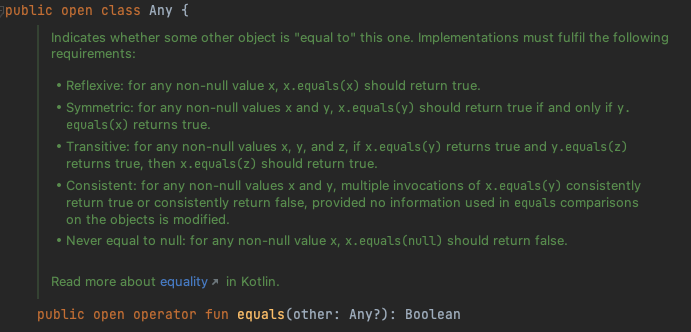
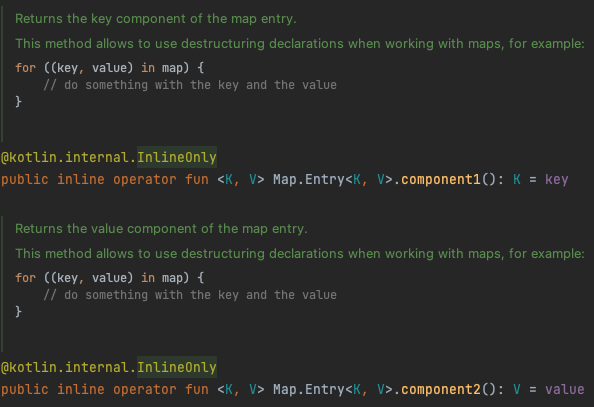

# 7장. 연산자 오버로딩과 기타 관례

# 개요

- Java에는 표준 라이브러리와 밀접하게 연관된 언어 기능이 존재한다.
- Kotlin도 이와 비슷하게 정해진 사용자 작성 함수와 연결되는 경우가 있다.
    - 하지만, Kotlin에는 어떤 타입(클래스)와 연관되기 보다는 특정 함수 이름과 연관된다. (관례라고 부름)
        - ex. plus 메서드 - 클래스 인스턴스에 대한 + 연산자 사용

- Java는 언어 기능을 타입에 의존하는 반면 Kotlin은 함수 이름을 통한 관례에 의존한다.
    - 기존 Java 클래스에 대해 확장함수를 구현하면서 관례에 따라 이름을 붙이면 기존 Java 코드를 변경하지 않고도 새로운 기능을 부여할 수 있다.

# 1. 산술 연산자 오버로딩

- Kotlin에서 관례를 사용하는 가장 단순한 예시는 산술 연산자이다.
    - Java에서는 원시 타입에 대해서만 산술 연산자를 사용할 수 있고, 추가로 String에 대해 + 연산자를 사용할 수 있다.
    - Kotlin에서는 다른 클래스에서도 산술 연산자를 사용할 수 있다.
        - BigInteger 클래스에서 add 메서드 대신 + 연산을 사용하는 것이 낫다.
        - 컬렉션에 원소를 추가할 때도 += 연산자를 사용할 수 있다.

## 이항 산술 연산 오버로딩

```kotlin
data class Point(val x: Int, val y: Int) {
	operator fun plus(other: Point): Point {  // plus 연산자 함수 정의
		return Point(x + other.x, y + other.y)
	}
}

>> val p1 = Point(10, 20)
>> val p2 = Point(30, 40)
>> println(p1 + p2)  // + 로 계산 시 plus 함수 호출
Point(x=40, y=60)
```

- 연산자를 오버로딩하는 함수 앞에는 operator가 반드시 있어야 한다.
    - operator 키워드를 붙임으로써 어떤 함수가 관례를 따르는 함수임을 명확히 할 수 있다.
- a + b → a.plus(b) 처럼 호출된다.

```kotlin
operator fun Point.plus(other: Point): Point {
	return Point(x + other.x, y + other.y)
}
```

- 연산자를 멤버함수로 구현하는 대신 확장함수로 정의할 수 있다.

- Kotlin에는 개발자가 직접 연산자를 만들어 사용할 수 없고 언어에서 미리 정해둔 연산자만 오버로딩할 수 있으며, 관례에 따르기 위해 클래스에서 정의해야 하는 이름이 연산자별로 정해져있다.
    - 연산자의 우선순위는 표준 숫자 타입에 대한 연산자 우선순위와 동일하다.
        - ex. a + b * c에서 곱셈이 항상 먼저 수행
    
    | 식 | 함수 이름 |
    | --- | --- |
    | a * b | times |
    | a / b | div |
    | a % b | rem |
    | a + b | plus |
    | a - b | minus |
    
- 연산자를 정의할 때 두 피연산자가 같은 타입일 필요는 없다.
    
    ```kotlin
    operator fun Point.times(scale: Double): Point {
    	return Point((x * scale).toInt(), (y * scale).toInt())
    }
    >> val p = Point(10, 20)
    >> println(p * 1.5)
    Point(x=15, y=30)
    ```
    
    - 15 * p를 쓴다면 Double.times로 구현해야 한다. (연산자 교환법칙 지원 X)

- 연산자 함수의 반환 타입이 꼭 두 피연산자 중 하나와 일치할 필요는 없다.
    
    ```kotlin
    operator fun Char.times(count: Int): String {
    	return toString().repeat(count)
    }
    >> println('a' * 3)
    aaa
    ```
    

## 복합 대입 연산자 오버로딩

- +=, -= 과 같은 복합 대입 연산자를 지원한다.
    
    ```kotlin
    >> var point = Point(1, 2)
    >> point += Point(3, 4)
    >> println(point)
    Point(x=4, y=6)
    ```
    
    - += 연산을 통해 새로운 객체가 만들어져 기존의 참조를 다른 참조로 바꿔치기 한다.
        - point = point + Point(3, 4)에서 point의 plus는 새로운 객체를 반환한다.
        - 즉, point + Point(3, 4)는 새로운 Point 객체를 만들어 point 변수에 대입이 되면서 다른 참조를 갖게 된다.
        
- += 연산자가 다른 참조로 바꾸기보다 원래 객체의 내부 상태를 변경하게 할 수도 있다.
    
    ```kotlin
    >> val numbers = ArrayList<Int>()
    >> numbers += 42  // 내부적으로 plusAssign()을 사용한다.
    >> println(numbers[0])
    42
    ```
    
    - 반환타입이 Unit인 plusAssign 함수를 정의하면 Kotlin은 += 연산자에 그 함수를 사용한다.
        - Kotlin 표준 라이브러리는 변경 가능한 컬렉션에 대해 plusAssign을 정의한다.
        
        ```kotlin
        operator fun <T> MutableCollection<T>.plusAssign(element: T) {
        	this.add(element)
        }
        ```
        
        - 마찬가지로, minusAssign, timesAssign 도 있다.

- 이론적으로 +=을 plus와 plusAssign 양쪽으로 컴파일 할 수 있다.
    - 변경 가능한 클래스의 경우에는 plusAssign을 변경 불가능한 클래스의 경우에는 plus로 정의해야 한다.

- Kotlin 표준 라이브러리는 컬렉션에 대해 두 가지 접근 방법을 제공한다.
    - +, - 의 경우 항상 새로운 컬렉션을 반환
    - +=, -= 의 경우 항상 변경 가능한 컬렉션에서만 작용해 메모리에 있는 객체 상태를 변화시킨다.
        - 읽기 전용 컬렉션에서는 변경을 적용한 복사본을 반환
    
    ```kotlin
    >> val list = arrayListOf(1, 2)
    >> list += 3
    >> val newList = list + listOf(4, 5)
    >> println(list)
    [1, 2, 3]
    >> println(newList)
    [1, 2, 3, 4, 5]
    ```
    

## 단항 연산자 오버로딩

- 이항 연산자와 동일하게 정해진 이름의 함수를 선언하면서 operator로 표시한다.

```kotlin
operator fun Point.unaryMinus(): Point {
	return Point(-x, -y)
}

>> val p = Point(10, 20)
>> println(-p)
Point(x=-10, y=-20)
```

| 식 | 함수 이름 |
| --- | --- |
| +a | unaryPlus |
| -a | unaryMinus |
| !a | not |
| ++a, a++ | inc |
| --a, a-- | dec |

# 2. 비교 연산자 오버로딩

- 산술 연산자와 마찬가지로 원시 타입 값 뿐만 아니라 모든 객체에 대해 비교 연산을 수행할 수 있다.
- equals나 compareTo 대신 == 비교 연산자를 사용할 수 있다.

## 동등성 연산자: equals

- == 와 != 은 내부에서 인자가 null인지 검사하므로 다른 연산과 달리 null이 될 수 있는 값에도 적용할 수 있다.
    - `a == b` → `a?.equals(b) ?: (b == null)`
        - a가 null인지 판단해서 null이 아닌 경우에만 a?.equals(b)를 수행, null일 경우 b == null이어야 true가 반환된다.

```kotlin
class Point(val x: Int, val y: Int) {
	override fun equals(obj: Any?): Boolean {
		if (obj == this) return true  // obj가 this(Point)와 동일한지 검사
		if (obj !is Point) return false  // 파라미터의 타입을 검사
		return obj.x == x && obj.y == y
	}
}
>> println(Point(10, 20) == Point(10, 20))
true
>> println(Point(10, 20) != Point(5, 5))
true
>> println(null == Point(1, 2))
false
```

- 식별자 비교 연산자 (===)를 사용해 equals의 파라미터가 수신 객체와 같은지 확인한다.
    - Java의 == 와 동일
    - 두 피연산자가 서로 같은 객체를 가리키는지 비교한다.
    - ===는 오버로딩할 수 없다.
- equals는 Any에 정의된 메서드이므로 override가 필요하다.
    - 상위 클래스에서 정의된 메서드를 오버라이드할 때는 operator가 붙지 않는다.
    - Any의 equals에는 operator가 붙어있지만 해당 메서드를 오버라이드하는 하위클래스의 메서드에는 operator를 붙이지 않아도 자동으로 상위 클래스의 operator 지정이 적용된다.
        
        
        
    - Any에서 상속받은 equals가 확장 함수보다 우선순위가 높기 때문에 equals를 확장 함수로 정의할 수 없다.

## 순서 연산자: compareTo

- Java에서 값 비교를 위해 Comparable 인터페이스를 구현한다.
    - Comparable의 compareTo 메서드를 통해 한 객체와 다른 객체의 크기를 비교해 정수로 나타낸다.
    - > 나 < 연산자는 원시 타입의 값만 비교할 수 있고 다른 모든 타입은 compareTo를 명시적으로 사용해야 한다.
- Kotlin도 동일하게 Comparable 인터페이스를 구현하지만 compareTo 메서드를 호출하는 관례를 제공한다.
    - >, <, >=, <= 와 같은 비교 연산자는 compareTo 호출로 컴파일 된다.
- compareTo는 Int값을 반환한다.
- `a >= b` → `a.compareTo(b) >= 0`

```kotlin
class Person(
	val firstName: String, val lastName: String
) : Comparable<Person> {
	override fun compareTo(other: Person): Int {
		return compareValuesBy(this, other, Person::lastName, Person::firstName)
	}
}

>> val p1 = Person("Alice", "Smith")
>> val p2 = Person("Bob", "Johnson")
>> println(p1 < p2)
false
```

- equals와 마찬가지로 Comparable의 compareTo에도 operator가 붙어있기 때문에 하위클래스의 오버라이딩 함수에서 operator를 붙일 필요 없다.
- compareValuesBy는 두 객체와 여러 비교 함수를 인자로 받는다.
    - 첫번째 비교 함수(`Person::lastName`)에 두 객체를 넘겨 같지 않다는 결과(0이 아닌 값)가 나오면 결과 값을 즉시 반환하고 두 객체가 같다는 결과(0)가 나오면 두 번째 비교 함수(`Person::firstName`)을 통해 두 객체를 비교한다.

# 3. 컬렉션과 범위에 대해 쓸 수 있는 관례

## 인덱스로 원소에 접근: get과 set

- Kotlin에서 map의 원소에 접근할 때나 Java에서 배열의 원소에 접근할 때 [ ] 를 사용한다.
    - 동일하게 변경 가능한 map에 Key-Value 쌍을 넣거나 존재하는 쌍을 변경할 수 있다.

```kotlin
mutableMap[key] = newValue
```

- Kotlin에서는 인덱스 연산자도 관례를 따른다.
    - 읽는 연산은 get 연산자 메서드로 변환, 쓰는 연산은 set 연산자 메서드로 변환
    - Map과 MutableMap 인터페이스에는 이미 존재한다.

```kotlin
operator fun Point.get(index: Int): Int {  // get 연산자 함수 구현
	return when(index) {
		0 -> x
		1 -> y
		else -> throw IndexOutOfBoundsException()
	}
}

>> val p = Point(10, 20)
>> println(p[1])
20
```

- `x[a, b]` → `x.get(a, b)`
    - 여러 파라미터를 사용하는 get을 정의할 수도 있다.
    - 컬렉션 클래스가 다양한 키 타입을 지원해야 한다면 다양한 파라미터 타입에 대해 오버로딩한 get 메서드를 여럿 정의할 수도 있다.

- 인덱스에 해당하는 컬렉션 원소를 쓰고 싶을 때는 set이라는 이름의 함수를 정의한다.
    
    ```kotlin
    data class MutablePoint(var x: Int, var y: Int)
    
    operator fun MutablePoint.set(index: Int, value: Int) {
    	when (index) {
    		0 -> x = value
    		1 -> y = value
    		else -> throw IndexOutOfBoundsException()
    	}
    }
    
    >> val p = MutablePoint(10, 20)
    >> p[1] = 42
    >> println(p)
    MutablePoint(x=10, y=42)
    ```
    
    - `x[a, b] = c` → `x.set(a, b, c)`

## in 관례

- 컬렉션에서 지원하는 연산자
- 객체가 컬렉션안에 들어있는지 검사한다. (멤버십 검사)
- in 연산자와 대응하는 함수는 contains이다.

```kotlin
data class Rectangle(val upperLeft: Point, val lowRight: Point)

operator fun Rectangle.contains(p: Point): Boolean {
  return p.x in upperLeft.x until lowRight.x 
		&& p.y in upperLeft.y until lowRight.y
}

>> val rect = Rectangle(Point(10, 20), Point(30, 50))
>> println(Point(20, 30) in rect)
true
>> println(Point(5, 5) in rect)
false
```

- in 우항의 객체는 contains 메서드의 수신 객체가 되고, 좌항은 contains 메서드에 인자로 전달된다.
    - `a in c` → `c.contains(a)`

- 열린 범위
    - 끝 값을 포함하지 않는 범위
    - `10 until 20` (10, 11, …, 19)
- 닫힌 범위
    - 끝 값을 포함하는 범위
    - `10..20` (10, 11, …, 20)

## rangeTo 관례

- 범위를 만들기 위해 `..` 구문을 사용해야 한다.
- `..` 연산자는 rangeTo 함수 호출로 컴파일된다.
    - `start..end` → `start.rangeTo(end)`
- rangeTo 함수는 범위를 반환한다.
    - 아무 클래스에서나 정의할 수 있다.
        - 하지만, Comparable 인터페이스를 구현하는 클래스에서는 정의할 필요가 없고, 표준 라이브러리를 통해 범위를 쉽게 만들 수 있다.
            
            ```kotlin
            operator fun <T: Comparable<T>> T.rangeTo(that: T): ClosedRange<T>
            ```
            
        - 해당 함수는 범위를 반환하며, 원소 포함 유무 확인을 위해 in을 사용한다.

```kotlin
>> val now = LocalDate.now()  // 2022-08-20
>> val vacation = now..now.plusDays(10)  // 2022-08-20..2022-08-30
>> println(now.plusWeeks(1) in vacation)
true
```

- rangeTo는 LocalDate의 멤버 함수가 아닌 Comparable에 대한 확장함수이다.
- rangeTo는 다른 산술 연산자에 비해 우선순위가 낮다
    - 괄호로 인자를 감싸 혼동을 피하는 것이 좋다.
        
        ```kotlin
        >> val n = 9
        >> println(0..(n+1))
        0..10
        ```
        
- 범위 연산자는 우선순위가 낮기 때문에 범위의 메서드를 호출하기 위해서는 괄호로 둘러싸야 한다.
    
    ```kotlin
    >> (0..n).forEach { print(it) }
    0123456789
    ```
    

## for 루프를 위한 iterator 관례

- for 루프에서도 in을 사용하지만 여기서 in의 의미는 다르다.
    - `for (x in list) { }`의 경우 `list.iterator()`를 호출해서 이터레이터를 얻은 다음, 이터레이터에 대한 hasNext와 next 호출을 반복하는 식으로 변환된다.
    - Kotlin은 이 과정이 관례이기 때문에 iterator 메서드를 확장 함수로 정의할 수 있다.
    - String 클래스의 상위 클래스인 CharSequence에 대한 iterator 확장 함수를 제공한다.
        
        ```kotlin
        operator fun CharSequence.iterator(): CharIterator
        >> for (c in "abc") { }
        ```
        

```kotlin
operator fun ClosedRange<LocalDate>.iterator(): Iterator<LocalDate> = 
	object : Iterator<LocalDate> {

	  var current = start

	  override fun hasNext(): Boolean {
      println("Called : hasNext()")
      return current <= endInclusive
    }

    override fun next(): LocalDate {
	    println("Called : next()")
      return current.apply { current = plusDays(1) }
    }
	}

fun main(args: Array<String>) {
  val newYear = LocalDate.ofYearDay(2017, 1)  // 2017-01-01
  val daysOff = newYear.minusDays(1)..newYear 

  for (dayOff in daysOff) { println(dayOff) }
}

Called : hasNext()
Called : next()
2016-12-31
Called : hasNext()
Called : next()
2017-01-01
Called : hasNext()
```

- 클래스 안에 직접 iterator 메서드를 구현하여 for문에서 in 사용 시 해당 메서드가 호출된다.
- `val daysOff = newYear.minusDays(1)..newYear`는 내부적으로 rangeTo로 컴파일되어 ClosedRange 인스턴스를 반환한다.
- ClosedRange에 대한 iterator 메서드를 정의했기 때문에 LocalDate 객체의 범위를 for 루프에서 사용할 수 있다.

# 4. 구조 분해 선언과 component 함수

```kotlin
>> val p = Point(10, 20)
>> val (x, y) = p
>> println(x)
10
>> println(y)
20
```

- 구조 분해를 사용하면 복합적인 값을 분해해서 여러 다른 변수를 한번에 초기화할 수 있다.
    - 구조 분해 선언의 각 변수 초기화를 위해서는 componentN이라는 함수를 호출한다.
    - `val (a, b) = p` → `val a = p.component1()  /  val b = p.component2()`
- data class의 주 생성자에 들어있는 프로퍼티 값에 대해 컴파일러가 자동으로 componentN 함수를 만들어준다.
    - 일반 클래스에서는 아래와 같이 구현해야 한다.
        
        ```kotlin
        class Point(val x: Int, val y: Int) {
        	operator fun component1() = x
        	operator fun component2() = y
        }
        ```
        

- 구조 분해 선언은 함수에서 여러 값을 반환할 때 유용하다.
    - 여러 값을 반환해야 하는 함수가 있다면 모든 값이 들어갈 데이터 클래스를 정의하고 함수의 반환 타입을 그 데이터 클래스로 바꾼다.
        
        ```kotlin
        data class NameComponents(val name: String, val ext: String)
        
        fun splitFileName(fullName: String): NameComponents {
          val result = fullName.split('.', limit = 2)
          return NameComponents(result[0], result[1])
        }
        
        >> val (name, ext) = splitFileName("example.kt")
        >> println(name)
        example
        >> println(ext)
        kt
        ```
        
    - 배열이나 컬렉션에도 componentN 함수가 있기 때문에 개선이 가능하다.
        
        ```kotlin
        data class NameComponents(val name: String, val ext: String)
        
        fun splitFileName(fullName: String): NameComponents {
          val (name, ext) = fullName.split('.', limit = 2)
          return NameComponents(name, ext)
        }
        ```
        

- 무한히 componentN을 선언할 수는 없다.
    - 하지만, 컬렉션에 대한 구조 분해에는 유용하다.
    - Kotlin 표준 라이브러리에서는 맨 앞의 다섯 원소에 대한 componentN을 제공한다. (component5 까지만 제공)
        - `error : destructuring declaration ... must have a 'component6()' function`
- Pair나 Triple 클래스를 통해 함수에서 여러 값을 반환할 수 있다.
    - 가독성이 떨어진다는 단점과 별도로 클래스를 작성할 필요가 없어 코드가 단순해진다는 장점이 있다.

## 구조 분해 선언과 루프

- 구조 분해 선언은 함수 블록 내의 선언문 뿐만 아니라 변수 선언이 들어가는 곳 어디에서든 사용 가능하다.
    - 루프 안에서도 사용 가능하며 map의 원소에 대한 이터레이션에 유용하다.
        
        ```kotlin
        fun printEntries(map: Map<String, String>) {
        	for ((key, value) in map) {
        		println("$key -> $value")
        	}
        }
        
        >> val map = mapOf("Oracle" to "Java", "JetBrains" to "Kotlin")
        >> printEntries(map)
        Oracle -> Java
        JetBrains -> Kotlin
        ```
        
        - 위 예시에서는 이터레이션 관례와 구조 분해 선언 관례가 사용되었다.
            - 표준 라이브러리의 map에 대한 확장함수 iterator를 통해 맵 원소에 대한 이터레이터 반환
            - 표준 라이브러리는 Map.Entry에 대한 확장함수로 component1과 component2 제공
                
                
                
    

# 5. 프로퍼티 접근자 로직 재활용: 위임 프로퍼티

- 위임 프로퍼티를 사용하면 값을 뒷받침 필드에 단순히 저장하는 것 보다 더 복잡한 방식으로 작동하는 프로퍼티를 쉽게 구현할 수 있다.
    - 접근자 로직을 매번 재구현할 필요도 없다.

- 위임 프로퍼티는 위임(delegation) 디자인 패턴에 기반한다.
    - 위임은 객체가 직접 작업을 수행하지 않고 다른 도우미 객체가 그 작업을 처리하게 맡기는 디자인 패턴
    - 도우미 객체를 위임 객체(delegation object)라고 부른다.

## 위임 프로퍼티 소개

- 일반적인 문법은 아래와 같다.
    
    ```kotlin
    class Foo {
    	var p: Type by Delegate()
    }
    ```
    
    - Foo의 프로퍼티 p는 접근자 로직을 Delegate 클래스의 인스턴스를 위임객체로 사용해 위임한다.
    - by 뒤에 있는 식을 계산해서 위임에 쓰일 객체를 얻는다.

- 숨겨진 도우미 프로퍼티를 만들고 그 프로퍼티를 위임 객체의 인스턴스로 초기화할 수 있다.
    
    ```kotlin
    class Foo {
    	private val delegate = Delegate()
    	var p: Type
    		set(value: Type) = delegate.setValue(..., value)
    		get() = delegate.getValue(..)
    }
    ```
    
    - 프로퍼티 위임 관례를 따르는 Delegate 클래스는 getValue와 setValue 메서드를 제공해야 한다.
        - 두 메서드는 멤버 함수이거나 확장 함수일 수 있다.
    
    ```kotlin
    // 단순화 시킨 Delegate 클래스
    
    class Delegate {
    	operator fun getValue(..) { .. }
    	operator fun setValue(..) { .. }
    }
    
    class Foo {
    	var p: Type by Delegate()
    }
    
    >> val foo = Foo()
    >> val oldValue = foo.p  // getValue 호출
    >> foo.p = newValue  // setValue 호출
    ```
    
    - p의 게터나 세터는 Delegate 타입의 위임 프로퍼티 객체에 있는 메서드(getValue, setValue)를 호출한다.

## 위임 프로퍼티 사용: by lazy()를 사용한 프로퍼티 초기화 지연

- 지연 초기화(lazy initialization)는 객체의 일부분을 초기화하지 않고 남겨놨다가 실제로 그 부분의 값이 필요할 경우 초기화할 때 쓰이는 패턴이다.
    - 초기화 과정에서 자원을 많이 사용하거나 객체를 사용할 때마다 꼭 초기화하지 않아도 되는 프로퍼티에 대해 지연 초기화 패턴을 사용할 수 있다.

```kotlin
// 이메일 프로퍼티 값을 최초로 사용할 때 단 한 번만 DB에서 가져온다는 요구사항

class Email { /* .. */ }

fun loadEmail(person: Person): List<Email> {
	println("${person.name}'s email")
	return listOf(/* .. */)
} 
```

```kotlin
// 이메일을 불러오기 전에는 null을 저장하고 불러온 다음에는 이메일 리스트를 
// 저장하는 _emails 프로퍼티를 추가하여 지연 초기화를 구현한 클래스

class Person(val name: String) {
	private var _emails: List<Email>? = null
	val emails: List<Email>
		get() {
			if(_emails == null) {
				_emails = loadEmails(this)
			}
			return _emails!!
		}
}
```

- 뒷받침 프로퍼티(backing property)를 사용한다.
    - _emails에는 값을 저장하고 emails는 _emails에 대한 읽기 연산을 제공한다.
    - _emails는 nullable하고 emails는 non-null 프로퍼티이다.

- 위임 프로퍼티를 사용하면 뒷받침 프로퍼티와 값이 오직 한 번만 초기화됨을 보장하는 게터 로직을 함께 캡슐화 한다.
    - Kotlin에서는 예시와 같은 경우를 위한 위임 객체를 반환하는 표준 라이브러리 함수로 lazy를 제공한다.
    
    ```kotlin
    class Person(val name: String) {
    	val emails by lazy { loadEmails(this) }
    }
    ```
    
    ```kotlin
    // 내부 코드
    public actual fun <T> lazy(lock: Any?, initializer: () -> T): Lazy<T> = SynchronizedLazyImpl(initializer, lock)
    
    private class SynchronizedLazyImpl<out T>(initializer: () -> T, lock: Any? = null) : Lazy<T>, Serializable {
      private var initializer: (() -> T)? = initializer
      @Volatile private var _value: Any? = UNINITIALIZED_VALUE
      private val lock = lock ?: this
    
      override val value: T
        get() {
          val _v1 = _value
          if (_v1 !== UNINITIALIZED_VALUE) {
            @Suppress("UNCHECKED_CAST")
            return _v1 as T
          }
    
          return synchronized(lock) {
            val _v2 = _value
            if (_v2 !== UNINITIALIZED_VALUE) {
              @Suppress("UNCHECKED_CAST") (_v2 as T)
            } else {
              val typedValue = initializer!!()
              _value = typedValue
              initializer = null
              typedValue
            }
          }
        }
    	...
    }
    ```
    
    - lazy 함수는 관례에 맞는 시그니처의 getValue 메서드가 들어있는 객체를 반환한다.
        - 이 때문에 lazy를 by와 함께 사용하여 위임 프로퍼티를 만들 수 있다.
    - lazy의 인자는 값을 초기화할 때 호출할 람다이다.
    - lazy 함수는 기본적으로 Thread-safe이다.
        - 경우에 따라 동기화에 사용할 lock을 인자로 전달할 수 있고, 멀티 스레드 환경에서 사용하지 않을 프로퍼티를 위해 lazy 함수가 동기화 못하게 막을 수 있다.
    
    ## 위임 프로퍼티 구현
    
    - 요구사항
        - 어떤 객체를 UI에 표시하는 경우 객체가 바뀌면 자동으로 UI도 바뀌게 한다.
            - PropertyChangeSupport 클래스는 리스너의 목록을 관리하고 PropertyChangeEvent 이벤트가 들어오면 목록의 모든 리스너에 이벤트를 통지한다.
    
    ```kotlin
    open class PropertyChangeAware {
    	protected val changeSupport = PropertyChangeSupport(this)
    
    	fun addPropertyChangeListener(listener: PropertyChangeListener) {
    		changeSupport.addPropertyChangeListener(listener)
    	}
    
    	fun removePropertyChangeListener(listener: PropertyChangeListener) {
    		changeSupport.removePropertyChangeListener(listener)
    	}
    }
    
    class Person(
    	val name: String, 
    	age: Int, 
    	salary: Int
    ) : PropertyChangeAware() {
    	
    	var age: Int = age
    		set(newValue) {
    			val oldValue = field
    			field = newValue
    			changeSupport.firePropertyChange("age", oldValue, newValue)
    		}
    	
    	var salary: Int = salary
    		set(newValue) {
    			val oldValue = field
    			field = newValue
    			changeSupport.firePropertyChange("salary", oldValue, newValue)
    		}
    }
    
    >> val p = Person("A", 34, 2000)
    >> p.addPropertyChangeListener { event ->
    ..     println("Property ${event.propertyName} changed from ${event.oldValue} to ${event.newValue}")
    .. }
    >> p.age = 35
    Property age changed from 34 to 35
    >> p.salary = 2100
    Property salary changed from 2000 to 2100
    ```
    
    - 위 코드는 setter에 중복이 많다.
    
    ```kotlin
    class ObservableProperty(
    	val propName: String, var PropValue: Int,
    	val changeSupport: PropertyChangeSupport
    ) {
    	fun getValue(): Int = propValue
    	fun setValue(newValue: Int) {
    		val oldValue = propValue
    		propValue = newValue
    		changeSupport.firePropertyChange(propName, oldValue, newValue)
    	}
    }
    
    class Person(
    	val name: String, age: Int, salary: Int
    ) : PropertyChangeAware() {
    	val _age = ObservableProperty("age", age, changeSupport)
    	var age: Int
    		get() = _age.getValue()
    		set(value) { _age.setValue(value) }
    	
    	val _salary = ObservableProperty("salary", salary, changeSupport)
    	var salary: Int
    		get() = _salary.getValue()
    		set(value) { _salary.setValue(value) }
    }
    ```
    
    - 실제 위임이 작동하는 방식과 유사하다.
        - 프로퍼티 값을 저장하고 그 값이 바뀌면 자동으로 변경 통지를 전달하는 클래스가 존재
        - 로직의 중복을 상당부분 제거
    - 하지만, 각 프로퍼티마다 ObservableProperty를 만들고 getter와 setter에서 ObservableProperty에 작엄을 위임하는 준비 코드가 있어야 한다.
        - Kotlin의 위임 프로퍼티를 통해 준비 코드를 제거할 수 있다.
    
    ```kotlin
    class ObservableProperty(
    	var PropValue: Int,
    	val changeSupport: PropertyChangeSupport
    ) {
    	operator fun getValue(p: Person, prop: KProperty<*>): Int = propValue
    	operator fun setValue(p: Person, prop: KProperty<*>, newValue: Int) {
    		val oldValue = propValue
    		propValue = newValue
    		changeSupport.firePropertyChange(propName, oldValue, newValue)
    	}
    }
    ```
    
    - Kotlin의 관례에 맞게 수정한다.
        - 관례에 맞게 getValue와 setValue에 operator 변경자가 붙는다.
        - getValue와 setValue는 프로퍼티가 포함된 객체(Person)와 프로퍼티를 표현하는 객체(KProperty)를 파라미터로 받는다.
    
    ```kotlin
    class Person(
    		val name: String, age: Int, salary: Int
    ) : PropertyChangeAware() {
    		var age: Int by ObservableProperty(age, changeSupport)
    		var salary: Int by ObservableProperty(salary, changeSupport)
    }
    ```
    
    - by를 통해 위임 객체를 지정하면 컴파일러가 자동으로 처리해준다.
        - Kotlin은 위임 객체를 감춰진 프로퍼티에 저장하고 주 객체의 프로퍼티를 읽거나 쓸 때 getValue와 setValue를 호출해준다.
    
    ## 위임 프로퍼티 컴파일 규칙
    
    ```kotlin
    class C {
    	var prop: Type by MyDelegate()
    }
    
    val c = C()
    ```
    
    - 컴파일러는 MyDelegate 클래스의 인스턴스를 감춰진 프로퍼티에 저장하고 해당 프로퍼티를 <delegate>라는 이름으로 부른다.
    - 또한, 컴파일러는 프로퍼티를 표현하기 위해 KProperty 타입의 객체를 사용한다. 이 객체를 <property>라고 부른다.
    - 컴파일러는 아래 코드를 생성한다.
        
        ```kotlin
        class C {
        	private val <delegate> = MyDelegate()
        	var prop: Type
        
        	get() = <delegate>.getValue(this, <property>)
        	set(value: Type) = <delegate>.setValue(this, <property>, value)
        }
        ```
        
        - `val x = c.prop` → `val x = <delegate>.getValue(c, <property>)`
        - `c.prop = x` → `<delegate>.setValue(c, <property>, x)`
    
    ## 프로퍼티 값을 맵에 저장
    
    - 자신의 프로퍼티를 동적으로 정의할 수 있는 객체를 만들 때 위임 프로퍼티를 활용하는 객체를 확장 가능한 객체라고 한다.
        
        ```kotlin
        class Person {
        	// 부가 정보
        	private val _attributes = hashMapOf<String, String>()
        	fun setAttribute(attrName: String, value: String) {
        		_attributes[attrName] = value
        	}
        
        	// 필수 정보
        	val name: String
        	get() = _attributes["name"]!!  // getter를 통해 수동으로 정보를 꺼냄
        }
        ```
        
        ```kotlin
        class Person {
        	// 부가 정보
        	private val _attributes = hashMapOf<String, String>()
        	fun setAttribute(attrName: String, value: String) {
        		_attributes[attrName] = value
        	}
        
        	// 필수 정보
        	val name: String by _attributes  // 위임 프로퍼티로 맵 사용
        }
        ```
        
        - Kotlin 표준 라이브러리는 Map과 MutableMap에 대해 getValue와 setValue를 지원하기 때문에 위임 프로퍼티로 맵을 사용할 수 있다.
            - `p.name` 사용 시 `_attributes.getvalue(p, prop)`를 대신 호출하고 이는 `_attributes[prop.name]`을 통해 구현된다.