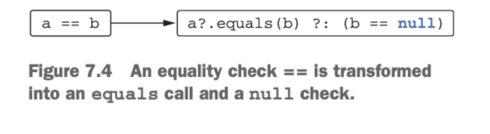
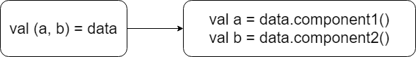
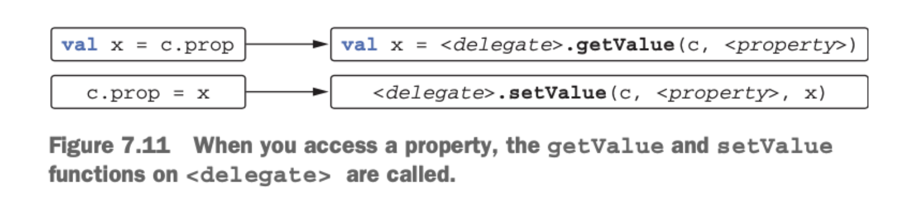

# 7장 연산자 오버로딩과 기타 관례

7장에서 다루는 내용

◼︎ 연산자 오버로딩

◼︎ 관례 : 여러 연산을 지원하기 위해 특별한 이름이 붙은 메소드

◼︎ 위임 프로퍼티

관례 → 어떤 언어 기능과 미리 정해진 이름의 함수를 연결해주는 기법

자바는 언어 기능을 타입에 의존하는 반면 코틀린은 (함수 이름을 통한) 관례에 의존한다.

## 산술 연산자 오버로딩

코틀린에서 관례를 사용하는 가장 단순한 예는 산술 연산자이다.

이항 산술 연산 오버로딩의 예를 살펴보자. 아래 코드는 Point 객체의 X, Y 좌표를 각각 더한다.

```kotlin
data class Point(val x: Int, val y: Int){
    operator fun plus(other: Point) : Point{
        return Point(x+other.x, y+other.y)
    }
}

fun main(args: Array<String>) {
    val p1 = Point(10, 20)
    val p2 = Point(30, 40)
		println(p1 + p2)
}
```

plus 함수 앞에 operator 키워드를 붙여야 한다. 연산자를 오버로딩하는 함수 앞에는 꼭 operator가 있어야 한다. operator 변경자를 추가해 plus 함수를 선언하고 나면 + 기호로 두 Point 객체를 더할 수 있다.


연산자를 멤버함수로 만드는 대신 확장함수로 만들 수 있다. 외부 함수의 클래스에 대한 연산자를 정의할 때는 관례를 따르는 이름의 확장함수로 구현하는게 일반적인 패턴이다.

| 식 | 함수 이름 |
| --- | --- |
| a * b | times |
| a / b | div |
| a % b | mod(1.1 부터 rem) |
| a + b | plus |
| a - b | minus |

연산자를 정의할 때 두 피연산자(연산자 함수의 두 파라미터)가 같은 타입일 필요는 없다.

```kotlin
data class Point(val x: Int, val y: Int){
    operator fun plus(other: Point) : Point{
        return Point(x+other.x, y+other.y)
    }
}

operator fun Point.times(scale: Double) : Point{
    return Point((x * scale).toInt(), (y * scale).toInt())
}

fun main(args: Array<String>) {
    val p = Point(10, 20)
		println(p * 1.5)
}
```

```kotlin
operator fun Double.times(p: Point) : Point{
    return Point((this * p.x).toInt(), (this * p.y).toInt())
}
```

> 코틀린 연산자가 자동으로 교환 법직(a op b == b op a)을 지원하지는 않는다. 1.5 * p 를 구하기 위해서는 별도 함수를 구현해야 한다.
>

```kotlin
operator fun Char.times(count: Int) : String{
    return toString().repeat(count)
}
```

> 그리고 연산자 함수의 반환 타입이 꼭 두 피연사자 중 하나와 일치해야만 하는 것도 아니다. 아래 코드는 문자를 여러번 반복해서 문자열을 만들어내는 예제이다.
>

일반 함수와 마찬가지로 operator 함수도 오버로딩할 수 있다. 따라서 이름은 같지만 파라미터 타입이 서로 다른 연산자 함수를 여럿 만들 수 있다.

<aside>
📖 비트 연산자에 대해 특별한 연산자 함수를 사용하지 않는다. 
코틀린은 표준 숫자 타입에 대해 비트 연산자를 정의하지 않는다. 따라서 커스텀 타입에서 비트 연산자를 정의할 수도 없다. 대신에 중위 연산자 표기법을 지원하는 일반 함수를 사용해 비트 연산을 수행한다.

> 다음은 코틀린에서 비트 연산을 수행하는 함수의 목록이다.
>
>
>
> | shl | 왼쪽 시프트(자바 <<) |
> | --- | --- |
> | shr | 오른쪽 시프트(부호 비트 유지, 자바 >>) |
> | ushr | 오른쪽 시프트(0으로 부호 비트 설정, 자바 >>>) |
> | and | 비트 곱(자바 &) |
> | or | 비트 합(자바 |) |
> | xor | 비트 배타 합(자바 ^) |
> | inv | 비트 반전(자바 ~) |
</aside>

## 복합 대입 연산자 오버로딩

plus와 같은 연산자를 오버로딩하면 코틀린은 + 연산자뿐 아니라 그와 관련 있는 연산자인 +=도 자동으로 함께 지원한다. +=, -= 등의 연산자는 복합 대입 연산자라 불린다.

```kotlin
var point = Point(1, 2)
point += Point(3, 4)
println(point)
```

경우에 따라 += 연산이 객체에 대한 참조를 다른 참조로 바꾸기보다 원래 객체의 내부 상태를 변경하게 만들려면, 변경 가능한 컬렉션에 원소를 추가하는 경우가 있다.

```kotlin
val numbers = ArrayList<Int>()
numbers += 42
println(numbers[0])

/*
@kotlin.internal.InlineOnly
public inline operator fun <T> MutableCollection<in T>.plusAssign(element: T) {
    this.add(element)
}
*/

val list = arrayListOf(1, 2)
list += 3
val newList = list + listOf(4, 5)
println(list)
println(newList)
```

## 단항 연산자 오버로딩

단항 연산자를 오버로딩하는 절차도 이항 연산자와 마찬가지이다. 미리 정해진 이름의 함수를 선언하면서 operator로 표시하면 된다. 단항 연산자를 오버로딩하기 위해 사용하는 함수는 인자를 취하지 않는다.

> 표. 오버로딩할 수 있는 단항 산술 연산자
>

| 식 | 함수이름 |
| --- | --- |
| +a | unaryPlus |
| -a | unaryMinus |
| !a | not |
| ++a, a++ | inc |
| —a, a— | dec |

## 비교 연산자 오버로딩

- 동등성 연산자 : equals
- 순서 연산자 : compareTo

### 동등성 연산자 : equals



```kotlin
class Point(val x: Int, val y: Int){
    override fun equals(obj: Any?): Boolean {
        if(obj == this) return true
        if(obj !is Point) return false
        return obj.x == x && obj.y == y
    }
}

fun main(args: Array<String>) {
		println(Point(10, 20) == Point(10, 20))
		println(Point(10, 20) != Point(5, 5))
		println(null == Point(1, 2))
}
```

### 순서연산자 : compareTo


```kotlin
class Person(
    val firstName: String, val lastName: String
) : Comparable<Person>{
    override fun compareTo(other: Person): Int {
        returncompareValuesBy(this, other,
        Person::lastName, Person::firstName)
    }
}

fun main(args: Array<String>) {
    val p1 = Person("Alice", "Smith")
    val p2 = Person("Bob", "Johnson")
		println(p1 < p2)
}
```

## 컬렉션과 범위에 대해 쓸 수 있는 관례

컬렉션을 다룰 때 많이 쓰이는 연산자

- 인덱스 연산자 → a[b]
- in 연산자 → 원소가 컬렉션이나 범위에 속하는지 검사 혹은 컬렉션에 있는 원소를 이터레이션 할때

### 인덱스로 원소에 접근 : get과 set

코틀린에서는 인덱스 연산자도 관례를 따른다. 원소를 읽는 연산은 get 연산자 메소드로 변환되고, 원소를 쓰는 연산은 set 연산자 메소드로 변환된다.

```kotlin
data class Point(val x: Int, val y: Int)
data class MutablePoint(var x: Int, var y: Int)

operator fun Point.get(index: Int) : Int{
    return when(index){
        0 -> x
        1 -> y
        else ->
            throw IndexOutOfBoundsException("Invalid coordinate $index")
    }
}

operator fun MutablePoint.set(index: Int, value: Int){
    when(index){
        0 -> x = value
        1 -> y = value
        else ->
            throw IndexOutOfBoundsException("Invalid coordinate $index")
    }
}

fun main(args: Array<String>) {
    val p = Point(10, 20)
    val q = MutablePoint(10, 20)
		println(p[1])
    q[1] = 42
		println(q)
}
```


### in 관례

```kotlin
data class Rectangle(val upperLeft: Point, val lowerRight: Point)

operator fun Rectangle.contains(p: Point) : Boolean{
    return p.x in upperLeft.xuntillowerRight.x &&
            p.y in upperLeft.yuntillowerRight.y
}

fun main(args: Array<String>) {
    val rect = Rectangle(Point(10, 20), Point(50, 50))
		println(Point(20, 30) in rect)
		println(Point(5, 5) in rect)
}
```

### for 루프를 위한 iterator 관례

```kotlin
operator fun ClosedRange<LocalDate>.iterator(): Iterator<LocalDate> =
    object : Iterator<LocalDate>{
        var current = start
        override fun hasNext() = current <= endInclusive

        override fun next(): LocalDate = current.apply{
					current = plusDays(1)
					}
}

fun main(args: Array<String>) {
    val newYear = LocalDate.ofYearDay(2022, 8)
		//Comparable 인터페이스를 구현하는 클래스에 대해서는 rangeTo를 정의할 필요가 없다.
    val daysOff = newYear.minusDays(5)..newYear
    for (dayOff in daysOff) {println(dayOff)}
}
```

## 구조 분해 선언과 component 함수

구조 분해를 사용하면 복합적인 값을 분해해서 여러 다른 변수를 한꺼번에 초기화할 수 있다. 구조 분해 선언은 = 의 좌변에 여러 변수를 괄호로 묶는다.

> 내부에서 구조 분해 선언은 다시 관례를 사용한다. 구조 분해 선언의 각 변수를 초기화하기 위해 componentN이라는 함수를 호출한다.(여기서 N은 구조 분해 선언에 있는 변수 위치에 따라 붙는 번호다)
>



```kotlin
data class Point(var x: Int, var y:Int)

/*class Point(var x: Int, var y:Int) {
    operator fun component1() = x
    operator fun component2() = y
}*/

fun main(args: Array<String>){
    val p = Point(10, 20)
    val (x, y) = p
		println(x)
		println(y)
}
```

```kotlin
data class NameComponents(val name: String, val extension: String)

fun splitFilename(fullName: String) : NameComponents{
    val (name, extension) = fullName.split('.', limit = 2)
		//spilit함수는 2개의 원소르 이뤄진 리스트를 반환한다.
    return NameComponents(name, extension)
}
/*fun splitFilename(fullName: String) : NameComponents{
    val result = fullName.split('.', limit = 2)
    return NameComponents(result[0], result[1])
}*/

fun main(args: Array<String>){
    val (name, ext) =splitFilename("example.kt")
		println(name)
		println(ext)
}
```

```kotlin
fun printEntries(map: Map<String, String>){
    for((key, value) in map){
			println("$key -> $value")
    }
}

/*
fun printEntries(map: Map<String, String>){
    for(entry in map.entries){
        val key = entry.component1()
        val value = entry.component2()
        println("$key -> $value")
    }
}
*/

fun main(args: Array<String>){
    val map =mapOf("Oracle"to"Java", "JetBrains"to"Kotlin")
		printEntries(map)
}
```

## 프로퍼티 접근자 로직 재활용 : 위임 프로퍼티

위임프로퍼티를 사용하면 백킹필드에 단순히 저장하는 것보다 더 복잡한 방식으로 작동하는 프로퍼티를 쉽게 구현할 수 있다. 또한 그 과정에서 접근자 로직을 매번 재구현할 필요도 없다. 예를 들어 프로퍼티는 위임을 사용해 자신의 값을 필드가 아니라 데이터베이스 테이블이나 브라우저 세션, 맵 등에 저장할 수 있다.

> 이런 특성의 기반에는 위임이 있다. 위임은 객체가 직접 작업을 수행하지 않고 다른 도우미 객체가 그 작업을 처리하게 맡기는 디자인 패턴을 말한다. 이때 작업을 처리하는 도우미 객체를 위임 객체(delegate)라고 부른다.(4.3.3절 참조, 클래스 위임)
>

```kotlin
class Foo {
    var p : Type by Delegate()
}

class Foo {

}

```

> 프로퍼티 위임 관례를 따르는 Delegate 클래스는 getValue와 setValue 메소드를 제공해야 한다.
>

## 위임 프로퍼티 사용 : by lazy()를 사용한 프로퍼티 초기화 지연

지연 초기화(lazy initialization)는 객체의 일부분을 초기화하지 않고 남겨뒀다가 실제로 그 부분의 값이 필요할 경우 초기화할때 흔히 쓰이는 패턴이다. **초기화 과정에 자원을 많이 사용하거나 객체를 사용할 때마다 꼭 초기화하지 않아도 되는 프로퍼티에 대해 지연 초기화 패턴을 사용할 수 있다.**

> lazy 함수는 코틀린 관례에 맞는 시그니처의 getValue 메소드가 들어있는 객체를 반환한다. 따라서 lazy를 by 키워드와 함께 사용해 위임 프로퍼티를 만들 수 있다. lazy 함수의 인자는 값을 초기화할 때 호출할 람다다.
>

```kotlin
class Email{}

fun loadEmails(person: Person) : List<Email>{
		println("${person.name}의 이메일을 가져옴")
    returnlistOf()
}

class Person(val name: String){
    private var _emails: List<Email>? = null
    val emails: List<Email>
    get(){
        if(_emails == null){
            _emails =loadEmails(this)
        }
        return _emails!!
    }
}

fun main(args: Array<String>) {
    val p = Person("Alice")
    p.emails
    p.emails
}
```

위 코드는 백킹 프로퍼티라는 기법을 사용한다. _emails라는 프로퍼티는 값을 저장하고, 다른 프로퍼티인 emails는 _emails라는 프로퍼티에 대한 읽기 연산을 제공한다. 위임 프로퍼티를 사용하면 이 코드가 훨씬 간단해진다. **위임 프로퍼티는 데이터를 저장할 때 쓰이는 백킹 프로퍼티와 값이 오직 한번만 초기화됨을 보장하는  게터 로직을 함께 캡슐화해준다.**

```kotlin
class Person(val name: String){
    val emails by lazy { loadEmails(this) }
}
```

```kotlin
open class PropertyChangeAware{
    protected val changeSupoort = PropertyChangeSupport(this)

    fun addPropertyChangeListener(listener: PropertyChangeListener){
        changeSupoort.addPropertyChangeListener(listener)
    }
    fun removePropertyChangeListener(listener: PropertyChangeListener){
        changeSupoort.removePropertyChangeListener(listener)
    }
}

class Person(
    val name: String, age: Int, salary: Int
) : PropertyChangeAware(){
    var age: Int = age
    set(newValue) {
        val oldValue =field
        field= newValue
        changeSupoort.firePropertyChange(
            "age", oldValue, newValue
        )
    }
    var salary: Int =  salary
    set(newValue){
        val oldValue =field
        field= newValue
        changeSupoort.firePropertyChange(
            "salary", oldValue, newValue
        )
    }
}

fun main(args: Array<String>) {
    val p = Person("Dmitry", 34, 2000)
    p.addPropertyChangeListener(
			PropertyChangeListener{
			event->println("Property ${event.propertyName} changed "+
			        "from ${event.oldValue} to ${event.newValue}")
			}
	)
    p.age = 35
    p.salary = 2100
}
```

```kotlin
class ObservableProperty(
    var propValue: Int,
    val changeSupport: PropertyChangeSupport
){
    operator fun getValue(p: Person, prop: KProperty<*>): Int = propValue)
    operator fun setValue(p: Person, prop: KProperty<*>, newValue: Int){
        val oldValue = propValue
        propValue = newValue
        changeSupport.firePropertyChange(prop.name, oldValue, newValue)
    }
}

/*
class ObservableProperty(
    val propName: String, var propValue: Int,
    val changeSupport: PropertyChangeSupport
){
    fun getValue(): Int = propValue
    fun setValue(newValue: Int){
       val oldValue = propValue
       propValue = newValue
       changeSupport.firePropertyChange(propName, oldValue, newValue)
    }
}
*/

open class PropertyChangeAware{
    protected val changeSupoort = PropertyChangeSupport(this)

    fun addPropertyChangeListener(listener: PropertyChangeListener){
        changeSupoort.addPropertyChangeListener(listener)
    }
    fun removePropertyChangeListener(listener: PropertyChangeListener){
        changeSupoort.removePropertyChangeListener(listener)
    }
}

class Person(
    val name: String, age: Int, salary: Int
) : PropertyChangeAware(){
    val _age = ObservableProperty("age", age, changeSupoort)
    var age: Int
    get() = _age.getValue()
    set(value) {_age.setValue(value)}
    val _salary = ObservableProperty("salary", salary, changeSupoort)
    var salary: Int
    get() = _salary.getValue()
    set(value) {_salary.setValue(value)}
}
```

이 코드는 코틀린의 위임이 실제로 작동하는 방식과 비슷하다. 프로퍼티 값을 저장하고 그 값이 바뀌면 자동으로 변경 통지를 전달해주는 클래스이다.

```kotlin
class Person(
    val name: String, age: Int, salary: Int
) : PropertyChangeAware(){
    var age: Int by ObservableProperty(age, changeSupoort)
    var salary: Int by ObservableProperty(salary, changeSupoort)
}

```

by 키워드를 사용해 위임 객체를 지정하면 컴파일러가 자동으로 처리 코드를 만들어준다. by 오른쪽에 오는 객체를 위임 객체(delegate)라고 부른다. 코틀린은 위임 객체를 감춰진 프로퍼티에 저장하고, 주 객체의 프로퍼티를 읽거나 쓸 때마다 위임 객체의 getValue와 setValue를 호출한다.

> 관찰 가능한 프로퍼티 로직을 직접 작성하는 대신 코틀린 표준 라이브러리를 사용해도 된다. 표준 라이브러리에는 이미 ObservableProperty와 비슷한 클래스가 있다. 다만 이 표준 라이브러리의 클래스는 PropertyChangeSupport와 연결돼 있지 않다. 따라서 프로퍼티 값의 변경을 통지할 때 PropertyChangeSupport를 사용하는 방법을 알려주는 람다를 그 표준 라이브러리 클래스에게 넘겨야 한다. 아래 코드를 살펴본다.
>

```kotlin
class Person(
    val name: String, age: Int, salary: Int
) : PropertyChangeAware(){
    private val observer ={
prop: KProperty<*>, oldValue: Int, newValue: Int->
changeSupoort.firePropertyChange(prop.name, oldValue, newValue)
}
var age: Int by Delegates.observable(age, observer)
    var salary: Int by Delegates.observable(salary, observer)
}
```

> by의 오른쪽에 있는 식이 꼭 새 인스턴스를 만들필요는 없다. 함수 호출, 다른 프로퍼티, 다른 식 등이 by의 우항에 올 수 있다. 다만 우항에 있는 식을 계산한 결과인 객체는 컴파일러가 호출할 수 있는 올바른 타입의 getValue와 setValue를 반드시 제공해야한다.
>

## 위임 프로퍼티 컴파일 규칙

위임 프로퍼티가 어떤 방식으로 동작하는지 살펴보자. 다음과 같은 위임 프로퍼티가 있는 클래스가 있다고 가정한다.

```kotlin
class C {
    var prop: Type by MyDelegate()
}

val c = C()
```

컴파일러는 MyDelegate 클래스의 인스턴스를 감춰진 프로퍼티에 저장하며 그 감춰진 프로퍼티를 <delegate>라고 부른다. 또한 컴파일러는 프로퍼티를 표현하기 위해 KProperty 타입의 객체를 사용한다. 이 객체를 <property>라고 부른다. 따라서 컴파일러는 아래와 같은 코드를 생성한다.

```kotlin
class C{
    private val <delegate> = MyDelegate()
    var prop: Type
    get() = <delegate>.getValue(this, <property>)
    set(value: Type) = <delegate>.setValue(this, <property>, value)
}
```


## 프로퍼티 값을 맵에 저장

자신의 프로퍼티를 동적으로 정의할 수 있는 객체를 만들 때 위임 프로퍼티를 활용하는 경우가 있다. **그런 객체를 확장 가능한 객체(expando object)라고 부른다.**

```kotlin
class Person{
    private val _attribute =hashMapOf<String, String>()
    fun setAttribute(attrName: String, value: String){
        _attribute[attrName] = value
    }
    val name: String
    get() = _attribute["name"]!!
}

fun main(args: Array<String>) {
    val p = Person()
    val data =mapOf("name"to"Dmitry", "company"to"JetBrains")
    for((attrName, value) in data)
        p.setAttribute(attrName, value)
		println(p.name)
}
```

```kotlin
class Person{
    private val _attribute =hashMapOf<String, String>()
    fun setAttribute(attrName: String, value: String){
        _attribute[attrName] = value
    }
    val name: String by _attribute
}

//p.name 는 _attributes.getValue(p, prop) 라는 호출을 대신한다.
//_attributes.getValue(p, prop) 는 _attributes[prop.name]를 통해 구현된다.
```

## 요약

- 코틀린에서는 정해진 이름의 함수를 오버로딩함으로써 표순 수학 연산자를 오버로딩할 수 있다. 하지만 직접 새로운 연산자를 만들 수는 없다.
- 비교연산자는 equals와 compateTo 메소드로 변환된다.
- 클래스에 get, set, contains라는 함수를 정의하면 그 클래스의 인스턴스에 대해 []와 in 연산을 사용할 수 있고, 그 객체를 컬렉션 객체와 비슷하게 다룰 수 있다.
- 미리 정해진 관례를 따라 rangeTo, iterator 함수를 정의하면 범위를 만들거나 컬렉션과 배열의 원소를 이터레이션할 수 있다.
- 구조 분해 선언을 통해 한 객체의 상태를 분해해서 여러 변수에 대입할 수 있다. 함수가 여러 값을 한꺼번에 반환해야 하는 경우 구조 분해가 유용하다. 데이터 클래스에 대한 구조 분해는 거저 사용할 수 있지만, 커스텀 클래스의 인스턴스에서 구조 분해를 사용하려면 componentN 함수를 정의해야한다.
- **위임 프로퍼티를 통해 프로퍼티 값을 저장하거나 초기화하거나 읽거나 변경할 때 사용하는 로직을 재활용할 수 있다. 위임 프로퍼티는 프레임워크를 만들 때 아주 유용하다.**
- 표준 라이브러리 함수인 lazy를 통해 지연 초기화 프로퍼티를 쉽게 구현할 수 있다.
- Delegates.observable 함수를 사용하면 프로퍼티 변경을 관찰할 수 있는 관찰자를 쉽게 추가할 수 있다.
- 맵을 위임 객체로 사용하는 위임 프로퍼티를 통해 다양한 속성을 제공하는 객체를 유연하게 다룰 수 있다.
