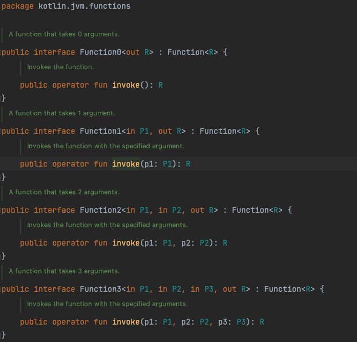

# 8장. 고차 함수: 파라미터와 반환 값으로 람다 사용 - 미완

# 개요

- 고차 함수
- 인라인 함수

# 고차 함수 정의

- 고차 함수는 다른 함수를 인자로 받거나 함수를 반환하는 함수이다.
    - Kotlin에서는 람다나 함수 참조를 사용해 함수를 값으로 표현할 수 있다.
    - 고차 함수를 통해 람다나 함수 참조를 인자로 넘길 수 있고, 이를 반환할 수 있다.
    - ex. filter는 술어 함수를 인자로 받는 고차함수이다.
        
        ```kotlin
        list.filter { x > 0 }
        ```
        

## 1. 함수 타입

- 고차 함수를 정의하기 위해서는 함수 타입을 알아야 한다.
- 람다를 인자로 받는 함수를 정의하기위해 람다 인자 타입을 어떻게 선언해야 하는지 알아야 한다.
    - Kotlin의 타입추론으로 인해 변수 타입을 지정하지 않아도 람다를 변수에 대입할 수 있을 것이다.
        
        ```kotlin
        val sum = { x: Int, y: Int -> x + y }
        val action = { println(42) }
        ```
        
        - 위 경우, 컴파일러는 sum과 action이 함수 타입임을 추론한다.
    
    - 구체적인 타입 선언은 아래처럼 한다.
        
        ```kotlin
        val sum: (Int, Int) -> Int = { x, y -> x + y }
        val action: () -> Unit = { println(42) }
        ```
        
        - sum은 Int 2개를 받아 Int 반환
        - action은 아무 인자도 받지 않고 아무 값도 반환하지 않는 함수
    
    - 함수 타입을 정의하려면 함수 파라미터의 타입을 괄호에 넣고, 화살표를 추가한 다음, 함수의 반환 타입을 지정한다.
        
        ```kotlin
        (Int, String) -> Unit  // 함수 타입
        (Int, String)          // 함수 파라미터 타입
        Unit                   // 반환 타입
        ```
        
        - 함수 타입을 선언할 때는 반환 타입을 반드시 명시해야하기 때문에 Unit을 빼먹으면 안된다.
    
- 함수 타입의 파라미터를 통해 람다의 파라미터 타입을 유추할 수 있다.
    
    ```kotlin
    AS-IS | { x: Int, y: Int -> x + y }
    TO-BE | { x, y -> x + y }
    ```
    
- 반환 타입을 nullable한 타입으로 지정할 수 있다.
    
    ```kotlin
    var canReturnNull: (Int, Int) -> Int? = { x, y -> null }
    ```
    
- nullable한 함수 타입 변수를 정의할 수 있다.
    
    ```kotlin
    var funOrNull: ((Int, Int) -> Int)? = null
    ```
    

- 함수 타입에서 파라미터의 이름을 지정할 수 있다.
    - 사용할 때는 원하는 다른 이름을 쓸 수도 있다.
    
    ```kotlin
    fun performRequest(
    	url: String,
    	callback: (code: Int, content: String) -> Unit    // code, content
    ) { /* .. */ }
    
    performRequest(url) { code, content -> /* .. */ } // Ok
    performRequest(url) { code, page -> /* .. */ }  // Ok
    ```
    

## 2. 인자로 받은 함수 호출

- 인자로 받은 함수를 호출할 때는 괄호안에 인자를 콤마로 구분해 넣으면 된다.
    
    ```kotlin
    fun twoAndThree(operation: (Int, Int) -> Int) {
    	val result = operation(2, 3)
    	println("The result is $result")
    }
    
    >> twoAndThree { a, b -> a + b }
    The result is 5
    ```
    
    ```kotlin
    String             // 수신객체 타입
    predicate          // 파라미터 이름
    (Char) -> Boolean  // 파라미터 함수 타입
    Char               // 파라미터로 받는 함수의 파라미터 타입
    Boolean            // 파라미터로 받는 함수의 반환 타입
    
    fun String.filter(predicate: (Char) -> Boolean): String {
    	val sb = StringBuilder()
    	for (index in 0 until length) {
    		val element = get(index)
    		if (predicate(element)) {  // predicate 파라미터로 전달받은 함수 호출
    			sb.append(element)  
    		}
    	}
    	return sb.toString()
    }
    
    >> println("ablc".filter { it in 'a'..'z' })  // 람다를 predicate 파라미터로 전달
    abc
    ```
    

## 3. 자바에서 코틀린 함수 타입 사용

- 컴파일된 코드 안에서 함수 타입은 일반 인터페이스로 바뀐다.
    - 함수 타입의 변수는 FunctionN 인터페이스를 구현하는 객체를 저장한다.

- Kotlin 표준 라이브러리는 함수 인자의 개수에 따라 Function0<R>, Function1<P1, R> 등의 인터페이스를 제공한다. (Function22 까지 가능)
    - Function0<R> : 인자가 없는 함수
    - Function1<P1, R> : 인자가 하나인 함수
    
    - 각 인터페이스에는 invoke 메서드를 통해 함수를 실행할 수 있다.
        
        
        
    - 함수 타입인 변수는 인자 개수에 따라 FunctionN 인터페이스를 구현하는 클래스의 인스턴스를 저장하며, 그 클래스의 invoke 메서드 본문에 람다의 본문이 들어간다.

```kotlin
// decompile한 코드
@NotNull
public static final String filter(@NotNull String $this$filter, @NotNull Function1 predicate) {
  Intrinsics.checkNotNullParameter($this$filter, "$this$filter");
  Intrinsics.checkNotNullParameter(predicate, "predicate");
  StringBuilder sb = new StringBuilder();
  int index = 0;

  for(int var4 = $this$filter.length(); index < var4; ++index) {
     char element = $this$filter.charAt(index);
     if ((Boolean)predicate.invoke(element)) {
        sb.append(element);
     }
  }

  String var10000 = sb.toString();
  Intrinsics.checkNotNullExpressionValue(var10000, "sb.toString()");
  return var10000;
}
```

## 4. 디폴트 값을 지정한 함수 타입 파라미터나 널이 될 수 있는 함수 타입 파라미터

- 파라미터를 함수 타입으로 선언할 때 디폴트값을 넣을 수 있다.
    
    ```kotlin
    fun <T> Collection<T>.joinToString(
    	seperator: String = ", ",
    	prefix: String = "",
    	postfix: String = "",
    	transform: (T) -> String = { it.toString() }
    ): String {
    	val result = StringBuilder(prefix)
    	
    	for((index, element) in this.withIndex()) {
    		if (index > 0) result.append(seperator)
    		result.append(element)
    	}
    	result.append(postfix)
    	
    	return result.toString()
    }
    
    >> val letters = listOf("Alpha", "Beta")
    >> println(letter.joinToString())
    Alpha, Beta
    ```
    
    - joinToString 함수는 제네릭 함수이다.
        - 컬렉션의 원소 타입을 표현하는 T를 타입 파라미터로 받는다.
    
    - 함수 타입 파라미터를 선언하면서 람다를 디폴트로 지정한다.
        
        ```kotlin
        transform: (T) -> String = { it.toString() }
        ```
        

- null이 될 수 있는 함수 타입을 사용할 수 있다.
    - 대신 그 함수를 직접 호출할 수는 없다. (NPE가 발생할 수 있기 때문)
    - 명시적으로 null검사를 하는 것으로 해결할 수는 있다.
        
        ```kotlin
        fun foo(callback: (() -> Unit)?) {
        	// ..
        	if (callback != null) {
        		callback()
        	}
        }
        ```
        

- 함수 타입이 invoke 메서드를 구현하는 인터페이스라는 사실을 활용하여 더 짧게 만들 수 있다.
    - 일반 메서드처럼 callback?.invoke()처럼 호출할 수 있다.
    
    ```kotlin
    fun <T> Collection<T>.joinToString(
    	seperator: String = ", ",
    	prefix: String = "",
    	postfix: String = "",
    	transform: ((T) -> String)? = null
    ): String {
    	val result = StringBuilder(prefix)
    	
    	for((index, element) in this.withIndex()) {
    		if (index > 0) result.append(seperator)
    		val str = transform?.invoke(element) ?: element.toString()
    		result.append(str)
    	}
    	result.append(postfix)
    	
    	return result.toString()
    }
    
    >> val letters = listOf("Alpha", "Beta")
    >> println(letter.joinToString())
    Alpha, Beta
    ```
    

## 5. 함수를 함수에서 반환

```kotlin
enum class Delivery { STANDARD, EXPEDITED}

class Order(val itemCount: Int)

fun getShippingCostCalculator(
  delivery: Delivery): (Order) -> Double {  // 함수를 반환하는 함수 선언
  if (delivery == Delivery.EXPEDITED) {
    return { order -> 6 + 2.1 * order.itemCount }  // 람다 반환
  }
  return { order -> 1.2 * order.itemCount }  // 람다 반환
}

fun main() {
  val calculator = getShippingCostCalculator(Delivery.EXPEDITED)
  println("${calculator(Order(3))}")  // 반환받은 함수 호출
}
```

- 함수를 반환하는 함수를 만들기 위해서는 반환타입으로 함수 타입을 지정해야 한다.
    - getShippingCostCalculator 함수는 Order를 받아 Double을 반환하는 함수를 반환한다.
    - 함수를 반환하기 위해서는 return에 람다, 멤버 참조 또는 함수 타입의 값을 계산하는 식을 넣으면 된다.

## 6. 람다를 활용한 중복 제거

- 함수 타입과 람다 식은 재활용하기 좋은 코드를 만들 때 쓸 수 있는 좋은 도구이다.

```kotlin
data class SiteVisit(
	val path: String,
	val duration: Double,
	val os: OS
)

enum class OS { WINDOWS, LINUX, MAC, IOS, ANDROID }

val log = listOf(
	SiteVisit("/", 34.0, OS.WINDOWS),
	SiteVisit("/", 22.0, OS.MAC),
	SiteVisit("/login", 12.0, OS.WINDOWS),
	SiteVisit("/signup", 8.0, OS.IOS),
	SiteVisit("/", 16.3, OS.ANDROID)
)
```

- OS별 사용자의 평균 방문 시간을 구하는 코드를 작성한다면 하드코딩할 수 있다.
    
    ```kotlin
    val averageWindowsDuration = log
    	.filter { it.os == os.WINDOWS }  // WINDOWS 사용자 filter
    	.map(SiteVisit::duration)
    	.average()
    ```
    

- 함수로 만들어 중복을 제거할 수 있다.
    
    ```kotlin
    fun List<SiteVisit>.averageDurationFor(os: OS)
    	= filter { it.os == os }.map(SiteVisit::duration).average()
    ```
    

- 복잡한 질의를 하는 경우에는 고차함수를 사용하는 것이 유용하다.
    
    ```kotlin
    fun List<SiteVisit>.averageDurationFor(predicate: (SiteVisit) -> Boolean)
    	= filter(predicate).map(SiteVisit::duration).average()
    
    >> println(log.averageDurationFor { it.os in setOf(OS.ANDROID, OS.IOS) }
    12.15
    >> println(log.averageDurationFor { it.os == OS.IOS && it.path == "/signup" }
    8.0
    ```
    

# 인라인 함수 : 람다의 부가 비용 없애기

- Kotlin에서 람다를 함수 인자로 넘기는 구문은 if나 for같은 일반 문장과 비슷하다.
- 보통 람다를 무명 클래스로 컴파일하지만 그렇다고 람다를 쓸 때마다 새로운 클래스가 생성되는 것은 아니다.
    - 람다가 변수를 포획하면 람다가 생성되는 시점마다 새로운 무명 클래스 객체가 생긴다.
    - 이 경우, 실행 시점에 무명 클래스 생성에 따른 비용이 든다.
    - 람다를 사용하는 구현은 똑같은 작업을 하는 일반 함수를 통한 구현보다 덜 효율적이다.
- 반복되는 코드를 함수로 빼고 효율적인 코드를 생성하는 방법은 inline 변경자를 붙이는 것이다.
    - inline 변경자를 함수에 붙이면 컴파일러는 그 함수를 호출하는 모든 문장을 함수 본문에 해당하는 바이트코드로 바꿔치기한다.

## 1. 인라이닝이 작동하는 방식

- 어떤 함수를 inline으로 선언하면 그 함수의 본문이 인라인된다.
    - 함수를 호출하는 코드를 함수를 호출하는 바이트코드 대신에 함수 본문을 번역한 바이트코드로 컴파일한다는 뜻이다.

```kotlin
inline fun <T> synchronized(lock: Lock, action: () -> T): T {
	lock.lock()
	try {
		return action()
	} finally {
		lock.unlock()
	}
}

val l = Lock()
synchronized(l) {
	// ...
}
```

- synchronized 함수를 inline으로 선언했기 때문에 synchronized를 호출하는 코드는 모두 자바의 synchronized문과 같아진다.
    
    ```kotlin
    fun foo(l: Lock) {
    	println("Before sync")
    	synchronized(l) {
    		println("Action")
    	}
    	println("After sync")
    }
    ```
    
    ```kotlin
    fun __foo__(l: Lock) {
    	println("Before sync")
    	l.lock()
    	try {
    		println("Action")
    	} finally {
    		l.unlock()
    	}
    	println("After sync")
    }
    ```